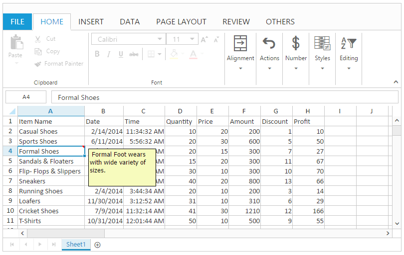
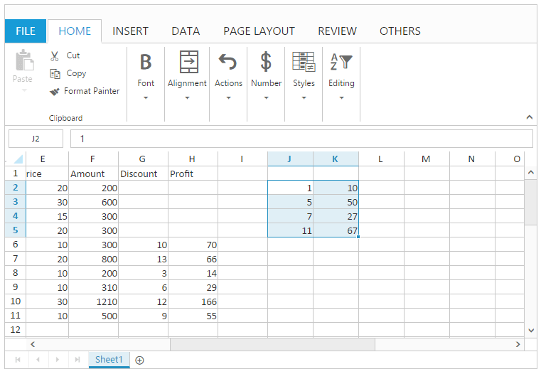
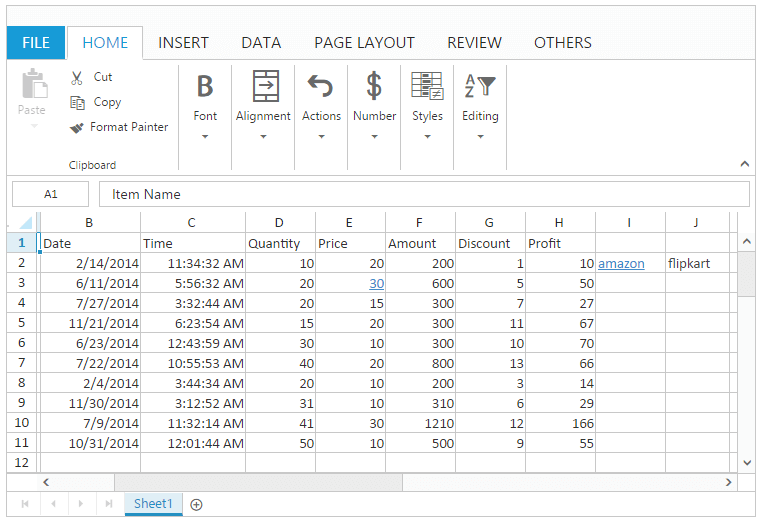
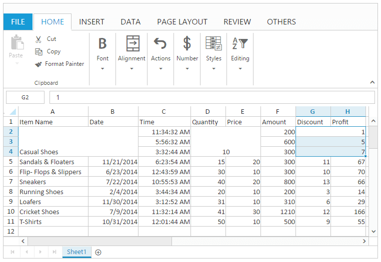

---
layout: post
title: Cell Range in JavaScript Spreadsheet widget | Syncfusion
description: You can learn here about cell range support in Syncfusion JavaScript Spreadsheet control and more details.
platform: js
control: Spreadsheet
documentation: ug
api: /api/js/ejspreadsheet
--- 

# Cell Range in JavaScript Spreadsheet

A Cell Range is a collection of cells in a sheet. It represents single cell or selection of cells. When cells have been selected, they are surrounded by border. 

You have following features in Cell Range,

* Comment
* Cell Navigation
* Data Validation
* Drag and Drop
* Auto Fill
* Hyperlink
* Merge Cell

## Comment

Comment is used to give additional information for an individual cell about the data it contains. When a cell has a comment, a red indicator appears in the corner of the cell. When mouse hover on the cell, the comment will appear. You can use [`allowComments`](https://help.syncfusion.com/api/js/ejspreadsheet#members:allowcomments "allowComments") property to enable/disable comments. 

### To insert a Comment

You can insert a comment by using one of the following ways,

* Using "New" button under Comments group of REVIEW Tab in ribbon.
* Using context menu to select "Insert Comment" option in "Comment".
* Using [`setComment`](https://help.syncfusion.com/api/js/ejspreadsheet#methods:xlcomment-setcomment "setComment") method.

### To remove a Comment

You can remove a comment by using one of the following ways,

* Using "Delete" button under Comments group of REVIEW Tab in ribbon.
* Using context menu to select "Delete Comment" option in "Comment".
* Using [`deleteComment`](https://help.syncfusion.com/api/js/ejspreadsheet#methods:xlcomment-deletecomment "deleteComment") method.

The following code example describes the above behavior.





$(function () {
    $("#Spreadsheet").ejSpreadsheet({
        // the datasource "window.defaultData" is referred from 'http://js.syncfusion.com/demos/web/scripts/xljsondata.min.js'
        sheets: [{
            rangeSettings: [{ dataSource: window.defaultData }],                               
        }],
        loadComplete: "loadComplete"
    });
});
function loadComplete(args) {
    if(!this.isImport) {
        this.XLComment.setComment("A2", " Casual Foot wears with wide variety of colors.", false);
        this.XLComment.setComment("A4", " Formal Foot wears with wide variety of sizes.", true); // If true comment is in Editing mode.
        //To Remove a Comment
        this.XLComment.deleteComment ("A2");
    }
}


The following output is displayed as a result of the above code example.

You have following Comment options in Spreadsheet.

1) Edit Comment

2) Find Next Comment

3) Find Previous Comment

4) Get Comment

5) Show All Comments

6) Show Hide Comment

7) User Name

#### Edit Comment
To edit the comment in the Spreadsheet. Use  [`editComment`](https://help.syncfusion.com/api/js/ejspreadsheet#methods:xlcomment-editcomment "editComment") method to edit comment via code.

#### Find Next Comment
To find the next comment in the Spreadsheet. Use  [`findNextComment`](https://help.syncfusion.com/api/js/ejspreadsheet#methods:xlcomment-findnextcomment "findNextComment") method to find next comment via code.

#### Find previous Comment
To find the previous comment in the Spreadsheet. Use  [`findPrevComment`](https://help.syncfusion.com/api/js/ejspreadsheet#methods:xlcomment-findprevcomment "findPrevComment") method to find previous comment via code.

#### Get Comment
To get the comment in the Spreadsheet. Use  [`getComment`](https://help.syncfusion.com/api/js/ejspreadsheet#methods:xlcomment-getcomment "getComment") method to get the comment via code.

#### Show All Comments
To show all the comments in the Spreadsheet. Use  [`showAllComments`](https://help.syncfusion.com/api/js/ejspreadsheet#methods:xlcomment-showallcomments "showAllComments") method to show all comments via code.

#### Show Hide Comment
To show or hide the specific comment in the Spreadsheet. Use  [`showHideComment`](https://help.syncfusion.com/api/js/ejspreadsheet#methods:xlcomment-showhidecomment "showHideComment") method to show or hide the specified comment via code.

#### User Name
To define the username for the Spreadsheet which is displayed in comment. Use  [`userName`](https://help.syncfusion.com/api/js/ejspreadsheet#members:username "userName") member to define user name for a comment via code.

## Cell Navigation

Cell navigation is used to navigate through the cells using keyboard. You can use [`allowKeyboardNavigation`](https://help.syncfusion.com/api/js/ejspreadsheet#members:allowkeyboardnavigation "allowKeyboardNavigation") property to enable/disable cell navigation. The following list of keys used for cell navigation are,

<table>
<colgroup><col width="180px" /></colgroup>
<tr><th>Keys </th><th>Description </th></tr>
<tr><td>Ctrl + Home </td><td>Go to first cell in the first row. </td></tr>
<tr><td>Ctrl + End </td><td>Go to last cell in the last row. </td></tr>
<tr><td>Up Arrow </td><td>Go to previous cell in the same column </td></tr>
<tr><td>Down Arrow </td><td>Go to next cell in the same column </td></tr>
<tr><td>Right Arrow </td><td>Go to next cell in the same row </td></tr>
<tr><td>Left Arrow </td><td>Go to previous cell in the same row </td></tr>
<tr><td>Page Down </td><td>Go to next block </td></tr>
<tr><td>Page Up </td><td>Go to previous block </td></tr>
<tr><td>Home </td><td>Go to first cell of the same row </td></tr>
<tr><td>End </td><td>Go to last cell of the same row </td></tr>
<tr><td>Enter </td><td>Save the current cell changes and navigate to the next row. </td></tr>
<tr><td>Tab </td><td>Go to next cell </td></tr>
<tr><td>Shift + Tab </td><td>Go to previous cell </td></tr>
<tr><td>Shift + Up Arrow </td><td>Go to previous row or previous row cell with selection </td></tr>
<tr><td>Shift+ Down Arrow </td><td>Go to next row or next row cell with selection </td></tr>
<tr><td>Shift + Right Arrow </td><td>Go to next cell within the same row with selection </td></tr>
<tr><td>Shift + Left Arrow </td><td>Go to previous cell within the same row with selection </td></tr>
<tr><td>Ctrl + Up Arrow </td><td>Go to next cell from the first empty cell in upwards. </td></tr>
<tr><td>Ctrl + Down Arrow </td><td>Go to previous cell from the first empty cell in downwards. </td></tr>
<tr><td>Ctrl + Left Arrow </td><td>Go to next cell from the first empty cell in leftwards. </td></tr>
<tr><td>Ctrl+ Right Arrow </td><td>Go to previous cell from the first empty cell in rightwards. </td></tr>
</table>

N> In the above table, "Ctrl + Home" and "Ctrl + End" is based on the used range.

## Data Validation

Data Validation is used to restrict the user to enter the invalid data. You can use [`allowDataValidation`](https://help.syncfusion.com/api/js/ejspreadsheet#members:allowdatavalidation "allowDataValidation") property to enable/disable data validation. 

N> The below validation script files are needed for validation.
N> * jquery.validate.min.js
N> * jquery.validate.unobtrusive.min.js

#### To apply validation.

You can apply data validation by using one of the following ways,

* Using "Data Validation" option in Data Validation button under Data Tools group of DATA Tab in ribbon, Data Validation dialog will be opened in that you can perform Validation.
* Using [`applyDVRules`](https://help.syncfusion.com/api/js/ejspreadsheet#methods:xlvalidate-applydvrules "applyDVRules") method.

The following code example describes the above behavior.





$(function () {
    $("#Spreadsheet").ejSpreadsheet({
        // the datasource "window.defaultData" is referred from 'http://js.syncfusion.com/demos/web/scripts/xljsondata.min.js'
        sheets: [{
            rangeSettings: [{ dataSource: window.defaultData }],                               
        }],
        loadComplete: "loadComplete"
    });
});
function loadComplete(args) {
    if(!this.isImport) {
        this.XLValidate.applyDVRules("G2:G12", ["Greater", 6], "number", true, true);
        //the last two boolean values used to ignore blank value and error alert.
    }
}


#### To clear validation

You can clear data validation rule by one of the following ways,

* Using "Clear Validation" option in Data Validation button under Data Tools group of DATA Tab in ribbon.
* Using [`clearDV`](https://help.syncfusion.com/api/js/ejspreadsheet#methods:xlvalidate-cleardv "clearDV") method.

The following code example describes the above behavior.





$(function () {
    $("#Spreadsheet").ejSpreadsheet({
        // the datasource "window.defaultData" is referred from 'http://js.syncfusion.com/demos/web/scripts/xljsondata.min.js'
        sheets: [{
            rangeSettings: [{ dataSource: window.defaultData }],                               
        }],
        loadComplete: "loadComplete"
    });
});
function loadComplete(args) {
    if(!this.isImport) {
        this.XLValidate.applyDVRules("G2:G12", ["Greater", 6], "number", true, true);
        //the last two boolean values used to ignore blank value and error alert.
        this.XLValidate.clearDV("G2:G12");
    }
}


#### To format invalid data

You can highlight the invalid data by using following ways,

* Using "Format Invalid Data" option in Data Validation button under Data Tools group of DATA Tab in ribbon.
* Using [`highlightInvalidData`](https://help.syncfusion.com/api/js/ejspreadsheet#methods:xlvalidate-highlightinvaliddata "highlightInvalidData") method.

The following code example describes the above behavior.





$(function () {
    $("#Spreadsheet").ejSpreadsheet({
        // the datasource "window.defaultData" is referred from 'http://js.syncfusion.com/demos/web/scripts/xljsondata.min.js'
        sheets: [{
            rangeSettings: [{ dataSource: window.defaultData }],                               
        }],
        loadComplete: "loadComplete"
    });
});
function loadComplete(args) {
    if(!this.isImport) {
        this.XLValidate.applyDVRules("G2:G12", ["Greater", 6], "number", true, true);
        //the last two boolean values used to ignore blank value and error alert.
        this.XLValidate.highlightInvalidData ("G2:G12");
    }
}


The following output is displayed as a result of the above code example.

#### To clear formatted invalid data

You can clear the highlighted invalid data by using following ways,

* Using "Clear Formats" option in Data Validation button under Data Tools group of DATA Tab in ribbon.
* Using [`clearHighlightedValData`](https://help.syncfusion.com/api/js/ejspreadsheet#methods:xlvalidate-clearhighlightedvaldata "clearHighlightedValData") method.

## Drag and Drop

Drag and drop is used to pick a selected cells and drop it into a new place on the worksheet. You can use [`allowDragAndDrop`](https://help.syncfusion.com/api/js/ejspreadsheet#members:allowdraganddrop "allowDragAndDrop") property to enable/disable drag and drop. 

You can do this by one of the following ways,

* Using mouse drag and drop.
* Using [`moveRangeTo`](https://help.syncfusion.com/api/js/ejspreadsheet#methods:xldragdrop-moverangeto "moveRangeTo") Method.

The following code example describes the above behavior.





$(function () {
    $("#Spreadsheet").ejSpreadsheet({
        // the datasource "window.defaultData" is referred from 'http://js.syncfusion.com/demos/web/scripts/xljsondata.min.js'
        sheets: [{
            rangeSettings: [{ dataSource: window.defaultData }],                               
        }],
        loadComplete: "loadComplete"
    });
});
function loadComplete(args) {
    if(!this.isImport)
        this.XLDragDrop.moveRangeTo([1, 6, 4, 7], [1, 9, 4, 10]);
}


The following output is displayed as a result of the above code example.

## Auto Fill

Auto Fill is used to fill the cells with data based on adjacent cells. It also follows a pattern from adjacent cells if available. There is no need to enter the repeated data manually. You can use [`allowAutoFill`](https://help.syncfusion.com/api/js/ejspreadsheet#members:allowautofill "allowAutoFill") property to enable/disable the auto fill support. You can also use [`showFillOptions`](https://help.syncfusion.com/api/js/ejspreadsheet#members:autofillsettings-showfilloptions "showFillOptions") property to enable/disable the fill option and [`fillType`](https://help.syncfusion.com/api/js/ejspreadsheet#members:autofillsettings-filltype "fillType") property to change the default auto fill option which is available in [`autoFillSettings`](https://help.syncfusion.com/api/js/ejspreadsheet#members:autofillsettings "autoFillSettings"). 

You can do this by one of the following ways,

* Using “AutoFillOptions” menu which is open, while drag and drop the cell using fill handle element.
* Using [`autoFill`](https://help.syncfusion.com/api/js/ejspreadsheet#methods:xldragfill-autofill "autoFill") method.

The following methods are available in spreadsheet to customize the auto fill options in the spreadsheet.

* Using [`hideAutoFillElement`](https://help.syncfusion.com/api/js/ejspreadsheet#methods:xldragfill-hideautofillelement "hideAutoFillElement") method to fide the auto fill element in the spreadsheet.
* Using [`hideAutoFillOptions`](https://help.syncfusion.com/api/js/ejspreadsheet#methods:xldragfill-hideautofilloptions "hideAutoFillOptions") method to fide the auto fill options in the spreadsheet.
* Using [`positionAutoFillElement`](https://help.syncfusion.com/api/js/ejspreadsheet#methods:xldragfill-positionautofillelement "positionAutoFillElement") method to set position of auto fill element in the spreadsheet.

In Auto Fill we have following options, 

* Copy Cells
* Fill Series
* Fill Formatting Only
* Fill Without Formatting
* Flash Fill

N> The default auto fill option is "fillSeries" which can be referred from [`fillType`](https://help.syncfusion.com/api/js/ejspreadsheet#members:autofillsettings-filltype "fillType") property.

#### Copy Cells

To copy the selected cell content to the adjacent cells. You can do this by one of the following ways,

* Using fill handle to select the adjacent cell range and "Copy Cells" option in "AutoFillOptions" menu to fill the adjacent cells.
* Using "copyCells" as fill type in [`autoFill`](https://help.syncfusion.com/api/js/ejspreadsheet#methods:xldragfill-autofill "autoFill") method to fill the adjacent cells.

#### Fill Series

To fill the series of numbers, characters, or dates based on selected cell content to the adjacent cells with their formats.

You can do this by one of the following ways,

* Using fill handle to select the adjacent cell range and "Fill Series" option in "AutoFillOptions" menu to fill the adjacent cells.
* Using "fillSeries" as fill type in [`autoFill`](https://help.syncfusion.com/api/js/ejspreadsheet#methods:xldragfill-autofill "autoFill") method to fill the adjacent cells.

#### Fill Formatting Only

To fill the cell style and number formatting based on the selected cell content to the adjacent cells without their content.

You can do this by one of the following ways,

* Using fill handle to select the adjacent cell range and "Fill Formatting Only" option in "AutoFillOptions" menu to fill the adjacent cells.
* Using "fillFormattingOnly" as fill type in [`autoFill`](https://help.syncfusion.com/api/js/ejspreadsheet#methods:xldragfill-autofill "autoFill") method to fill the adjacent cells.

#### Fill Without Formatting

To fill series of numbers, characters, or dates based on the selected cells to the adjacent cells without their formats.

You can do this by one of the following ways,

* Using fill handle to select the adjacent cell range and "Fill Without Formatting" option in "AutoFillOptions" menu to fill the adjacent cells.
* Using "fillWithoutFormatting" as fill type in [`autoFill`](https://help.syncfusion.com/api/js/ejspreadsheet#methods:xldragfill-autofill "autoFill") method to fill the adjacent cells.

#### Flash Fill 

To fill the column when it senses a pattern from adjacent column data based on what you type.

You can do this by one of the following ways,

* Using fill handle to select the adjacent cell range and "Flash Fill" option in "AutoFillOptions" menu to fill the adjacent cells.
* Using "flashFill" as fill type in [`autoFill`](https://help.syncfusion.com/api/js/ejspreadsheet#methods:xldragfill-autofill "autoFill") method to fill the adjacent cells.

The following code example describes the above behavior.






$(function () {
    $("#Spreadsheet").ejSpreadsheet({
        // the datasource "window.defaultData" is referred from 'http://js.syncfusion.com/demos/web/scripts/xljsondata.min.js'
        sheets: [{
            rangeSettings: [{ dataSource: window.defaultData },
                { dataSource: [{i : 1, j: 1, k : 1, l : 1}, {i : 2, j: 2, k : 2, l : 2}, {i : 3, j: 3, k : 3, l : 3}, {i : 4, j: 4, k : 4, l : 4}], startCell: "I2"}
            ],                               
        }],
        loadComplete: "loadComplete"
    });
});
function loadComplete(args) {
    if(!this.isImport) {
        this.XLEdit.updateValue("N2", "Name");
        this.XLEdit.updateValue("N3", "Casual Shoes");
        this.XLEdit.updateValue("N4", "Formal Shoes");
        this.XLEdit.updateValue("N5", "Sports Shoes");
        this.XLEdit.updateValue("O2", "FirstName");
        this.XLEdit.updateValue("O3", "Casual");
        this.XLFormat.format({ "style": { "background-color": "yellow" } }, "K2:L2");
        this.XLFormat.format({ "style": { "background-color": "red" } }, "K4:L4");
        this.XLFormat.format({ "style": { "background-color": "blue" } }, "K5:L5");
        this.XLDragFill.autoFill({sheetIdx: 1, dataRange:[1, 8, 4, 8], fillRange: "I6:I10", fillType: "copycells", direction:"down"}); //copy Cells
        this.XLDragFill.autoFill({sheetIdx: 1, dataRange:[1, 9, 4, 9], fillRange: "J6:J10", fillType: "fillseries", direction:"down"}); //fill series
        this.XLDragFill.autoFill({sheetIdx: 1, dataRange:[1, 10, 4, 10], fillRange: "K6:K10", fillType: "fillformattingonly", direction:"down"}); //fill formatting only
        this.XLDragFill.autoFill({sheetIdx: 1, dataRange:[1, 11, 4, 11], fillRange: "L6:L10", fillType: "fillwithoutformatting", direction:"down"}); //fill without formatting
        this.XLDragFill.autoFill({sheetIdx: 1, dataRange:[2, 14, 2, 14], fillRange: "O4:O6", fillType: "flashfill", direction:"down"}); //flash fill
    }      
}


The following output is displayed as a result of the above code example.

N> 1. To get the active cell object in Spreadsheet, use[`getActiveCell`](https://help.syncfusion.com/api/js/ejspreadsheet#methods:getactivecell "getActiveCell")method.
N> 2. To get the cell element based on specified row and column index in the Spreadsheet, use[`getCell`](https://help.syncfusion.com/api/js/ejspreadsheet#methods:getcell "getCell")method.
N> 3. To get the sheet details based on the given sheet index in Spreadsheet, use[`getSheet`](https://help.syncfusion.com/api/js/ejspreadsheet#methods:getsheet "getSheet")method.

## Hyperlink

Hyperlink is used to navigate to web links or cell reference within the sheet or to other sheets in Spreadsheet. You can use [`allowHyperlink`](https://help.syncfusion.com/api/js/ejspreadsheet#members:allowhyperlink "allowHyperlink") property to enable/disable Hyperlink.

### To insert a Hyperlink

You can insert a hyperlink by one of the following ways,

* Using "Hyperlink" button under Links group of INSERT Tab in ribbon.
* Using context menu to select "Insert Hyperlink" option in "Hyperlink".
* Using [`setHyperlink`](https://help.syncfusion.com/api/js/ejspreadsheet#methods:sethyperlink "setHyperlink") method.

### To remove a Hyperlink

You can remove a hyperlink by one of the following ways,

* Using context menu to select "Remove Hyperlink" option in Hyperlink.
* Using [`removeHyperlink`](https://help.syncfusion.com/api/js/ejspreadsheet#methods:removehyperlink "removeHyperlink") method.

The following code example describes the above behavior.





$(function () {
    $("#Spreadsheet").ejSpreadsheet({
        // the datasource "window.defaultData" is referred from 'http://js.syncfusion.com/demos/web/scripts/xljsondata.min.js'
        sheets: [{
            rangeSettings: [{ dataSource: window.defaultData }],                               
        }],
        loadComplete: "loadComplete"
    });
});
function loadComplete(args) {
    if(!this.isImport) {
        this.XLEdit.updateValue("I2", "amazon");
        this.XLEdit.updateValue("J2", "flipkart");
        this.setHyperlink("E3:E3", { "cellAddr": "A1:D2" }, 2);
        this.setHyperlink("I2:I2", { "webAddr": "http://www.amazon.com" }, 1);
        this.setHyperlink("J2:J2", { "webAddr": "http://www.flipkart.com" }, 1);
        //To Remove a Hyperlink
        this.removeHyperlink("J2:J2");
    }
}


The following output is displayed as a result of the above code example.

## Merge Cell

Merge cell is a single cell created by combining two or more individual cells together. You can use [`allowMerging`](https://help.syncfusion.com/api/js/ejspreadsheet#members:allowmerging "allowMerging") property to enable/disable merge cells. The cell reference for a merged cell is the cell in the upper left corner of the original selected range or group of cells. 

You have following options in Merge Cell,

* Merge Cells
* Merge & Center
* Merge Across
 
### Merge Cells

You can combine two or more cells located in the same row or column into a single cell. When cells with multiple values are merged, upper-left most cell's data will be the data of merged cell. 

You can do this by one of the following ways,

* Using "Merge Cells" option in Merge & Center button under Alignment group of HOME Tab in ribbon.
* Using [`mergeCells`](https://help.syncfusion.com/api/js/ejspreadsheet#methods:mergecells "mergeCells") method.
* Using [`mergeCells`](https://help.syncfusion.com/api/js/ejspreadsheet#members:sheets-mergecells "mergeCells") option in [`sheets`](https://help.syncfusion.com/api/js/ejspreadsheet#members:sheets "sheets")property.

### Merge & Center

You can combine two or more cells located in the same row or column into a single cell with center text align. When cells with multiple values are merged, upper-left most cell's data will be the data of the merged cell. You can do this by one of the following ways,

* Using Merge & Center button under Alignment group of HOME Tab in ribbon.
* Using "Merge & Center" option in Merge & Center button under Alignment group of HOME Tab in ribbon.
* Using [`mergeCells`](https://help.syncfusion.com/api/js/ejspreadsheet#methods:mergecells "mergeCells") method with `mergeCenter` property as `true` to enable the center alignment.

### Merge Across

You can combine two or more cells located in the same row into a single cell. When cells with multiple values are merged, left most cell's data will be the data of the merged cell.

You can do this by one of the following ways,

* Using "Merge Across" option in Merge & Center button under Alignment group of HOME Tab in ribbon.
* Using [`mergeAcrossCells`](https://help.syncfusion.com/api/js/ejspreadsheet#methods:mergeacrosscells "mergeAcrossCells") method.

The following code example describes the behavior of merge Cells, merge & center and merge Across.





$(function () {
    $("#Spreadsheet").ejSpreadsheet({
        // the datasource "window.defaultData" is referred from 'http://js.syncfusion.com/demos/web/scripts/xljsondata.min.js'
        sheets: [{
            rangeSettings: [{ dataSource: window.defaultData }],                               
        }],
        loadComplete: "loadComplete"
    });
});
function loadComplete(args) {
    if(!this.isImport) {
        this.mergeCells("A2:B4", true);
        this.mergeCenter = true;
        this.mergeCells("D2:E4", true); // true is to prevent the alert message.
        this.mergeAcrossCells("G2:H4", true); // true is to prevent the alert message.
    }
}   


The following output is displayed as a result of the above code example.

### Unmerge Cells

You can split the merged cell into multiple cells. You can do this by one of the following ways,

* Using "Unmerge cells" option in Merge & Center button under Alignment group of HOME Tab in ribbon.
* Using [`unMergeCells`](https://help.syncfusion.com/api/js/ejspreadsheet#methods:unmergecells "unMergeCells") method.

The following code example describes the above behavior.





$(function () {
    $("#Spreadsheet").ejSpreadsheet({
        // the datasource "window.defaultData" is referred from 'http://js.syncfusion.com/demos/web/scripts/xljsondata.min.js'
        sheets: [{
            rangeSettings: [{ dataSource: window.defaultData }],                               
        }],
        loadComplete: "loadComplete"
    });
});
function loadComplete(args) {
    if(!this.isImport) {
        this.mergeCells("B2:C4", true); // true is to prevent the alert message.
        this.unmergeCells("B2:C4");
    }
}


The following output is displayed as a result of the above code example.
