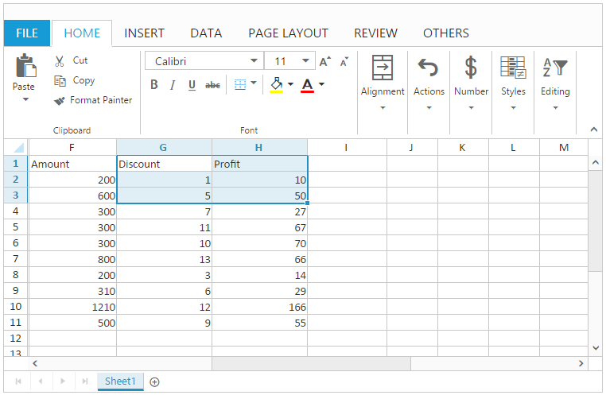

# Clipboard in JavaScript Spreadsheet

The Spreadsheet provides support for the clipboard operations (cut, copy, and paste). Clipboard operations can be enabled or disabled by setting [`allowClipboard`](https://help.syncfusion.com/api/js/ejspreadsheet#members:allowclipboard "allowClipboard") property in Spreadsheet.
By default [`allowClipboard`](https://help.syncfusion.com/api/js/ejspreadsheet#members:allowclipboard "allowClipboard") property is `true`.  

## Cut

This function cuts the selected range values and make it available in clipboard.

You can do this by one of the following ways. 

* Using "Ctrl + X" key.
* Using Cut button of HOME tab in ribbon to perform cut operation.
* Using Cut option in Context Menu.
* Using [`cut`](https://help.syncfusion.com/api/js/ejspreadsheet#methods:xlclipboard-cut "cut") method.

## Copy

This function copies the selected range values and make it available in clipboard.

You can do this by one of the following ways. 

* Using "Ctrl + C" key.
* Using Copy button of HOME tab in ribbon to perform copy operation.
* Using Copy option in Context Menu.
* Using [`copy`](https://help.syncfusion.com/api/js/ejspreadsheet#methods:xlclipboard-copy "copy") method.

## Paste

This function pastes the clipboard content to newly selected range. If you perform cut paste, clipboard contents are cleared whereas in copy paste the clipboard contents are maintained. 

You have following options in Paste.

* Paste Special - You can paste the values with formatting.
* Paste - You can paste only the values.

N> The default paste option is Paste Special. This is working only within the current Spreadsheet. If you copy the content from other sources, it will paste only the values in the Spreadsheet.

You can do this by one of the following ways,

* Using "Ctrl + V" key.
* Using Paste button of HOME tab in ribbon to perform paste operation.
* Using Paste option in Context Menu.
* Using [`paste`](https://help.syncfusion.com/api/js/ejspreadsheet#methods:xlclipboard-paste "paste") method.

The following code example describes the above behavior.






$(function () {
    $("#Spreadsheet").ejSpreadsheet({
        // the datasource "window.defaultData" is referred from 'http://js.syncfusion.com/demos/web/scripts/xljsondata.min.js'
        sheets: [{
            rangeSettings: [{ dataSource: window.defaultData }],                               
        }],
        allowClipboard: true,
        loadComplete: "loadComplete"
    });
});
function loadComplete() {
    var excelClip = this.XLClipboard;
    this.performSelection("G1:H3");
    excelClip.cut(); // Cut the selected cells
    //excelClip.copy();//Copy the selected cells.
    this.performSelection("J4");
    excelClip.paste();
}


The following output is displayed as a result of the above code example.

N> Similarly you can perform clipboard operations for shapes (Chart and Image).