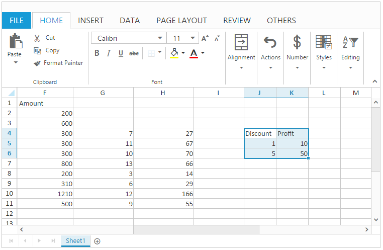

# Clipboard

A clipboard is a temporary storage area for data that the user wants to copy from one place to another. When the user copies the selected content, it's stored in the clipboard buffer until it's pasted. 

You can use [`allowClipboard`](https://help.syncfusion.com/js/api/ejspreadsheet#members:allowclipboard "allowClipboard") property to enable/disable this feature. You have following clipboard operations.

* Cut
* Copy
* Paste

The following code example describes the above behavior.






$(function () {
    $("#Spreadsheet").ejSpreadsheet({
        // the datasource "window.defaultData" is referred from 'http://js.syncfusion.com/demos/web/scripts/xljsondata.min.js'
        sheets: [{
            rangeSettings: [{ dataSource: window.defaultData, startCell: "A1" }],                               
        }],
        allowClipboard: true,
        loadComplete: "loadComplete"
    });
});
function loadComplete() {
    var xlClip = this.XLObj.XLClipboard;
    this.XLObj.performSelection("A1:C3");
}


The following output is displayed as a result of the above code example.

## Cut

This function removes the currently selected text and places it on the clipboard. The clipboard is a temporary storage for the last item you've cut.

You can do this by one of the following ways. 

* By pressing "Ctrl-X" or using Cut button of HOME tab in ribbon to perform cut operation.
* Using [`cut`](https://help.syncfusion.com/js/api/ejspreadsheet#methods:xlclipboard-cut "cut") method.

## Copy

This function copies the currently selected text and places it on the clipboard. The clipboard is a temporary storage for the last item you've copied.

You can do this by one of the following ways. 

* By pressing "Ctrl-C" or using Copy button of HOME tab in ribbon to perform copy operation.
* Using [`copy`](https://help.syncfusion.com/js/api/ejspreadsheet#methods:xlclipboard-copy "copy") method.

## Paste

This function pastes the content from the clipboard to somewhere else and clears the clipboard. You have following options in Paste.

* Paste Special - You can paste the values with formatting.
* Paste - You can paste only the values.

N> The default paste option is Paste Special.

You can do this by one of the following ways,

* By pressing "Ctrl-V" or using Paste button of HOME tab in ribbon to perform paste operation.
* Using [`paste`](https://help.syncfusion.com/js/api/ejspreadsheet#methods:xlclipboard-paste "paste") method.

The following code example describes the above behavior.






$(function () {
    $("#Spreadsheet").ejSpreadsheet({
        // the datasource "window.defaultData" is referred from 'http://js.syncfusion.com/demos/web/scripts/xljsondata.min.js'
        sheets: [{
            rangeSettings: [{ dataSource: window.defaultData, startCell: "A1" }],                               
        }],
        allowClipboard: true,
        loadComplete: "loadComplete"
    });
});
function loadComplete() {
    var xlClip = this.XLObj.XLClipboard;
    this.XLObj.performSelection("A1:C3");
    xlClip.cut(); // Cut the selected cells
    //xlClip.copy();//Copy the selected cells.
    this.XLObj.performSelection("J4");
    xlClip.paste();
}


The following output is displayed as a result of the above code example.

