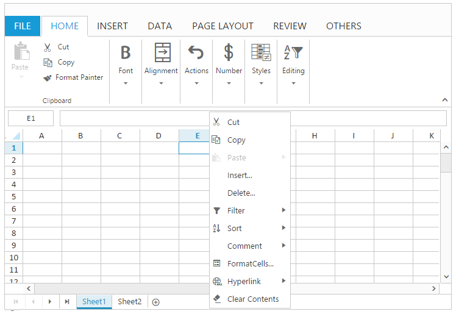
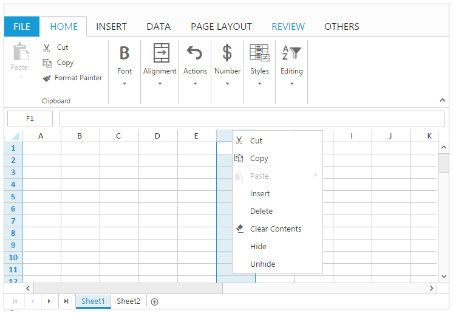
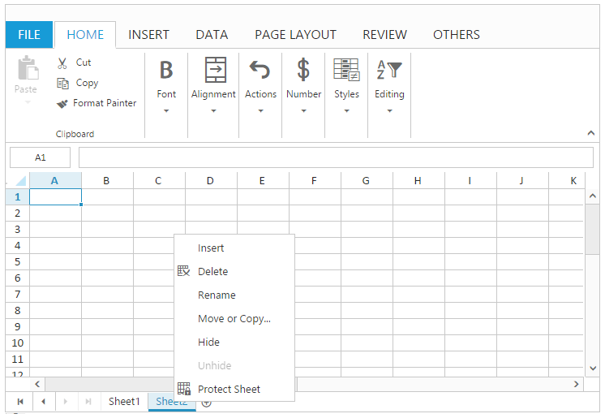
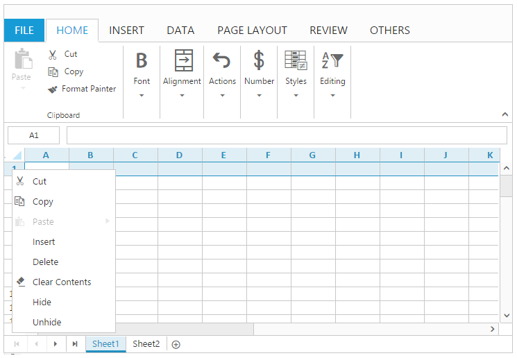

# Context Menu

Context Menu is used to improve user interaction with Spreadsheet. This will open when right clicking on Spreadsheet elements. You can use [`enableContextMenu`](http://help.syncfusion.com/js/api/ejspreadsheet#members:enablecontextmenu "enableContextMenu") property to enable/disable context menu. 

## Types Of Context Menu

You have following context menus in ejSpreadsheet.

* Cell Context Menu.
* Column Header Context Menu.
* Pager Context Menu.
* Row Header Context Menu.

The following code example describes the above behavior.



 



$(function () {
    $("#Spreadsheet").ejSpreadsheet({                                            
        enableContextMenu: true,
    });
});


### Cell Context Menu

The following output is displayed when right click on a cell.

### Column Header Context Menu

The following output is displayed when right click on a column header.

### Pager Context Menu

The following output is displayed when right click on a pager.

### Row Header Context Menu

The following output is displayed when right click on a row header.

## Default Context Menu items

You can use some default items in context menu. Please find the below table for default context menu items and its actions.

<table>
    <colgroup><col width= "225px"/><col width = "125px"/></colgroup>
    <tr><th>Section </th><th>Menu items </th><th>Action </th></tr>
    <tr><td>Row Cell </td><td>Cut </td><td>Cut the selected cells content to the clipboard, so that you can paste it to somewhere else. </td></tr>
    <tr><td> </td><td>Copy  </td><td>Copy the selected cells content to the clipboard, so that you can paste it to somewhere else. </td></tr>
    <tr><td> </td><td>Paste </td><td>Paste the content from clipboard to spreadsheet. </td></tr>
    <tr><td> </td><td>Insert </td><td>Insert new cells or rows or columns to worksheet. </td></tr>
    <tr><td> </td><td>Delete </td><td>Delete existing cells or rows or columns from worksheet. </td></tr>
    <tr><td> </td><td>Sort </td><td>Perform sorting to the selected range of cells by ascending or descending. </td></tr>
    <tr><td> </td><td>Filter </td><td>Perform filtering to the selected cells based an active cell's value or active cell's color. </td></tr>
    <tr><td> </td><td>Hyperlink </td><td>Create a link in the spreadsheet for quick access to webpages or worksheet reference. </td></tr>
    <tr><td> </td><td>Comment </td><td>Add a note or extra information about the cells. </td></tr>
    <tr><td> </td><td>Format Cells </td><td>Apply number format to the selected cells. </td></tr>
    <tr><td> </td><td>Clear Contents </td><td>Delete the contents in the selected cells. </td></tr>
    <tr><td>Row Header / Column Header </td><td>Cut </td><td>Cut the selected cells content to the clipboard, so that you can paste it to somewhere else. </td></tr>
    <tr><td> </td><td>Copy  </td><td>Copy the selected cells content to the clipboard, so that you can paste it to somewhere else. </td></tr>
    <tr><td> </td><td>Paste </td><td>Paste the content from clipboard to spreadsheet. </td></tr>
    <tr><td> </td><td>Clear Contents </td><td>Delete the contents in the selected cells. </td></tr>
    <tr><td> </td><td>Insert </td><td>Insert new cells or rows or columns to worksheet. </td></tr>
    <tr><td> </td><td>Delete </td><td>Delete existing cells or rows or columns from worksheet. </td></tr>
    <tr><td> </td><td>Hide </td><td>Hide the selected worksheet. </td></tr>
    <tr><td> </td><td>Unhide </td><td>Opens unhide dialog to unhide worksheet. </td></tr>
    <tr><td>Pager </td><td>Insert </td><td>Insert new worksheet to spreadsheet. </td></tr>
    <tr><td> </td><td>Delete </td><td>Delete the selected worksheet from spreadsheet. </td></tr>
    <tr><td> </td><td>Move or copy </td><td>Opens move or copy dialog to move or create duplicate worksheet. </td></tr>
    <tr><td> </td><td>Rename </td><td>Rename the selected work sheet. </td></tr>
    <tr><td> </td><td>Protect Sheet </td><td>Prevent unwanted changes from others by limiting their ability to edit. </td></tr>
    <tr><td> </td><td>Hide  </td><td>Hide the selected worksheet. </td></tr>
    <tr><td> </td><td>Unhide </td><td>Opens unhide dialog to unhide worksheet. </td></tr>
</table>
