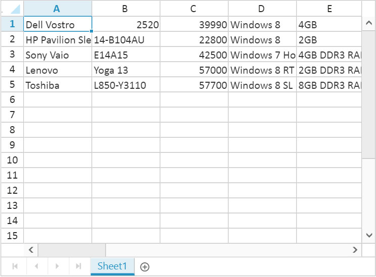

# Data Binding in JavaScript Spreadsheet

Spreadsheet can be populated with external datasource using [`dataSource`](https://help.syncfusion.com/api/js/ejspreadsheet#members:sheets-datasource "dataSource") property. The [`dataSource`](https://help.syncfusion.com/api/js/ejspreadsheet#members:sheets-datasource "dataSource") property can be assigned either with the instance of [`ej.DataManager`](https://help.syncfusion.com/api/js/ejdatamanager "ej.DataManager") or JSON data array collection. Spreadsheet supports three different kinds of Data binding.

* Local Data
* Remote Data
* HTML Table Data

## Local Data

To bind local data to the Spreadsheet, you can assign a JSON array to the worksheet [`dataSource`](https://help.syncfusion.com/api/js/ejspreadsheet#members:sheets-datasource "dataSource") property. The following code illustrates how to bind local data to the Spreadsheet,





The following output is displayed as a result of the above code snippets.

## Remote Data

To bind remote data to the Spreadsheet, you can assign a service data as an instance of [`ej.DataManager`](https://help.syncfusion.com/api/js/ejdatamanager "ej.DataManager") to the worksheet [`dataSource`](https://help.syncfusion.com/api/js/ejspreadsheet#members:sheets-datasource "dataSource") property. The following code illustrates how to bind remote data to the Spreadsheet,





The following output is displayed as a result of the above code snippets.

### Offline Mode

To avoid sending post back request to server on every action, Spreadsheet allows user to create, update and delete data on client side. To enable this, set `offline` property of [`ej.DataManager`](https://help.syncfusion.com/api/js/ejdatamanager "ej.DataManager") as `true` to fetch all data from server on initial rendering of Spreadsheet and perform all operation on client side.

The following code illustrates offline data binding for Spreadsheet,





The following output is displayed as a result of the above code snippets.

N> For further reference about `offline` property in [`ej.DataManager`](https://help.syncfusion.com/api/js/ejdatamanager "ej.DataManager") refer following [`link`](https://help.syncfusion.com/js/datamanager/data-binding#offline-mode "link")

## HTML Table Data

An HTML Table element can also be used as the data source of Spreadsheet. To use HTML Table as data source, the table element should be passed to worksheet [`dataSource`](https://help.syncfusion.com/api/js/ejspreadsheet#members:sheets-datasource "dataSource") property of Spreadsheet as an instance of the [`ej.DataManager`](https://help.syncfusion.com/api/js/ejdatamanager "ej.DataManager"). The following code illustrates how to bind HTML Table data to the Spreadsheet,



<table id="Table1">
    <thead>
        <tr>
            <th>Laptop</th>
            <th>Model</th>
            <th>Price</th>
            <th>OS</th>
            <th>RAM</th>
            <th>ScreenSize</th>
        </tr>
    </thead>
    <tbody>
        <tr>
            <td>Dell Vostro</td>
            <td>2520</td>
            <td>39990</td>
            <td>Windows 8</td>
            <td>4GB</td>
            <td>15.6</td>
        </tr>
        <tr>
            <td>HP Pavilion Sleekbook</td>
            <td>14-B104AU</td>
            <td>22800</td>
            <td>Windows 8</td>
            <td>2GB</td>
            <td>14</td>
        </tr>
        <tr>
            <td>Sony Vaio</td>
            <td>E14A15</td>
            <td>42500</td>
            <td>Windows 7 Home Premium</td>
            <td>4GB DDR3 RAM</td>
            <td>14</td>
        </tr>
        <tr>
            <td>Lenovo</td>
            <td>Yoga 13</td>
            <td>57000</td>
            <td>Windows 8 RT</td>
            <td>2GB DDR3 RAM</td>
            <td>11.6</td>
        </tr>
        <tr>
            <td>Toshiba</td>
            <td>L850-Y3110</td>
            <td>57700</td>
            <td>Windows 8 SL</td>
            <td>8GB DDR3 RAM</td>
            <td>15.6</td>
        </tr>
    </tbody>
</table>



The following output is displayed as a result of the above code snippets.

## Ways to bind data in Spreadsheet

You can bind data to Spreadsheet in following ways,

* Cell binding
* Range binding
* Sheet binding

### Cell Binding

Spreadsheet can bind data for individual cells in a sheet. The data may contain value, style, format, comment and hyperlink. The individual cell properties are listed below,

<table>
    <tr>
        <th>
            Properties
        </th>
        <th>
            Description
        </th>
    </tr>
    <tr>
        <td>
            {{'[`index`](https://help.syncfusion.com/api/js/ejspreadsheet#members:sheets-rows-cells-index "index")'| markdownify }}
        </td>
        <td>
            To specify particular cell
        </td>
    </tr>
    <tr>
        <td>
            {{'[`value`](https://help.syncfusion.com/api/js/ejspreadsheet#members:sheets-rows-cells-value "value")'| markdownify }}
        </td>
        <td>
            To specify value. It may be string, integer, formula etc.
        </td>
    </tr>
    <tr>
        <td>
            {{'[`style`](https://help.syncfusion.com/api/js/ejspreadsheet#members:sheets-rows-cells-style "style")'| markdownify }}
        </td>
        <td>
            To specify style in the cell.
             <table class="params">
            <thead>
            <tr>
            <th>Properties</th>
            <th>Description</th>
            </tr>
            </thead>
            <tbody>
            <tr>
            <td>{{'[`backgroundColor`](https://help.syncfusion.com/api/js/ejspreadsheet#members:sheets-rows-cells-style-backgroundcolor "backgroundColor")'| markdownify }} </td>
            <td>Specifies the background color of a cell in the Spreadsheet.</td>
            </tr>
            <tr>
            <td>{{'[`color`](https://help.syncfusion.com/api/js/ejspreadsheet#members:sheets-rows-cells-style-color "color")'| markdownify }}</td>
            <td>Specifies the font color of a cell in the Spreadsheet.</td>
            </tr>
            <tr>
            <td>{{'[`fontWeight `](https://help.syncfusion.com/api/js/ejspreadsheet#members:sheets-rows-cells-style-fontweight "fontWeight ")'| markdownify }}</td>
            <td>Specifies the font weight of a cell in the Spreadsheet.</td>
            </tr>
            </tbody>
            </table>
        </td>
    </tr>
    <tr>
        <td>
            {{'[`format`](https://help.syncfusion.com/api/js/ejspreadsheet#members:sheets-rows-cells-format "format")'| markdownify }}
        </td>
        <td>
            To specify number format in the cell.
            <table class="params">
            <thead>
            <tr>
            <th>Properties</th>
            <th>Description</th>
            </tr>
            </thead>
            <tbody>
            <tr>
            <td>{{'[`type `](https://help.syncfusion.com/api/js/ejspreadsheet#members:sheets-rows-cells-format-type "type ")'| markdownify }}  </td>
            <td>Specifies the type of the format in Spreadsheet.</td>
            </tr>
            <tr>
            <td>{{'[`decimalPlaces  `](https://help.syncfusion.com/api/js/ejspreadsheet#members:sheets-rows-cells-format-decimalplaces "decimalPlaces  ")'| markdownify }} </td>
            <td>Specifies the number of decimal places for the given input.</td>
            </tr>
            <tr>
            <td>{{'[`formatStr  `](https://help.syncfusion.com/api/js/ejspreadsheet#members:sheets-rows-cells-format-formatstr "formatStr  ")'| markdownify }} </td>
            <td>Specifies the string format for the given input.</td>
            </tr>
            <tr>
            <td>{{'[`thousandSeparator `](https://help.syncfusion.com/api/js/ejspreadsheet#members:sheets-rows-cells-format-thousandseparator "thousandSeparator ")'| markdownify }} </td>
            <td>Specifies the thousand separator for the given input.</td>
            </tr>
            </tbody>
            </table>
        </td>
    </tr>
    <tr>
        <td>
            {{'[`comment`](https://help.syncfusion.com/api/js/ejspreadsheet#members:sheets-rows-cells-comment "comment")'| markdownify }}
        </td>
        <td>
            To specify comment in the cell
            <table class="params">
            <thead>
            <tr>
            <th>Properties</th>
            <th>Description</th>
            </tr>
            </thead>
            <tbody>
            <tr>
            <td>{{'[`isVisible `](https://help.syncfusion.com/api/js/ejspreadsheet#members:sheets-rows-cells-comment-isvisible "isVisible ")'| markdownify }}</td>
            <td>Indicates whether to show or hide comments in Spreadsheet.</td>
            </tr><tr>
            <td>{{'[`value `](https://help.syncfusion.com/api/js/ejspreadsheet#members:sheets-rows-cells-comment-value "value ")'| markdownify }}</td>
            <td>Specifies the value for the comment in Spreadsheet.</td>
            </tr>
            </tbody>
            </table>
        </td>
    </tr>
    <tr>        
        <td>
            {{'[`hyperlink`](https://help.syncfusion.com/api/js/ejspreadsheet#members:sheets-rows-cells-hyperlink "hyperlink")'| markdownify }}
        </td>
        <td>
            To specify hyperlink in the cell.
            <table class="params">
            <thead>
            <tr>
            <th>Properties</th>
            <th>Description</th>
            </tr>
            </thead>
            <tbody>
            <tr>
            <td>{{'[`webAddr `](https://help.syncfusion.com/api/js/ejspreadsheet#members:sheets-rows-cells-hyperlink-webaddr "webAddr ")'| markdownify }}</td>
            <td>Specifies the web address for the hyperlink of a cell.</td>
            </tr>
            <tr>
            <td>{{'[`cellAddr `](https://help.syncfusion.com/api/js/ejspreadsheet#members:sheets-rows-cells-hyperlink-celladdr "cellAddr ")'| markdownify }}</td>
            <td>Specifies the cell address for the hyperlink of a cell.</td>
            </tr>
            <tr>
            <td>{{'[`sheetIndex  `](https://help.syncfusion.com/api/js/ejspreadsheet#members:sheets-rows-cells-hyperlink-sheetindex "sheetIndex  ")'| markdownify }}</td>
            <td>Specifies the sheet index to which the cell is referred.</td>
            </tr>
            </tbody>
            </table>
        </td>
    </tr>
    <tr>        
        <td>
            {{'[`isLocked`](https://help.syncfusion.com/api/js/ejspreadsheet#members:sheets-rows-cells-islocked "isLocked")'| markdownify }}
        </td>
        <td>
            To lock or unlock a specified cell
        </td>
    </tr>
</table>

The individual row properties are listed below,

<table>
    <tr>
        <th>
            Properties
        </th>
        <th>
            Description
        </th>
    </tr>
    <tr>
        <td>
            {{'[`index`](https://help.syncfusion.com/api/js/ejspreadsheet#members:sheets-rows-index "index")'| markdownify }}
        </td>
        <td>
            To specify particular row
        </td>
    </tr>
    <tr>
        <td>
             {{'[`height`](https://help.syncfusion.com/api/js/ejspreadsheet#members:sheets-rows-height "height")'| markdownify }}
        </td>
        <td>
            To specify height in the row
        </td>
    </tr>
</table>

You can specify particular row with `index` property and its height with `height` property in the [`rows`](https://help.syncfusion.com/api/js/ejspreadsheet#members:sheets-rows "rows") and [`cells`](https://help.syncfusion.com/api/js/ejspreadsheet#members:sheets-rows-cells "cells") property collection. The following code illustrates cell binding in Spreadsheet,





The following output is displayed as a result of the above code snippets.

N> To get the active sheet index and data settings in Spreadsheet, use [`getActiveSheetIndex`](https://help.syncfusion.com/api/js/ejspreadsheet#methods:getactivesheetindex "getActiveSheetIndex") and [`getDataSettings`](https://help.syncfusion.com/api/js/ejspreadsheet#methods:getdatasettings "getDataSettings") methods.

### Range Binding

Spreadsheet can bind data for one or more range in a sheet using [`rangeSettings`](https://help.syncfusion.com/api/js/ejspreadsheet#members:sheets-rangesettings "rangeSettings"). The individual range properties are listed below,

<table>
    <tr>
        <th>
            Properties
        </th>
        <th>
            Description
        </th>
    </tr>
    <tr>
        <td>
            {{'[`dataSource`](https://help.syncfusion.com/api/js/ejspreadsheet#members:sheets-rangesettings-datasource "dataSource")'| markdownify }}
        </td>
        <td>
            To specify JSON or {{'[`ej.DataManager`](https://help.syncfusion.com/api/js/ejdatamanager "ej.DataManager")'| markdownify }}
        </td>
    </tr>
    <tr>    
        <td>
            {{'[`query`](https://help.syncfusion.com/api/js/ejspreadsheet#members:sheets-rangesettings-query "query")'| markdownify }}
        </td>
        <td>
            To specify query for {{'[`ej.DataManager`](https://help.syncfusion.com/api/js/ejdatamanager "ej.DataManager")'| markdownify }}
        </td>
    </tr>
    <tr>
        <td>    
            {{'[`startCell`](https://help.syncfusion.com/api/js/ejspreadsheet#members:sheets-rangesettings-startcell "startCell")'| markdownify }}
        </td>
        <td>
            To specify start cell of a range
        </td>
    </tr>
    <tr>
        <td>
            {{'[`primarykey`](https://help.syncfusion.com/api/js/ejspreadsheet#members:sheets-rangesettings-primarykey "primarykey")'| markdownify }}
        </td>
        <td>
            To specify data source primary key
        </td>
    </tr>
    <tr>
        <td>
            {{'[`showHeader`](https://help.syncfusion.com/api/js/ejspreadsheet#members:sheets-rangesettings-showheader "showHeader")'| markdownify }}
        </td>
        <td>
            To show data source header
        </td>
    </tr>
    <tr>
        <td>
            {{'[`headerStyles`](https://help.syncfusion.com/api/js/ejspreadsheet#members:sheets-rangesettings-headerstyles "headerStyles")'| markdownify }}
        </td>
        <td>
            To specify header styles
        </td>
    </tr>
</table>

The following code illustrates range binding in Spreadsheet





The following output is displayed as a result of the above code snippets.

### Sheet Binding

Spreadsheet can bind data for a sheet. The individual sheet properties are listed below,

<table>
    <tr>
        <th>
            Properties
        </th>
        <th>
            Description
        </th>
    </tr>
    <tr>
        <td>
            {{'[`dataSource`](https://help.syncfusion.com/api/js/ejspreadsheet#members:sheets-datasource "dataSource")'| markdownify }}
        </td>
        <td>
            To specify JSON or {{'[`ej.DataManager`](https://help.syncfusion.com/api/js/ejdatamanager "ej.DataManager")'| markdownify }}
        </td>
    </tr>
    <tr>
        <td>
            {{'[`query`](https://help.syncfusion.com/api/js/ejspreadsheet#members:sheets-query "query")'| markdownify }}
        </td>
        <td>
            To specify query for {{'[`ej.DataManager`](https://help.syncfusion.com/api/js/ejdatamanager "ej.DataManager")'| markdownify }}
        </td>
    </tr>
    <tr>
        <td>
            {{'[`startCell`](https://help.syncfusion.com/api/js/ejspreadsheet#members:sheets-startcell "startCell")'| markdownify }}
        </td>
        <td>
            To specify start cell of a range
        </td>
    </tr>
    <tr>
        <td>
            {{'[`primarykey`](https://help.syncfusion.com/api/js/ejspreadsheet#members:sheets-primarykey "primarykey")'| markdownify }}
        </td>
        <td>
            To specify data source primary key
        </td>
    </tr>
    <tr>
        <td>
            {{'[`showHeader`](https://help.syncfusion.com/api/js/ejspreadsheet#members:sheets-showheader "showHeader")'| markdownify }}
        </td>
        <td>
            To show data source header
        </td>
    </tr>
    <tr>
        <td>
            {{'[`headerStyles`](https://help.syncfusion.com/api/js/ejspreadsheet#members:sheets-headerstyles "headerStyles")'| markdownify }}
        </td>
        <td>
            To specify header styles
        </td>
    </tr>
    <tr>
        <td>
            {{'[`fieldAsColumnHeader`](https://help.syncfusion.com/api/js/ejspreadsheet#members:sheets-fieldascolumnheader  "fieldAsColumnHeader")'| markdownify }}
        </td>
        <td>
            To show data source fields in column header
        </td>
    </tr>
    <tr>
        <td>
            {{'[`colCount`](https://help.syncfusion.com/api/js/ejspreadsheet#members:sheets-colcount  "colCount")'| markdownify }}
        </td>
        <td>
             To define column count in the Spreadsheet.
        </td>
    </tr>
    <tr>
        <td>
            {{'[`columnWidth`](https://help.syncfusion.com/api/js/ejspreadsheet#members:sheets-columnwidth  "columnWidth")'| markdownify }}
        </td>
        <td>
             To define column width in the Spreadsheet.
        </td>
    </tr>
     <tr>
        <td>
            {{'[`rowCount`](https://help.syncfusion.com/api/js/ejspreadsheet#members:sheets-rowcount  "rowCount")'| markdownify }}
        </td>
        <td>
             To define row count in the Spreadsheet.
        </td>
    </tr>
    <tr>
        <td>
            {{'[`sheetName`](https://help.syncfusion.com/api/js/ejspreadsheet#members:sheets-sheetname  "sheetName")'| markdownify }}
        </td>
        <td>
            To specify the name for sheet in the Spreadsheet.
        </td>
    </tr>
</table>

The following code illustrates sheet binding in Spreadsheet





The following output is displayed as a result of the above code snippets. 

