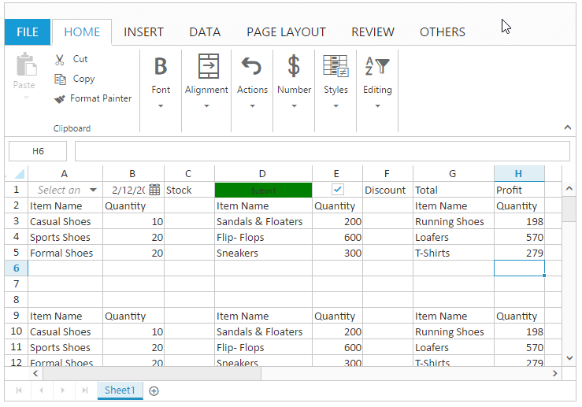
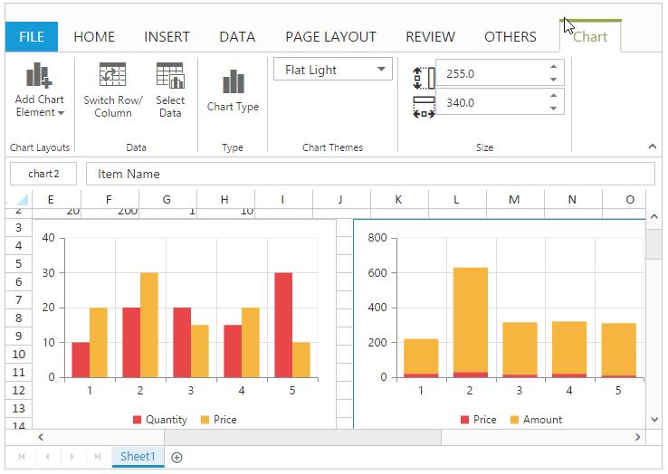
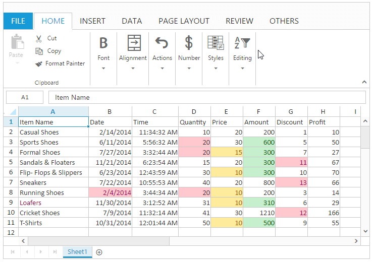
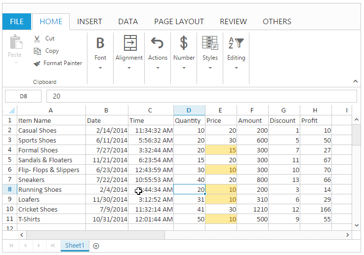
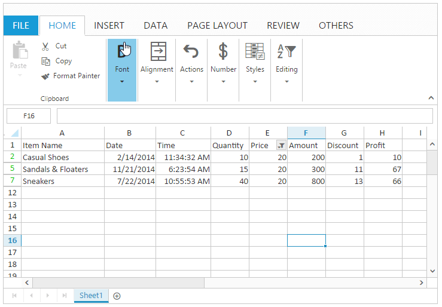
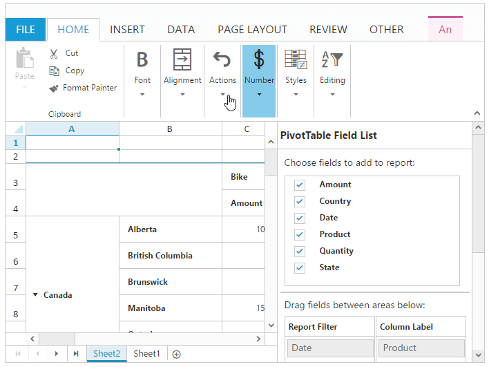
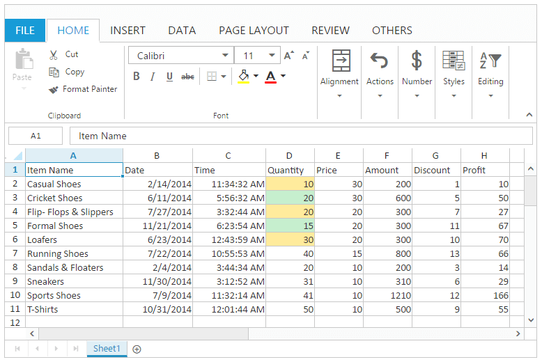
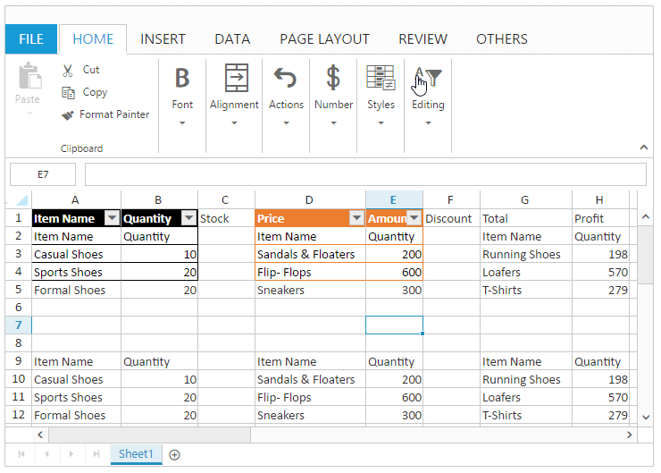

---
layout: post
title: Data presentation in Essential JS Spreadsheet widget | Syncfusion
description: How to perform the proper representation of data with Syncfusion Essential Javascript Spreadsheet widget.
platform: js
control: Spreadsheet
documentation: ug
api: /api/js/ejspreadsheet
--- 

# Spreadsheet Data Presentation

Data presentation is helpful for proper representation of data in Spreadsheet. You have following features in Data Presentation.

* Cell types
* Chart
* Conditional formatting
* Filtering 
* Picture
* Pivot table
* Sorting 
* Table

## Cell Type

You can insert the controls like Button, Checkbox, Dropdown list and Date picker. You can use [`allowCellType`](https://help.syncfusion.com/api/js/ejspreadsheet#members:allowcelltype "allowCellType") property to enable/disable cell type operations.

To enable or disable auto rendering of cell type in the Spreadsheet use [`allowAutoCellType`](https://help.syncfusion.com/api/js/ejspreadsheet#members:allowautocelltype "allowAutoCellType") property.

### To insert a Cell Type.

You can insert the cell type to the selected range of cells by one of the following ways

* Using [`cellTypes`](https://help.syncfusion.com/api/js/ejspreadsheet#members:sheets-celltypes "cellTypes") property in sheets.
* Using [`addCellTypes`](https://help.syncfusion.com/api/js/ejspreadsheet#methods:xlcelltype-addcelltypes "addCellTypes") method. 

### To remove Cell Type

You can delete the cell type in the selected range of cells by using [`removeCellTypes`](https://help.syncfusion.com/api/js/ejspreadsheet#methods:xlcelltype-removecelltypes "removeCellTypes") method.

The following code example describes the above behavior. 






$(function () {
    $("#Spreadsheet").ejSpreadsheet({
        // the datasource "window.defaultData" is referred from 'http://js.syncfusion.com/demos/web/scripts/xljsondata.min.js'
        sheets: [{
            rangeSettings: [{ dataSource: window.defaultData }], 
            cellTypes: [{ 'range': 'A1', 'settings': { 'type': ej.Spreadsheet.CustomCellType.DropDownList, 'dataSourceRange': 'A2:A11' } },
                        { 'range': 'D1', 'settings': {"type" : ej.Spreadsheet.CustomCellType.Button, "text" : "Button1", "background-color" : "green" } }
                        { 'range': 'C1', 'settings': { 'type': ej.Spreadsheet.CustomCellType.DropDownList, 'dataSourceRange': 'A2:A11' } }]                           
        }],
        allowCellType: true,
        loadComplete: "loadComplete"
     });
});
function loadComplete() {
    var excelCellType = this.XLCellType;
    if (!this.isImport) {
        excelCellType.addCellTypes("B1", {"type" : ej.Spreadsheet.CustomCellType.DatePicker, 'value' : '2/12/2016'},  1);
        excelCellType.addCellTypes("E1", {"type" : ej.Spreadsheet.CustomCellType.CheckBox, "isChecked" : true },  1);
        excelCellType.removeCellTypes("C1");
    }
}


The following output is displayed as a result of the above code example.

## Chart

Chart is a graphical representation of data, that organizes and represents a set of numerical or qualitative data. It mostly displays the selected range of data in terms of x axis and y axis. You can use [`allowCharts`](https://help.syncfusion.com/api/js/ejspreadsheet#members:allowcharts "allowCharts") property to enable/disable chart operations.

### Types of Chart

The following types of charts are available in Spreadsheet.

* Area Chart
* Bar Chart
* Column Chart
* Line Chart
* Pie Chart
* Radar Chart
* Scatter Chart

You can create the Chart by one of the following ways,

* Using "Chart Type" button to Select the type of chart under Charts group of INSERT Tab in ribbon.
* Using [`createChart`](https://help.syncfusion.com/api/js/ejspreadsheet#methods:xlchart-createchart "createChart") method to create the chart.

### Chart Customization

You can perform the following customizations for chart. These are available in DESIGN Tab which is enabled while clicking the chart element.

<table>
    <colgroup><col width="180px" /></colgroup>
    <tr><th>Feature</th><th>API</th><th>Description</th></tr>
    <tr><td>Add Chart Elements</td><td>{{'[`updateChartElement`](https://help.syncfusion.com/api/js/ejspreadsheet#methods:xlchart-updatechartelement  "updateChartElement")'| markdownify }}</td><td>You can add a chart element like chart axes, legends, chart title, axis title, data labels and grid lines.</td></tr>
    <tr><td>Switch Row/Column</td><td>{{'[`switchRowColumn`](https://help.syncfusion.com/api/js/ejspreadsheet#methods:xlchart-switchrowcolumn  "switchRowColumn")'| markdownify }}</td><td>You can switch the row of the chart to column of the chart and vice versa.</td></tr>
    <tr><td>Select Data</td><td>{{'[`changeDataRange`](https://help.syncfusion.com/api/js/ejspreadsheet#methods:xlchart-changedatarange  "changeDataRange")'| markdownify }}</td><td>You can modify the data source of Chart.</td></tr>
    <tr><td>Chart Type</td><td>{{'[`changeType`](https://help.syncfusion.com/api/js/ejspreadsheet#methods:xlchart-changetype  "changeType")'| markdownify }}</td><td>You can change the type of the chart using Chart Type dialog.</td></tr>
    <tr><td>Height and Width</td><td>{{'[`height`](https://help.syncfusion.com/api/js/ejspreadsheet#members:chartsettings-height  "height")'| markdownify }} and {{'[`width`](https://help.syncfusion.com/api/js/ejspreadsheet#members:chartsettings-width  "width")'| markdownify }}</td><td>You can change the height and width of the chart.</td></tr>
    <tr><td>Chart Themes</td><td>{{'[`changeTheme`](https://help.syncfusion.com/api/js/ejspreadsheet#methods:xlchart-changetheme "changeTheme")'| markdownify }}</td><td>You can change the theme of the chart. The available themes are saffron, lemon and azure in dark, light themes.</td></tr>
    <tr><td>Refresh Chart</td><td>{{'[`refreshChart`](https://help.syncfusion.com/api/js/ejspreadsheet#methods:xlchart-refreshchart  "refreshChart")'| markdownify }}</td><td>To refresh the chart in the Spreadsheet.</td></tr>
    <tr><td>Resize Chart</td><td>{{'[`resizeChart`](https://help.syncfusion.com/api/js/ejspreadsheet#methods:xlchart-resizechart  "resizeChart")'| markdownify }}</td><td>To resize the chart of specified id in the Spreadsheet.</td></tr>
</table>

The following code example describes the above behavior.





$(function () {
    $("#Spreadsheet").ejSpreadsheet({
        // the datasource "window.defaultData" is referred from 'http://js.syncfusion.com/demos/web/scripts/xljsondata.min.js'
        sheets: [{
            rangeSettings: [{ dataSource: window.defaultData }],                               
        }],
        allowCharting: true,
        loadComplete: "loadComplete"
    });
});
function loadComplete() {
    if (!this.isImport) {
        this.XLChart.createChart("D1:E6", { type: "column", enable3D: false, marker: false, top: 40, left: 260, width: 340, height: 250 });
        this.performSelection("E1");
        this.XLChart.createChart("E1:F6", { type: "stackingcolumn", enable3D: false, marker: { visible: false }, top: 40, left: 620, width: 340, height: 250 });                     
    }
}


The following output is displayed as a result of the above code example.

## Conditional Formatting

Conditional formatting helps you to apply formats to a cell or range with certain color based on the cells values. You can use [`allowConditionalFormats`](https://help.syncfusion.com/api/js/ejspreadsheet#members:allowconditionalformats "allowConditionalFormats") property to enable/disable Conditional formats.

### Condition Definition

You can define conditions such as greater than, less than, between, equal to, text contains and date occurring for selected cells and defining value for condition. It highlights the specified cell. 
You can do this by one of the following ways,

* Using "Conditional Formatting" option in Conditional Formatting button of HOME Tab in ribbon to open the conditional formatting dialog.
* Using [`setCFRule`](https://help.syncfusion.com/api/js/ejspreadsheet#methods:xlcformat-setcfrule "setCFRule") method to define the condition.
* Using [`cFormatRule`](https://help.syncfusion.com/api/js/ejspreadsheet#members:sheets-cformatrule "cFormatRule") in `sheets` API.
* Using [`getCFRule`](https://help.syncfusion.com/api/js/ejspreadsheet#methods:xlcformat-getcfrule "getCFRule") method to get the defined condition.

Conditional Formatting have the following options in spreadsheet,

* Using [`action`](https://help.syncfusion.com/api/js/ejspreadsheet#members:sheets-cformatrule-action "action") in `cFormatRule` API you can specify the conditions to apply for the range of cells in Spreadsheet.
* Using [`color`](https://help.syncfusion.com/api/js/ejspreadsheet#members:sheets-cformatrule-color "color") in `cFormatRule` API, you can specify the color to apply for the range of cell while conditional formatting.
* Using [`inputs`](https://help.syncfusion.com/api/js/ejspreadsheet#members:sheets-cformatrule-inputs "inputs") in `cFormatRule` API, you can specify the inputs for conditional formatting in Spreadsheet.
* Using [`range`](https://help.syncfusion.com/api/js/ejspreadsheet#members:sheets-cformatrule-range "range") in `cFormatRule` API, you can specify the range for conditional formatting in Spreadsheet.

The following code example describes the above behavior.





$(function () {
   $("#Spreadsheet").ejSpreadsheet({
        // the datasource "window.defaultData" is referred from 'http://js.syncfusion.com/demos/web/scripts/xljsondata.min.js'
        sheets: [{
            rangeSettings: [{ dataSource: window.defaultData}],                               
        }],
        allowConditionalFormats: true,
        loadComplete: "loadComplete"
    });
});
function loadComplete() {
    var excelFormat = this.XLCFormat;
    if (!this.isImport) {
        excelFormat.setCFRule({ "action": "greaterthan", "inputs": ["10"], "color": "redft", "range": "G2:G11" });
        excelFormat.setCFRule({ "action": "lessthan", "inputs": ["20"], "color": "yellowft", "range": "E1:E11" });
        excelFormat.setCFRule({ "action": "between", "inputs": ["300", "600"], "color": "greenft", "range": "F2:F11" });
        excelFormat.setCFRule({ "action": "textcontains", "inputs": ["loafers"], "color": "redt", "range": "A1:A11" });
        excelFormat.setCFRule({ "action": "dateoccur", "inputs": ["02/04/2014"], "color": "redft", "range": "B1:B11" });
		excelFormat.setCFRule({ "action": "databar", "color": "redft", "range": "H1:H11" });
		excelFormat.setCFRule({action: ej.Spreadsheet.CFormatRule.ColorScale, color: ej.Spreadsheet.ColorScale.GreenYellowRed, range: "D2:D11"});
    }
}


The following output is displayed as a result of the above code example.

### Clear Rules

You can clear the defined rules by using one of the following ways,

* Using "Clear Rules" option in Conditional Formatting button of HOME Tab in ribbon to clear the rule.
* Using [`clearCF`](https://help.syncfusion.com/api/js/ejspreadsheet#methods:xlcformat-clearcf "clearCF") method to clear the defined rules.

The following code example describes the above behavior.





$(function () {
    $("#Spreadsheet").ejSpreadsheet({
        // the datasource "window.defaultData" is referred from 'http://js.syncfusion.com/demos/web/scripts/xljsondata.min.js'
        sheets: [{
            rangeSettings: [{ dataSource: window.defaultData}],                               
        }],
        allowConditionalFormats: true,
        loadComplete: "loadComplete"
    });
});
function loadComplete() {
    var excelFormat = this.XLCFormat;
    if (!this.isImport) {
        excelFormat.setCFRule({ "action": "greaterthan", "inputs": ["10"], "color": "redft", "range": "G2:G11" });
        excelFormat.setCFRule({ "action": "lessthan", "inputs": ["20"], "color": "yellowft", "range": "E1:E11" });
        excelFormat.setCFRule({ "action": "between", "inputs": ["300", "600"], "color": "greenft", "range": "F2:F11" });
        excelFormat.clearCF(true, "G2:G11");
        excelFormat.clearCF(true, "F2:F11");
    }
}


The following output is displayed as a result of the above code example.

## Filtering

Filtering allows you to view specific rows in Spreadsheet, while hiding the other rows. When a filter is added to the header row, a drop-down menu appears in each cell of the header row. You can use [`allowFiltering`](https://help.syncfusion.com/api/js/ejspreadsheet#members:allowfiltering "allowFiltering") property to enable/disable filtering. 

You can apply filtering by one of the following ways,

* Using "Filter" option in Sort & Filter button under Editing group of HOME Tab in ribbon.
* Using "Filter" button under Sort and Filter group of DATA Tab in ribbon.
* Using[`filter`](https://help.syncfusion.com/api/js/ejspreadsheet#methods:xlfilter-filter "filter") method.

You have following options in Filtering.

* Filter by Value.
* Filter by Color.
* Clear Filter.

### Filter by Value

You can perform filtering by using number, string. The filtered rows are only visible in the Spreadsheet. All the other rows within the filtered range were hidden.

You can do this by one of the following ways,

* Using dropdown button in filter header to open the filter dialog.
* Using context menu to select "Filter by Selected Cell's Value" option in Filter. 
* Using [`filterByActiveCell`](https://help.syncfusion.com/api/js/ejspreadsheet#methods:xlfilter-filterbyactivecell "filterByActiveCell") method.

The following code example describes the above behavior.





$(function () {
    $("#Spreadsheet").ejSpreadsheet({
        // the datasource "window.defaultData" is referred from 'http://js.syncfusion.com/demos/web/scripts/xljsondata.min.js'
        sheets: [{
            rangeSettings: [{ dataSource: window.defaultData }],
        }],
        loadComplete: "loadComplete"
    });
});
function loadComplete() {
    var excelFilter = this.XLFilter;
    if (!this.isImport) {
        this.performSelection("E2");
        excelFilter.filterByActiveCell();
    }
}


The following output is displayed as a result of the above code example.

### Filter by Color

You can perform filtering by the selected cell color or font color. The filtered rows are only visible in the Spreadsheet. You can do this by clicking "Filter by Color" option in filter dialog to select filter by cell color or font color.

N> This option is only available if the selected range of cells having any color.

### Clear Filter

You can clear the filtering to show all the filtered rows in the spreadsheet within the filtered range.

You can do this by one of the following ways,

* Using "Clear Filter" option in the filter dialog.
* Using context menu to select "Clear Filter" option in Filter.
* Using "Clear Filter" option in "Sort & Filter" button under Editing group of HOME Tab in ribbon.
* Using "Clear Filter" option under Sort and Filter group of DATA Tab in ribbon.
* Using [`clearFilter`](https://help.syncfusion.com/api/js/ejspreadsheet#methods:xlfilter-clearfilter "clearFilter") method to perform clear filtering.

The following code example describes the above behavior.





$(function () {
    $("#Spreadsheet").ejSpreadsheet({
        // the datasource "window.defaultData" is referred from 'http://js.syncfusion.com/demos/web/scripts/xljsondata.min.js'
        sheets: [{
            rangeSettings: [{ dataSource: window.defaultData }],                               
        }],
        loadComplete: "loadComplete"
    });
});
function loadComplete() {
    var excelFilter = this.XLFilter;
    if (!this.isImport) {
        this.performSelection("E2");
        excelFilter.filterByActiveCell();
        excelFilter.clearFilter();
    }
}


The following output is displayed as a result of the above code example.

## Picture

You can insert a picture by selecting the "Pictures" button under Illustrations group of INSERT Tab in ribbon, To enable/disable picture operations in spreadsheet use [`allowPictures`](https://help.syncfusion.com/api/js/ejspreadsheet#members:picturesettings-allowpictures "allowPictures") option in [`pictureSettings`](https://help.syncfusion.com/api/js/ejspreadsheet#members:picturesettings "pictureSettings") 

You can also insert a picture by using[`setPicture`](https://help.syncfusion.com/api/js/ejspreadsheet#methods:xlshape-setpicture "setPicture") method.

### Picture Customization

You can perform the following customizations for picture. These are available in DESIGN Tab which is enabled while clicking the picture element.

<table>
    <colgroup><col width="150px" /></colgroup>
    <tr><th>Feature</th><th>API</th><th>Description</th></tr>
    <tr><td>Change Picture</td><td> {{'[`changePicture`](https://help.syncfusion.com/api/js/ejspreadsheet#methods:xlshape-changepicture  "changePicture")'| markdownify }}</td><td>You can change the picture with existing picture.</td></tr>
    <tr><td>Reset Picture</td><td> {{'[`resetPicture`](https://help.syncfusion.com/api/js/ejspreadsheet#methods:xlshape-resetpicture  "resetPicture")'| markdownify }}</td><td>You can reset the changes done in the picture such as border changes, height and width changes.</td></tr>
    <tr><td>Picture Border</td><td> {{'[`changePictureBorder`](https://help.syncfusion.com/api/js/ejspreadsheet#methods:xlshape-changepictureborder  "changePictureBorder")'| markdownify }}</td><td>You can add border to the picture. You have Border Color, Border Type and Border weight options to draw a border.</td></tr>
    <tr><td>Height and Width</td><td> {{'[`height`](https://help.syncfusion.com/api/js/ejspreadsheet#members:picturesettings-height  "height")'| markdownify }} and {{'[`width`](https://help.syncfusion.com/api/js/ejspreadsheet#members:picturesettings-width  "width")'| markdownify }}</td><td>You can change the height and width of the picture.</td></tr>
</table>

## Pivot Table

Pivot table is a program tool that allows you to reorganize and summarize selected columns and rows of data to obtain a desired report. You can use [`enablePivotTable`](https://help.syncfusion.com/api/js/ejspreadsheet#members:enablepivottable "enablePivotTable") property to enable/disable pivot table operations. 

You can do this by one of the following ways,

* Using "Pivot Table" option under Tables group of INSERT Tab in ribbon.
* Using [`createPivotTable`](https://help.syncfusion.com/api/js/ejspreadsheet#methods:xlpivot-createpivottable "createPivotTable") method to create pivot table
* Using [`deletePivotTable`](https://help.syncfusion.com/api/js/ejspreadsheet#methods:xlpivot-deletepivottable "deletePivotTable") method to remove the pivot table.

In Pivot table we have following options, 

* Using [`clearPivotFieldList`](https://help.syncfusion.com/api/js/ejspreadsheet#methods:xlpivot-clearpivotfieldlist "clearPivotFieldList") method to clear the pivot table list in Spreadsheet.
* Using [`refreshDataSource`](https://help.syncfusion.com/api/js/ejspreadsheet#methods:xlpivot-refreshdatasource "refreshDataSource") method to refresh data in pivot table.
* Using [`showActivationPanel`](https://help.syncfusion.com/api/js/ejspreadsheet#methods:showactivationpanel "showActivationPanel") method to show the pivot table activationPanel in the Spreadsheet.
* Using [`hideActivationPanel`](https://help.syncfusion.com/api/js/ejspreadsheet#methods:hideactivationpanel "hideActivationPanel") method to hide the pivot table activationPanel in the Spreadsheet.
* Using [`apWidth `](https://help.syncfusion.com/api/js/ejspreadsheet#members:apwidth "apWidth ") method to define the width of the activation panel in Spreadsheet.

The following code example describes the above behavior.





$(function () {
    $("#Spreadsheet").ejSpreadsheet({
        // the datasource "window.pivot" is referred from 'http://js.syncfusion.com/demos/web/scripts/xljsondata.min.js'
        sheets: [{
            rangeSettings: [{ dataSource: window.pivot }],                               
        }],
        enablePivotTable: true,
        loadComplete: "loadComplete"
    });
});
function loadComplete() {
    if (!this.isImport) {
        var settings = {
            rows: [{fieldName: "Country"}, { fieldName: "State"}],
            columns: [{fieldName: "Product"}],
            values: [{fieldName: "Amount"},{fieldName: "Quantity"}],
            filters: [{fieldName: "Date"}]
        };
        this.XLPivot.createPivotTable("Sheet1!$A$1:$F$25", null, null, settings); 
        //this.XLPivot.deletePivotTable("name");
    }
}


The following output is displayed as a result of the above code example.

## Sorting

Sorting helps you to arrange the data to particular order in a selected range of cells. You can use [`allowSorting`](https://help.syncfusion.com/api/js/ejspreadsheet#members:allowsorting "allowSorting") property to enable/disable sorting. 

You have following options in sorting.

* Sort by Ascending or Descending.
* Sort by Color.

### Sort by Ascending and Descending

You can perform number sorting by ascending or descending and string sorting by A to Z or Z to A to arrange the data. 

You can do this by one of the following ways,

* By choosing "Sort A to Z" or "Sort Z to A" in Sort & Filter button under Editing group of HOME Tab in ribbon. 
* Using "Sort A to Z" or "Sort Z to A" button in Sort & Filter group of DATA Tab in ribbon.
* Using context menu to select "Sort A to Z" or "Sort Z to A" for strings and option in Sort.
* Using "Sort A to Z" or "Sort Z to A" for strings an "Sort Smallest to Largest" or "Sort Largest to Smallest" for numbers in filter dialog.
* Using [`sortByRange`](https://help.syncfusion.com/api/js/ejspreadsheet#methods:xlsort-sortbyrange "sortByRange") method.

The following code example describes the above behavior.





$(function () {
    $("#Spreadsheet").ejSpreadsheet({
        // the datasource "window.defaultData" is referred from 'http://js.syncfusion.com/demos/web/scripts/xljsondata.min.js'
        sheets: [{
            rangeSettings: [{ dataSource: window.defaultData }],                               
        }],
        loadComplete: "loadComplete"
    });
});
function loadComplete() {
    var excelSort = this.XLSort, excelFormat = this.XLFormat;
    if (!this.isImport) {
        excelSort.sortByRange("A2:A10", "A", "ascending");
        excelSort.sortByRange("E2:E10", "E", "descending");     
    }
}


The following output is displayed as a result of the above code example.

### Sort by Color

You can perform sort by color to arrange the data based on the selected cell's background color or font color. This option is only available if the selected range of cells having any color.

You can do this by one of the following ways,

* Using "Sort By Color" option in filter dialog to perform sorting by cell color or font color.
* Using context menu to select "Put Selected Cell Color To The Top" or "Put Selected Font Color To The Top" in Sort option.
* Using [`sortByColor`](https://help.syncfusion.com/api/js/ejspreadsheet#methods:xlsort-sortbycolor "sortByColor") method. 

## Table

A table is a data structure that organizes information into rows and columns. You can use [`allowFormatAsTable`](https://help.syncfusion.com/api/js/ejspreadsheet#members:allowformatastable "allowFormatAsTable") property to enable/disable table operations. 

You can do this by one of the following ways,

* Using "Format As Table" under Styles group of HOME Tab in ribbon.
* Using Table option under Tables group of INSERT Tab in ribbon.
* Using [`createTable`](https://help.syncfusion.com/api/js/ejspreadsheet#methods:xlformat-createtable "createTable") method to insert a table and [`removeTable`](https://help.syncfusion.com/api/js/ejspreadsheet#methods:xlformat-removetable "removeTable") to delete a table.
* Using [`convertToRange`](https://help.syncfusion.com/api/js/ejspreadsheet#methods:xlformat-converttorange "convertToRange") method to convert table range to normal range.

### Table Customization

You can perform the following customizations for table. These are available in DESIGN Tab which is enabled while clicking the table.

<table>
    <colgroup><col width="150px" /></colgroup>
    <tr><th>Feature</th><th>Description</th></tr>
    <tr><td>Resize Table</td><td>You can resize the table only to increase row count.</td></tr>
    <tr><td>Convert to Range</td><td>You can remove the table using this option.</td></tr>
    <tr><td>First Column</td><td>You can highlight the first column of the table.</td></tr>
    <tr><td>Last Column</td><td>You can highlight the last column of the table.</td></tr>
    <tr><td>Total Row</td><td>You can insert a new row in the bottom of the table to display the total value of the last column. You can toggle this by using checkbox.</td></tr>
    <tr><td>Filter Button</td><td>You can able to hide or unhide the filter icons in the filter header of a table.</td></tr>
</table>

The following code example describes the above behavior.





$(function () {
    $("#Spreadsheet").ejSpreadsheet({
        // the datasource "window.bill" is referred from 'http://js.syncfusion.com/demos/web/scripts/xljsondata.min.js'
        sheets: [{
            rangeSettings: [{ dataSource: window.bill }],                               
        }],
        allowFormatAsTable: true,
        loadComplete: "loadComplete"
    });
});
function loadComplete() {
    var excelFormat = this.XLFormat;
    if (!this.isImport) {
        excelFormat.createTable({ "header": true, "formatName": "TableStyleLight8" }, "A1:B4");
        excelFormat.createTable({ "header": true, "formatName": "TableStyleLight10" }, "D1:E4");
    }
}


The following output is displayed as a result of the above code example.

