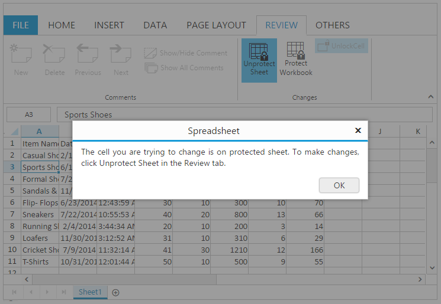

# Editing in JavaScript Spreadsheet 

You can edit the contents of a cell directly in the cell. You can also do this by typing in the formula bar. When you edit the cell, Spreadsheet is operating in edit mode. In editing mode formatting options are not available. You can use [`allowEditing`](https://help.syncfusion.com/api/js/ejspreadsheet#members:allowediting "allowEditing") property to enable/disable editing feature.

N> By default [`allowEditing`](https://help.syncfusion.com/api/js/ejspreadsheet#members:allowediting "allowEditing") property is set to true.

## Edit cell content

You can perform this by one of the following ways,

* Double click on the cell to perform editing. This starts the edit mode and positions the cursor at the end of the cell.
* Press F2 Key to edit the active cell.
* Use Formula bar to perform editing.
* Use Backspace and Delete Key to delete the contents of a cell.
* Use "Alt + Enter" keys to perform multi line editing.
* Using [`editCell`](https://help.syncfusion.com/api/js/ejspreadsheet#methods:xledit-editcell "editCell") method.
* Using [`allowOverflow `](https://help.syncfusion.com/api/js/ejspreadsheet#members:allowoverflow "allowOverflow ") API you can hide the overflow text in a cell.

## Save cell content

You can do this by one of the following ways,

* Perform mouse click on any other cell other than the current editing cell.
* Perform Enter/Tab key press on the cell.
* Using [`saveCell`](https://help.syncfusion.com/api/js/ejspreadsheet#methods:xledit-savecell "saveCell") method.

N> Edited cells are automatically formatted (right/left/center/Number Formatting) based on cell values.

The following code example describes the above behavior.



 



$(function () {
    $("#Spreadsheet").ejSpreadsheet({
        // the datasource "window.defaultData" is referred from 'http://js.syncfusion.com/demos/web/scripts/xljsondata.min.js'
        sheets: [{
            rangeSettings: [{ dataSource: window.defaultData }],                               
        }],
        loadComplete: "loadComplete"
    });
});
function loadComplete(args) {
    if(!this.isImport) {
        this.XLEdit.editCell(3, 0, true); // if true, it maintains the existing data otherwise it clears the data.
        //this.XLEdit.saveCell();
    }
}


The following output is displayed as a result of the above code example.

## Read-Only cells

You can restrict/prevent the editing in the specified range. You can use [`allowLockCell`](https://help.syncfusion.com/api/js/ejspreadsheet#members:allowlockcell "allowLockCell") property to enable/disable the lock cells. You can do using following ways,

* Using [`lockCells`](https://help.syncfusion.com/api/js/ejspreadsheet#methods:lockcells "lockCells") method to lock the specified range. Then you need to protect the sheet using [`protectSheet`](https://help.syncfusion.com/api/js/ejspreadsheet#methods:protectsheet "protectSheet") method to restrict the editing.
* Using "Lock Cells" option under Changes group of REVIEW tab in ribbon. Then Using "Protect Sheet" option under Changes group of REVIEW tab in ribbon to restrict editing.
* Using [`isReadOnly`](https://help.syncfusion.com/api/js/ejspreadsheet#members:isreadonly "isReadOnly") API to enable/disable read only support in spreadsheet.
* Using [`setReadOnly`](https://help.syncfusion.com/api/js/ejspreadsheet#methods:setreadonly "setReadOnly") method to set the readonly option for the specified range.
* Using [`removeReadOnly`](https://help.syncfusion.com/api/js/ejspreadsheet#methods:removereadonly "removeReadOnly") method to remove the readonly option for the specified range. 

The following code example describes the above behavior.



 



$(function () {
    $("#Spreadsheet").ejSpreadsheet({
        // the datasource "window.defaultData" is referred from 'http://js.syncfusion.com/demos/web/scripts/xljsondata.min.js'
        sheets: [{
            rangeSettings: [{ dataSource: window.defaultData }],                               
        }],
        allowLockCell: true,
        loadComplete: "loadComplete"
    });
});
function loadComplete(args) {
    if(!this.isImport) {
        this.protectSheet(false);
        this.lockCells("A1:A5", true);
        this.protectSheet(true);
    }
}


The following output is displayed as a result of editing in Spreadsheet which is rendered with above code example.

## Events

The following events will trigger when editing and saving the cell. 

* [`cellEdit`](https://help.syncfusion.com/api/js/ejspreadsheet#events:celledit"cellEdit") - Triggered when the cell is edited.
* [`cellSave`](https://help.syncfusion.com/api/js/ejspreadsheet#events:cellsave"cellSave") - Triggered when save the edited cell.

## Data binding

You can bind the data to Spreadsheet using data manager. You can refer [`Data Binding`](https://help.syncfusion.com/js/spreadsheet/data-binding# "Data Binding") to know more about this. You can use [`saveBatchChanges`](https://help.syncfusion.com/api/js/ejspreadsheet#methods:savebatchchanges "saveBatchChanges") method to update the changes in server.  

The following code example describes the above behavior.



 



$(function () {
    var dataManager = ej.DataManager({
        url: "Home/Default" , adaptor: new ej.UrlAdaptor(), batchUrl: "Home/BatchUpdate"
        //  "Home/Default" and "Home/BatchUpdate" referred from the service.
    });
    $("#Spreadsheet").ejSpreadsheet({
        sheets: [{
            rangeSettings: [{ dataSource: dataManager, primaryKey: "ItemName" }],                               
        }],
        loadComplete: "loadComplete"
    });
});
function loadComplete(args) {
    if(!this.isImport) {
        this.XLEdit.updateValue("I2", "amazon");
        this.XLEdit.updateValue("J2", "flipkart");
        this.saveBatchChanges(this.getActiveSheetIndex());
    }
}


The code snippets to specify the BatchUpdate in server side are as follows,



public ActionResult BatchUpdate( List<ItemDetail> changed,  List<ItemDetail> added,  List<ItemDetail> deleted, string action, string key)
{
    //Save the batch changes
}



N> To save and retrieve the Spreadsheet data in the database, you can refer this [`Knowledge Base`](https://www.syncfusion.com/kb/7567/how-to-save-and-retrieve-the-spreadsheet-data-in-database "Knowledge Base") link.

You can update data dynamically in the Spreadsheet by using the following methods.

* Using [`updateRange`](https://help.syncfusion.com/api/js/ejspreadsheet#methods:updaterange "updateRange") method to update the range of cells based on the specified settings.
* Using [`updateData`](https://help.syncfusion.com/api/js/ejspreadsheet#methods:updatedata "updateData") method to update the data for the specified range of cells in the Spreadsheet.
* Using [`updateUniqueData`](https://help.syncfusion.com/api/js/ejspreadsheet#methods:updateuniquedata "updateUniqueData") method to update the unique data for the specified range of cells in Spreadsheet.
* Using [`updateCell`](https://help.syncfusion.com/api/js/ejspreadsheet#methods:xledit-updatecell "updateCell") method to update a particular cell value in the Spreadsheet.
* Using [`updateValue`](https://help.syncfusion.com/api/js/ejspreadsheet#methods:xledit-updatevalue "updateValue") method to update a particular cell value and its format in the Spreadsheet.

You can update range dynamically in the Spreadsheet by using the following methods.

* Using [`editRange`](https://help.syncfusion.com/api/js/ejspreadsheet#methods:editrange "editRange") method to edit data in the specified range of cells based on its corresponding rangeSettings.
* Using [`removeRange`](https://help.syncfusion.com/api/js/ejspreadsheet#methods:removerange "removeRange") method to remove the range data and its defined rangeSettings property based on the specified range name.

You have the following range options in Spreadsheet.

 1. To get the data in specified range in Spreadsheet, use [`getRangeData`](https://help.syncfusion.com/api/js/ejspreadsheet#methods:getrangedata "getRangeData") method.
 2. To get the range indices array based on the specified alpha range in Spreadsheet, use [`getRangeIndices`](https://help.syncfusion.com/api/js/ejspreadsheet#methods:getrangeindices "getRangeIndices") method.
 3. To get the alpha range of the given index in Spreadsheet, use[`getAlphaRange`](https://help.syncfusion.com/api/js/ejspreadsheet#methods:getalpharange "getAlphaRange")method.
 4. To get all cell elements in the specified range, use[`getRange`](https://help.syncfusion.com/api/js/ejspreadsheet#methods:getrange "getRange") method.

 N> 1. To get the property value of particular cell, based on the row and column index in the Spreadsheet use [`getPropertyValue`](https://help.syncfusion.com/api/js/ejspreadsheet#methods:xledit-getpropertyvalue "getPropertyValue")
 