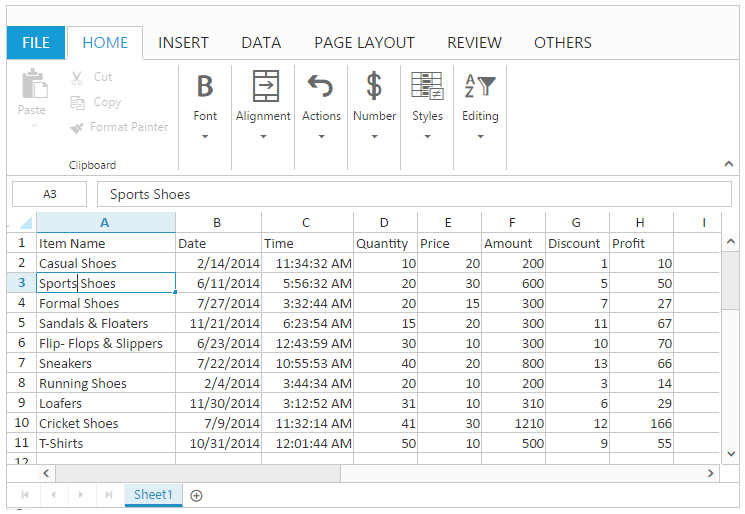

# Editing 

You can edit the content of a cell directly by clicking on the cell. When you edit the cell, Spreadsheet is operating in Edit mode. In this mode Some of the options are unavailable. You can use [`allowEditing`](http://help.syncfusion.com/js/api/ejspreadsheet#members:allowediting "allowEditing") property to enable/disable Editing feature.

N> By default allowEditing property is set to true.
N> If you perform editing in single click, all the existing content will be erased.
N> The cell content is also displayed in the formula bar.

You can do following operations in Editing.

* Edit the Cell
* Save the Cell
* Data Binding
* Read Only Cell

## Edit the Cell

You can perform this by following ways,

* Double Click Editing.
* F2 Key Editing.
* Formula bar Editing.
* Backspace and Delete Key Editing.
* Multi line Editing.
* Using [`editCell`](https://help.syncfusion.com/js/api/ejspreadsheet#methods:xledit-editcell "editCell") method.

### Double Click Editing

You can double click on the cell to perform editing. This starts the Edit mode and positions the cursor at the end of the cell. You can move the cursor to any of the position in the cell to edit.

### F2 Key Editing

You can use F2 key to perform editing, that is similar to "Double Click Editing".

### Formula bar Editing

You can use Formula bar to perform editing. This is used to display formula or value of the selected cell. The quickest way to do this is simply press F2. 

### Multi-line Editing

You can use Alt + Enter key to insert line break when editing the cell. 

### Backspace and Delete Key Editing

You can use Backspace key to delete the active cell content and starts editing. Delete key is used to delete the selected cells.

## Save the Edited Cell

You can do this by following ways,

* Perform mouse click on any other cell other than the current editing cell.
* Perform Enter/Tab key press on the cell.
* Using [`saveCell`](https://help.syncfusion.com/js/api/ejspreadsheet#methods:xledit-savecell "saveCell") method.

N> Edited cells are automatically formatted (right/left/center/Number Formatting) based on cell values.

The following code example describes the above behavior.



 



$(function () {
    $("#Spreadsheet").ejSpreadsheet({
        // the datasource "window.defaultData" is referred from 'http://js.syncfusion.com/demos/web/scripts/xljsondata.min.js'
        sheets: [{
            rangeSettings: [{ dataSource: window.defaultData, showHeader: true }],                               
        }],
        loadComplete: "loadComplete"
    });
});
function loadComplete(args) {
    if(!this.isImport) {
        this.XLEdit.editCell(3, 0, "Sports”); // mouse curser placed after the text "Sports”
        //this.XLEdit.saveCell();
    }
}


The following output is displayed as a result of the above code example.

## Data binding

You can bind the data to Spreadsheet using data manager. You can refer [`Data Binding`](https://help.syncfusion.com/js/spreadsheet/data-binding# "Data Binding") to know more about this. You can use [`saveBatchChanges`](https://help.syncfusion.com/js/api/ejspreadsheet#methods:savebatchchanges "saveBatchChanges") method to update the changes in server.  

## Read-Only Cells

You can restrict/prevent the editing in the selected cells. You can use [allowLockCell](https://help.syncfusion.com/js/api/ejspreadsheet#members:allowlockcell "") property to enable/disable the lock cells. You can do using following ways,

* Using [`lockCells`](http://help.syncfusion.com/js/api/ejspreadsheet#methods:lockcells "lockCells") method to lock the selected cells. Then you need to protect the sheet using [`protectSheet`](https://help.syncfusion.com/js/api/ejspreadsheet#methods:protectsheet "protectSheet") method to restrict the editing.
* Using "lock Cells” option under Changes tab in REVIEW tab of ribbon. Then Using "protect Sheet” option under Changes tab in REVIEW tab of ribbon to restrict editing.

The following code example describes the above behavior.



 



$(function () {
    $("#Spreadsheet").ejSpreadsheet({
        // the datasource "window.defaultData" is referred from 'http://js.syncfusion.com/demos/web/scripts/xljsondata.min.js'
        sheets: [{
            rangeSettings: [{ dataSource: window.defaultData, showHeader: true }],                               
        }],
        allowLockCell: true,
        loadComplete: "loadComplete"
    });
});
function loadComplete(args) {
    if(!this.isImport) {
        this.protectSheet(false);
        this.lockCells("A1:A5”, true);
        this.protectSheet(true);
    }
}


The following output is displayed as a result of the above code example.

## Events

The following events will trigger when editing and saving the cell. 

<table>
    <tr><th>Events </th><th>Description </th></tr>
    <tr><td >[`cellEdit`](http://help.syncfusion.com/js/api/ejspreadsheet#events:celledit"cellEdit") </td><td >Triggered when the cell is edited. </td></tr>
    <tr><td >[`cellSave`](http://help.syncfusion.com/js/api/ejspreadsheet#events:cellsave"cellSave") </td><td >Triggered when save the edited cell. </td></tr>
</table>
