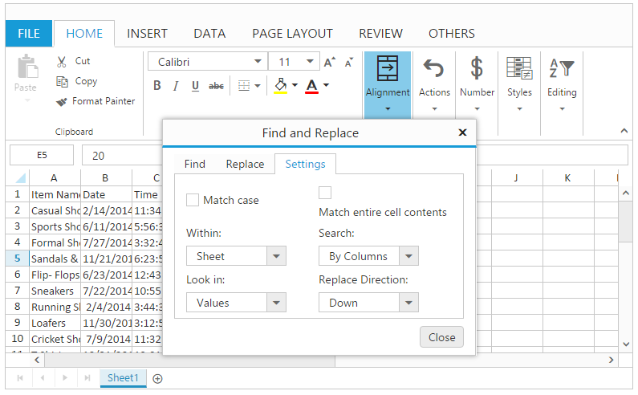
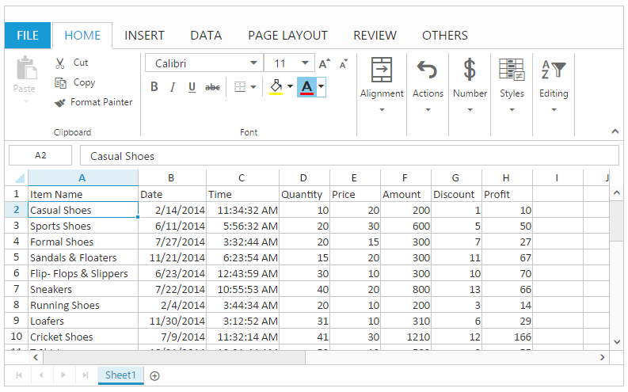
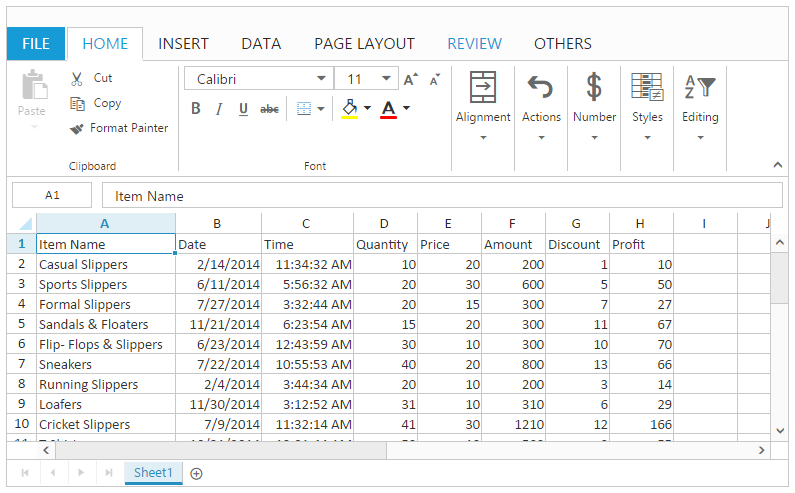
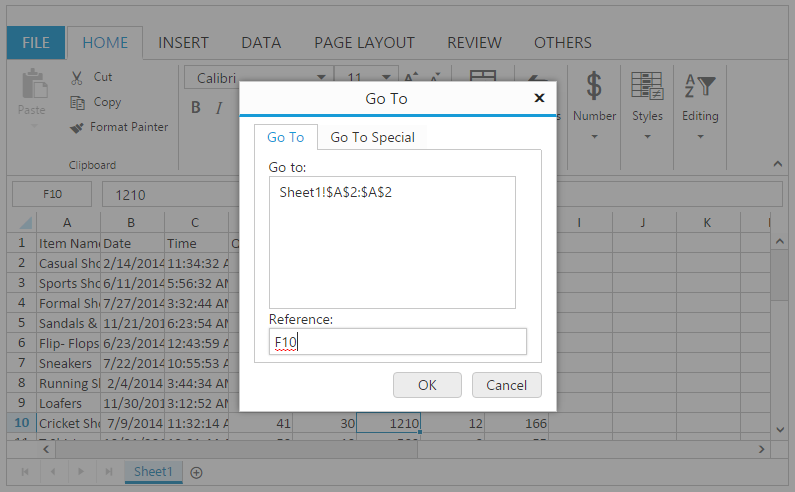
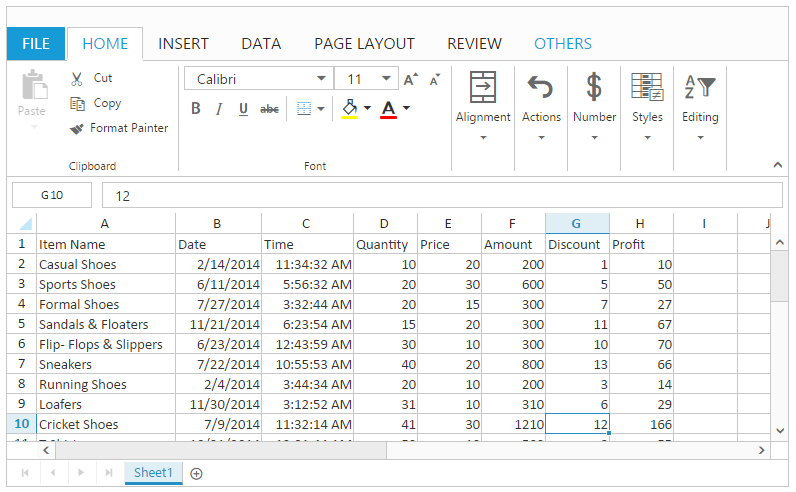
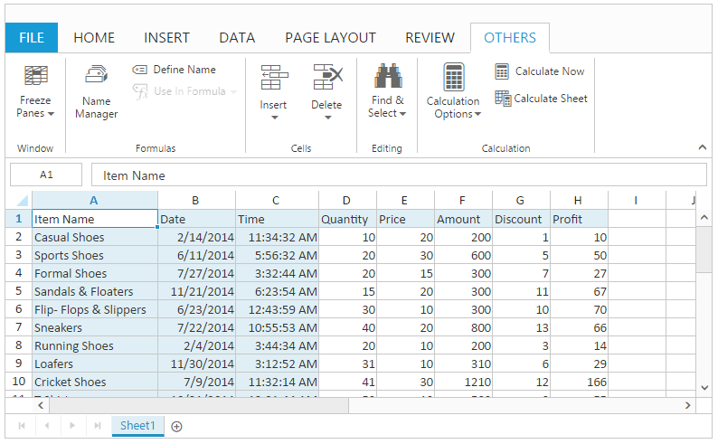

# Find and Replace

This feature is used to search for something and replace the found content with the new content in your worksheet or workbook, such as a particular number or text string. You can use [`allowSearching`](https://help.syncfusion.com/js/api/ejspreadsheet#members:allowsearching "allowSearching") property to enable or disable this feature.

The following code example describes the above behavior.



 



$(function () {
    $("#Spreadsheet").ejSpreadsheet({
        // the datasource "window.defaultData" is referred from 'http://js.syncfusion.com/demos/web/scripts/xljsondata.min.js'
        sheets: [{
            rangeSettings: [{ dataSource: window.defaultData}],                               
        }],
        allowSearching: true
    });
});


The following output is displayed as a result of the above code example.

## Find

This is used to search the contents of a cell. You can do this by following ways.

* Using "Find" option in Find and Replace button of OTHERS Tab in ribbon to open the Find and Replace dialog.
* Using [`findNext`](https://help.syncfusion.com/js/api/ejspreadsheet#methods:xlsearch-findnext "findNext") and [`findPrevious`](https://help.syncfusion.com/js/api/ejspreadsheet#methods:xlsearch-findprevious "findPrevious") methods to search the given value in workbook.

You can customize the following settings in find.

* Match Case - Case of the corresponding letters must match such as lowercase or uppercase.
* Match Entire Cell Content - Entire cell content must match.
* Look in - You can search the contents by values, formulas and comments.
* Within - You can search the content within the sheet or workbook.
* Search - You can search the contents by rows or columns.
* Replace Direction - You can replace the contents by up or down direction.

The following code example describes the above behavior.


 



$(function () {
    $("#Spreadsheet").ejSpreadsheet({
        // the datasource "window.defaultData" is referred from 'http://js.syncfusion.com/demos/web/scripts/xljsondata.min.js'
        sheets: [{
            rangeSettings: [{ dataSource: window.defaultData}],                               
        }],
        allowSearching: true,
        loadComplete: "loadComplete"
    });
});
function loadComplete() {
    var xlSearch = this.XLSearch;
    if (!this.isImport) {
        //xlSearch.findPrevious("Shoes", 1, true, false, "value", "sheet", "rows"); 
        xlSearch.findNext("Shoes", 1, true, false, "value", "sheet", "rows");
    }
}


The following output is displayed as a result of the above code example.

## Replace

This is used to replace the contents of a cell. You can do this by following ways.

* Using "Replace" option in Find and Replace button of OTHERS Tab in ribbon to open the Find and Replace dialog.
* Using [`replaceAllByBook`](https://help.syncfusion.com/js/api/ejspreadsheet#methods:xlsearch-replaceallbybook "replaceAllByBook") or [`replaceAllBySheet`](https://help.syncfusion.com/js/api/ejspreadsheet#methods:xlsearch-replaceallbysheet "replaceAllBySheet") method to replace the contents.
* Using findNext and findPrevious methods to search the given value in workbook.

The following code example describes the above behavior.


 



$(function () {
    $("#Spreadsheet").ejSpreadsheet({
        // the datasource "window.defaultData" is referred from 'http://js.syncfusion.com/demos/web/scripts/xljsondata.min.js'
        sheets: [{
            rangeSettings: [{ dataSource: window.defaultData}],                               
        }],
        allowSearching: true,
        loadComplete: "loadComplete"
    });
});
function loadComplete() {
    var xlSearch = this.XLSearch;
    if (!this.isImport) {
        xlSearch.replaceAllBySheet("Shoes", "Slippers", true, false); 
        //xlSearch.replaceAllBySheet("Shoes", "Slippers", true, false);
    }
}


The following output is displayed as a result of the above code example.

## Go To

This feature is used to navigate to the particular cell in the worksheet or workbook. You can use [`allowSearching`](https://help.syncfusion.com/js/api/ejspreadsheet#members:allowsearching "allowSearching") property to enable or disable this feature.

You can do this by one of the following ways.

* Using "Go To" option in Find and Replace button of OTHERS Tab in ribbon to open the Go To dialog.
* Using [`goTo`](https://help.syncfusion.com/js/api/ejspreadsheet#methods:xlsearch-goto "goTo") method to navigate the particular cell in workbook.

The following output is displayed the Go To dialog.

The following code example describes the above behavior.



 



$(function () {
    $("#Spreadsheet").ejSpreadsheet({
        // the datasource "window.defaultData" is referred from 'http://js.syncfusion.com/demos/web/scripts/xljsondata.min.js'
        sheets: [{
            rangeSettings: [{ dataSource: window.defaultData}],                               
        }],
        allowSearching: true,
        loadComplete: "loadComplete"
    });
});
function loadComplete() {
    var xlSearch = this.XLSearch;
    if (!this.isImport) 
        xlSearch.goTo("G10"); 
}


The following output is displayed as a result of the above code example.

## GoTo Special

This feature is used to quickly select cells of a specified type within the worksheet. You can do this by following ways,

* Using "Go to Special" option in Find and Replace button of OTHERS Tab in ribbon to open the Go To dialog.

* Using "Go to Formulas" option in Find and Replace button of OTHERS Tab in ribbon to highlight the cells, which contains formulas.

* Using "Go to Comments" option in Find and Replace button of OTHERS Tab in ribbon to highlight the cells, which contains comments.

* Using "Go to Conditional Formats" option in Find and Replace button of OTHERS Tab in ribbon to highlight the cells, which contains conditional formats.

* Using "Go to Data Validation" option in Find and Replace button of OTHERS Tab in ribbon to highlight the cells, which contains data validations.

* Using "Go to Constants" option in Find and Replace button of OTHERS Tab in ribbon to highlight the cells, which contains constant values.

* Using [`goToSpecial`](https://help.syncfusion.com/js/api/ejspreadsheet#methods:xlsearch-gotospecial "goToSpecial") method to navigate the particular cell in workbook.

The following code example describes the above behavior.



 



$(function () {
    $("#Spreadsheet").ejSpreadsheet({
        // the datasource "window.defaultData" is referred from 'http://js.syncfusion.com/demos/web/scripts/xljsondata.min.js'
        sheets: [{
            rangeSettings: [{ dataSource: window.defaultData}],                               
        }],
        allowSearching: true,
        loadComplete: "loadComplete"
    });
});
function loadComplete() {
    var xlSearch = this.XLSearch;
    if (!this.isImport)
        xlSearch.goToSpecial("constants", false, true, false, false); 
}


The following output is displayed as a result of the above code example.

