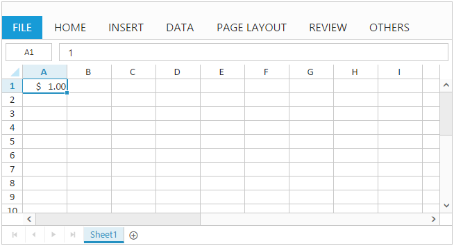
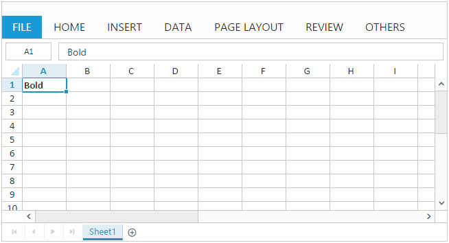
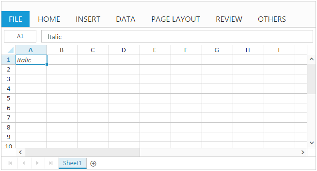

# Formatting in JavaScript Spreadsheet

Spreadsheet supports many formatting options to make your data easier to view and understand. Use [`allowCellFormatting`](https://help.syncfusion.com/api/js/ejspreadsheet#members:allowcellformatting "allowCellFormatting") API to enable / disable formatting option in Spreadsheet. The different types of formatting supported in Spreadsheet are,
    
1) Number Formatting

2) Text Formatting

3) Cell Formatting

## Number Formatting

Number formatting is used to represent type for your data in Spreadsheet. The different types of number formatting supported in Spreadsheet are, 
    
1) Number

2) Currency

3) Accounting

4) Percentage

5) Short Date

6) Long Date

7) Time

8) Scientific

9) Fraction

To enable/disable [`allowDecimalPlaces`](https://help.syncfusion.com/api/js/ejspreadsheet#members:formatsettings-allowdecimalplaces "allowDecimalPlaces") API in [`formatSettings`](https://help.syncfusion.com/api/js/ejspreadsheet#members:formatsettings "formatSettings") you can update the decimal place by using the method[`updateDecimalPlaces`](https://help.syncfusion.com/api/js/ejspreadsheet#methods:xlformat-updatedecimalplaces "updateDecimalPlaces").

You can apply number format for a cell in following ways,
    
1) Initial Load

2) Method

3) User Interface

### Initial Load

You can set number format for a cell by specifying [`format`](https://help.syncfusion.com/api/js/ejspreadsheet#members:sheets-rows-cells-format "format") property in cell data binding. The following code example describes the above behavior,





The following output is displayed as a result of the above code example.

### Method

You can set number format for a cell using [`format`](https://help.syncfusion.com/api/js/ejspreadsheet#methods:xlformat-format "format") method. The following code example describes the above behavior,





The following output is displayed as a result of the above code example.

### User Interface

You can set number format for a cell through number formatting options in ribbon `HOME` tab.

### Custom Number Format

Spreadsheet supports many number format to display your data as currency, date, percentage and so on. If these pre-defined number formats do not meet your needs you can create and apply your own number formats using format cell dialog and [`addCustomFormatSpecifier`](https://help.syncfusion.com/api/js/ejspreadsheet#methods:xlformat-addcustomformatspecifier "addCustomFormatSpecifier") method. The following screenshot illustrate this,

N> Spreadsheet supports basic number format customization and it doesn't have all functionality similar to excel   

## Text Formatting

To organize and easier to follow your financial, statistical or scientific data, you can apply text formats like font size, font color, text alignment etc. to a cell or range of cells.

### Fonts

To distinguish your data from built-in font formats, you can apply different font formats like bold, italic, strike-through, color, font-family and size etc.
Use [`allowFontFamily`](https://help.syncfusion.com/api/js/ejspreadsheet#members:formatsettings-allowfontfamily "allowFontFamily") in formatSettings API in to enable / disable font option in Spreadsheet.

You have following Font options in Spreadsheet,

* Using [`addFontFamily`](https://help.syncfusion.com/api/js/ejspreadsheet#methods:xlformat-addfontfamily "addFontFamily") method to add the font to the Ribbon font family dropdown.
* Using [`removeFontFamily`](https://help.syncfusion.com/api/js/ejspreadsheet#methods:xlformat-removefontfamily "removeFontFamily") method  to remove the font from the Ribbon font family dropdown.

### Text Alignment

To enhance the visual presentation of your data, you can align text in a cell vertically or horizontally. To align text vertically pick top, middle or bottom align and to align text horizontally pick left, center or right align.

### Indents

To enhance the appearance of text in a cell, you can change the indentation of a cell content by increasing or decreasing text indent. 

### Applying Text Formatting

You can apply text format for a cell in following ways,
    
1) Initial Load

2) Method

3) User Interface

#### Initial Load

You can apply text format for a cell by specifying [`style`](https://help.syncfusion.com/api/js/ejspreadsheet#members:sheets-rows-cells-style "style") property in cell data binding. The following code example describes the above behavior,





The following output is displayed as a result of the above code example.

#### Method

You can apply text format for a cell or range of cells using [`format`](https://help.syncfusion.com/api/js/ejspreadsheet#methods:xlformat-format "format") method. The following code example describes the above behavior,





The following output is displayed as a result of the above code example.

#### User Interface

You can apply text format for a cell through text formatting options in ribbon `HOME` tab.

### Wrap Text 

To make text appearance on multiple lines in a cell, you can apply wrap text to the cell. So, that the text wraps automatically or you can enter a manual line break using `ALT + ENTER` key in edit mode. Use [`allowWrap`](https://help.syncfusion.com/api/js/ejspreadsheet#members:allowwrap "allowWrap") API to enable/disable wrap text. You can apply wrap text for a cell in following ways,

1) Method

2) User Interface

#### Method

You can wrap, text in a cell using [`wrapText`](https://help.syncfusion.com/api/js/ejspreadsheet#methods:wraptext "wrapText") method and it can be unwrap using [`unWrapText`](https://help.syncfusion.com/api/js/ejspreadsheet#methods:unwraptext "unWrapText") method. The following code example describes the [`wrapText`](https://help.syncfusion.com/api/js/ejspreadsheet#methods:wraptext "wrapText") behavior,





The following output is displayed as a result of the above code example.

#### User Interface

You can wrap or unwrap text in a cell using wrap text option in ribbon `HOME` tab.

## Cell Formatting

To highlight particular cell or section of cells from whole workbook you can use cell formatting options like borders, fill color etc.

You have the following options in cell formatting,

* Using [`updateFormat`](https://help.syncfusion.com/api/js/ejspreadsheet#methods:xlformat-updateformat "updateFormat") method to update the format for the selected range of cells in the Spreadsheet.
* Using [`updateUniqueFormat`](https://help.syncfusion.com/api/js/ejspreadsheet#methods:xlformat-updateuniqueformat "updateUniqueFormat") method to update the unique format for selected range of cells in the Spreadsheet.
* Using [`removeStyle`](https://help.syncfusion.com/api/js/ejspreadsheet#methods:xlformat-removestyle "removeStyle") method to remove the style in the specified range.
* Using [`getBorderFromHashCode`](https://help.syncfusion.com/api/js/ejspreadsheet#methods:xlformat-getborderfromhashcode "getBorderFromHashCode") method to get the border from hashcode in the Spreadsheet.
* Using [`getFormatClass`](https://help.syncfusion.com/api/js/ejspreadsheet#methods:xlformat-getformatclass "getFormatClass") method to get the format class in Spreadsheet.
* Using [`getFormatFromHashCode`](https://help.syncfusion.com/api/js/ejspreadsheet#methods:xlformat-getformatfromhashcode "getFormatFromHashCode") method to get the format from the given hashcode in Spreadsheet.
* Using [`getFormatHashCode`](https://help.syncfusion.com/api/js/ejspreadsheet#methods:xlformat-getformathashcode "getFormatHashCode") method to get the hashcode from the given style object in Spreadsheet.
* Using [`getHashCodeClassAsArray`](https://help.syncfusion.com/api/js/ejspreadsheet#methods:xlformat-gethashcodeclassasarray "getHashCodeClassAsArray") method to get the format as array from the given specified range in Spreadsheet.

### Borders 

You can add border around a cell or range of cells to define a section of worksheet or table. 
Use [`allowCellBorder`](https://help.syncfusion.com/api/js/ejspreadsheet#members:formatsettings-allowcellborder "allowCellBorder") in [`formatSettings`](https://help.syncfusion.com/api/js/ejspreadsheet#members:formatsettings "formatSettings") API in to enable / disable border option in Spreadsheet.

The different types of borders supported in Spreadsheet are,
    
1) Bottom Border

2) Top Border

3) Left Border

4) Right Border

5) All Borders

6) Outside Borders

7) Thick Box Border

8) Bottom Double Border

9) Thick Bottom Border

10) Top and Bottom Border

11) Top and Thick Bottom Border

12) Top and Bottom Double Border

You can apply border for a cell or range of cells through following ways,
    
1) Use [`format`](https://help.syncfusion.com/api/js/ejspreadsheet#methods:xlformat-format "format") method to apply border via code

2) Apply border for a cell or range of cells using border options in ribbon `HOME` tab

3) Use draw border options in ribbon `HOME` tab

4) Specify the border at initial load by using the [`border`](https://help.syncfusion.com/api/js/ejspreadsheet#members:sheets-border"border") in `sheets` API.

5) Use [`setBorder`](https://help.syncfusion.com/api/js/ejspreadsheet#methods:setborder "setBorder") method to set border for the specified range of cells in the Spreadsheet.

In Border you have the following options in spreadsheet.

* To specify the border type in the Spreadsheet.Use [`type`](https://help.syncfusion.com/api/js/ejspreadsheet#members:sheets-border-type "type") in `border` API.
* To Specify the border color for range of cells in Spreadsheet.Use [`color`](https://help.syncfusion.com/api/js/ejspreadsheet#members:sheets-border-color "color") in `border` API.
* To apply border for the specified range of cell.Use [`range`](https://help.syncfusion.com/api/js/ejspreadsheet#members:sheets-border-range "range") in `border` API.

### Fill color

To highlight cell or range of cells from whole workbook you can apply background color for a cell using fill color option in Spreadsheet.

### Cell Styles

Cell styles is a collection of pre-defined styles with multiple formatting characteristics to apply several formats in one step. You can apply cell style for a cell using `cell style` option in ribbon `HOME` tab. The following screenshot illustrate this,

### Custom Cell Style

you can apply several formats in a single step by using the New Cell Style option in cell styles.

The following options are available in cell style customization.

1) Add New Custom Style

2) Modify Custom Style

3) Apply Custom Cell Style

4) Delete Custom Style

#### Add New Custom Style
To add new custom cell style in the spreadsheet. Use [`addNewCustomStyle`](https://help.syncfusion.com/api/js/ejspreadsheet#methods:xlformat-addnewcustomstyle "addNewCustomStyle") method to add new custom cell style in spreadsheet via code.

#### Modify Custom Style
To modify custom cell style in the spreadsheet. Use [`modifyCustomStyle`](https://help.syncfusion.com/api/js/ejspreadsheet#methods:xlformat-modifycustomstyle "modifyCustomStyle") method to modify the added custom cell style via code.

#### Apply Custom Cell Style
To apply custom cell style in the spreadsheet. Use [`applyCustomCellStyle`](https://help.syncfusion.com/api/js/ejspreadsheet#methods:xlformat-applycustomcellstyle "applyCustomCellStyle") method to apply the custom cell style in cells via code.

#### Delete Custom Style
To delete custom cell style in the spreadsheet. Use [`deleteCustomStyle`](https://help.syncfusion.com/api/js/ejspreadsheet#methods:xlformat-deletecustomstyle "deleteCustomStyle") method to delete the added custom cell style via code.

### Format painter

The `format painter` lets you copy all of the formatting from a cell or range of cells and apply the same formatting to another cell or range of cells including font size, color, style etc. Use [`allowFormatPainter`](https://help.syncfusion.com/api/js/ejspreadsheet#members:allowformatpainter "allowFormatPainter") API to enable/disable format painter option in spreadsheet.

### Clear	

Clear option is used to clear cell contents, formats or any attached comments from a cell or range of cells in worksheet. Use [`allowClear`](https://help.syncfusion.com/api/js/ejspreadsheet#members:allowclear "allowClear") API to enable/disable clear option in Spreadsheet.You have following clear options in Spreadsheet,
    
1) Clear All 

2) Clear Formats 

3) Clear Contents

4) Clear Comments

5) Clear Hyperlinks

6) Clear Border

7) Clear range

8) Clear Range data

9) Clear Undo Redo
 

#### Clear All
To clear content, format, comment, hyperlink etc. from a cell or range of cells, use clear all option in Spreadsheet. Use [`clearAll`](https://help.syncfusion.com/api/js/ejspreadsheet#methods:clearall "clearAll") method to clear cells via code.

#### Clear Formats
To clear [`formats`](https://help.syncfusion.com/js/spreadsheet/formatting "formats") in a cell or range of cells use clear formats option in Spreadsheet. Use [`clearAllFormat`](https://help.syncfusion.com/api/js/ejspreadsheet#methods:clearallformat "clearAllFormat") method to clear formats via code.

#### Clear Contents
To clear contents in a cell or range of cells use clear contents option in Spreadsheet. Use [`clearContents`](https://help.syncfusion.com/api/js/ejspreadsheet#methods:clearcontents "clearContents") method to clear contents via code.

#### Clear Comments
To clear [`comment`](https://help.syncfusion.com/js/spreadsheet/cell-range#comment "comments") in a cell or range of cells use clear comments option in Spreadsheet. Use `clearComments` method to clear comments via code.

#### Clear Hyperlinks
To clear [`hyperlink`](https://help.syncfusion.com/js/spreadsheet/formatting#hyperlink "hyperlink") in a cell or range of cells use clear hyperlink option in Spreadsheet. Use `clearHyperlinks` method to clear hyperlinks via code.

#### Clear Border
To clear `border` in a cell or range of cells use clear border option in Spreadsheet. Use  [`clearBorder`](https://help.syncfusion.com/api/js/ejspreadsheet#methods:clearborder "clearBorder") method to clear border via code.

#### Clear Range
To clear only the data in the range denoted by the specified range in Spreadsheet. Use  [`clearRange`](https://help.syncfusion.com/api/js/ejspreadsheet#methods:clearrange "clearRange") method to clear range data via code.

#### Clear Range Data
To clear data in the specified range of cells based on the defined property in Spreadsheet. Use  [`clearRangeData`](https://help.syncfusion.com/api/js/ejspreadsheet#methods:clearrangedata "clearRangeData") method to clear range data via code.

#### Clear Undo Redo
To clear undo and redo collections in the Spreadsheet. Use  [`clearUndoRedo`](https://help.syncfusion.com/api/js/ejspreadsheet#methods:clearundoredo "clearUndoRedo") method to clear Undo and Redo collections via code.