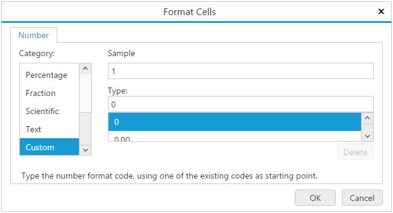

# Formatting

Spreadsheet supports many Formatting options to make your data easier to view and understand. Use [`allowCellFormatting`](https://help.syncfusion.com/js/api/ejspreadsheet#members:allowcellformatting "allowCellFormatting") API to enable / disable formatting option in Spreadsheet. Following are the different types of formatting supported in Spreadsheet,
    
    1) Number Formatting

    2) Text Formatting

    3) Cell Formatting

## Number Formatting

Number formatting is used to represent what type of data you are using in Spreadsheet to make your data easier view and understand. Following are the different type of number formatting supported in Spreadsheet, 
    
    1) Number

    2) Currency

    3) Accounting

    4) Percentage

    5) Short Date

    6) Long Date

    7) Time

    8) Scientific

    9) Fraction

You can apply number format for a cell in following ways,
    
    1) Initial Load

    2) Method

    3) User Interface

### Initial Load

You can set number format for a cell by specifying [`format`](https://help.syncfusion.com/js/api/ejspreadsheet#members:sheets-rows-cells-format "format") property in cell data binding. The following code example describes the above behavior,





The following output is displayed as a result of the above code example.

### Method

You can set number format for a cell using [`Format`](https://help.syncfusion.com/js/api/ejspreadsheet#methods:xlformat-format "Format") method. The following code example describes the above behavior,





The following output is displayed as a result of the above code example.

### User Interface

You can set number format for a cell through number formatting options in ribbon Home tab.

## Custom Number Format

Spreadsheet supports many number format to display your data as currency, date, percentage and so on. If these pre-defined number formats do not meet your needs you can create and apply your own number formats using format cell dialog. The following screenshot illustrate this,

## Text Formatting

To make your data easier to view and understand you can apply text formats like font size, font color, text alignment etc.

### Fonts

To customize your fonts you can apply formats like bold, italic, strike-through etc. and can vary its size, color, font-family etc.

### Text alignment

Text align like top, bottom, middle, left, right, and centre is used to align texts based on cell dimension.

### Indents

To align your text appearance you can increase or decrease text indent based on cell.

## Applying Text Formatting

You can apply text format for a cell in following ways,
    
    1) Initial Load

    2) Method

    3) User Interface

### Initial Load

You can apply text format for a cell by specifying [`style`](https://help.syncfusion.com/js/api/ejspreadsheet#members:sheets-rows-cells-style "style") property in cell data binding. The following code example describes the above behavior,





The following output is displayed as a result of the above code example.

### Method

You can apply text format for a cell or range of cells using [`Format`](https://help.syncfusion.com/js/api/ejspreadsheet#methods:xlformat-format "Format") method. The following code example describes the above behavior,





The following output is displayed as a result of the above code example.

### User Interface

You can apply text format for a cell through text formatting options in ribbon Home tab.

## Wrap text 

To appear text on multiple lines in a cell you can format the cell so that the text wraps automatically or you can enter a manual line break using `ALT + ENTER` key in edit mode. Use [`allowWrap`](https://help.syncfusion.com/js/api/ejspreadsheet#members:allowwrap "allowWrap") API to enable / disable wrap text. You can apply wrap text for a cell in following ways,

    1) Method

    2) User Interface

### Method

You can wrap, text in a cell using [`wrapText`](https://help.syncfusion.com/js/api/ejspreadsheet#methods:wraptext "wrapText") method. The following code example describes the above behavior,





The following output is displayed as a result of the above code example.

You can unwrap wrapped text using [`unWrapText`](https://help.syncfusion.com/js/api/ejspreadsheet#methods:unwraptext "unWrapText") method.

### User Interface

You can wrap or unwrap text in a cell using Wrap Text option in ribbon Home tab.

## Cell Formatting

To highlight particular cell or section of cells from whole workbook you can use cell formatting options like borders, fill color etc.

### Borders 

You can add border around a cell or range of cells to define a section of worksheet or table. Following are the different types of borders supported in Spreadsheet,
    
    1) Bottom Border

    2) Top Border

    3) Left Border

    4) Right Border

    5) All Borders

    6) Outside Borders

    7) Thick Box Border

    8) Thick Bottom Border

    9) Top and Bottom Border

    10) Top and Thick Bottom Border

You can apply border for a cell or range of cells through following ways,
    
    1) Use [`Format`](https://help.syncfusion.com/js/api/ejspreadsheet#methods:xlformat-format "Format") method to apply border via code

    2) Apply border for a cell or range of cells using border options in ribbon Home tab

    3) Use draw border options in ribbon Home tab

### Fill color

To highlight cell or range of cells from whole workbook you can apply background color for a cell using fill color option in Spreadsheet.

## Cell Styles

Cell styles is a collection of pre-defined styles with multiple formatting characteristics to apply several formats in one step. You can apply Cell Style for a cell using Cell Style option in ribbon Home tab. The following screenshot illustrate this,

## Format painter

The Format Painter lets you copy all of the formatting from one object and apply the same formatting to another one including font size, color, style etc.

## Clear	

Clear option is used to clear cell contents, formats or any attached comments from a cell or range of cells in Spreadsheet. You have following clear options in Spreadsheet,
    
    * Clear all 

    * Clear Formats 

    * Clear Contents

    * Clear Comments

    * Clear Hyperlinks