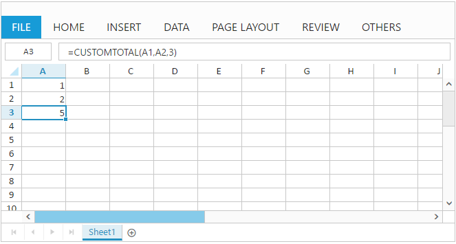

# Formulas

Formulas are used for calculation of data in sheet. You can refer the formula cell reference in following ways,

1. Cell reference from same sheet
2. Cell reference from different sheets

You can set formula for a `cell` in following ways,

1. Initial Load
2. Method
3. User Interface

### Initial Load

You can set formula for a cell by specifying [`value`](https://help.syncfusion.com/api/js/ejspreadsheet#members:sheets-rows-cells-value "value") property in cell data binding. 

The following code example describes the above behavior,





The following output is displayed as a result of the above code example.

Cell Reference from Same sheet
{:.caption}

Cell Reference from different sheets
{:.caption}

### Method

You can set formula for a cell using [`updateCellValue`](https://help.syncfusion.com/api/js/ejspreadsheet#methods:xledit-updatecellvalue "updateCellValue") method. The following code example describes the above behavior,





The following output is displayed as a result of the above code example.

### User Interface

You can set formula for a cell by edit and save a cell through user interface using `Editing` feature. The following code example and screenshot describes the above behavior,





The following output is displayed while saving edited cell with above code example.

N> 1. The list of supported formulas can be find in following [`link`](https://help.syncfusion.com/js/calculate/supported-formulas/supported-formulas "link")
N> 2. Constant values, cell references, formulas and named ranges can be passed as argument to formulas
N> 3. Selection can be used to mention cell references within formula

## User Defined Functions

The list of formulas supported in Spreadsheet is sufficient for most of your calculations. If not, you can create and use your own function using user defined function option. You can add user defined function to Spreadsheet in following ways,

1. Initial Load

2. Method

### Initial Load

You can add your own function to Spreadsheet at initial load with [`customFormulas`](https://help.syncfusion.com/api/js/ejspreadsheet#members:customformulas "customFormulas") API. The following code example describes the above behavior,





The following output is displayed as a result of the above code example.

### Method

You can add your own function to Spreadsheet using [`addCustomFormula`](https://help.syncfusion.com/api/js/ejspreadsheet#methods:addcustomformula "addCustomFormula") method. The following code example describes the above behavior,

You can also calculate formulas in the specified sheet by using[`calcNow`](https://help.syncfusion.com/api/js/ejspreadsheet#methods:xledit-calcnow "calcNow") method in Spreadsheet.





The following output is displayed as a result of the above code example.

To remove user defined function from Spreadsheet use [`removeCustomFormula`](https://help.syncfusion.com/api/js/ejspreadsheet#methods:removecustomformula "removeCustomFormula") method.

## Named Ranges

To understand the purpose of cell reference or table, you can define a meaningful name using named ranges support. By using names, you can make your formula much easier to understand and maintain. You can add named ranges to Spreadsheet in following ways,
    
1. Initial Load

2. Method

3. User Interface

### Initial Load

To add named ranges at initial load by using [`nameManager`](https://help.syncfusion.com/api/js/ejspreadsheet#members:namemanager "nameManager") API, and also you can specify the name and address of the range by using [`name`](https://help.syncfusion.com/api/js/ejspreadsheet#members:namemanager-name "name") and [`refersto`](https://help.syncfusion.com/api/js/ejspreadsheet#members:namemanager-refersto "refersto") API. You can find the added named range list collection in Spreadsheet by accessing [`nameManager`](https://help.syncfusion.com/api/js/ejspreadsheet#members:namemanager "nameManager") API.
The following code example describes the above behavior,





The following output is displayed as a result of the above code example.

### Method

You can add named range to Spreadsheet with [`addNamedRange`](https://help.syncfusion.com/api/js/ejspreadsheet#methods:xlribbon-addnamedrange "addNamedRange") method and it can be removed with [`removeNamedRange`](https://help.syncfusion.com/api/js/ejspreadsheet#methods:xlribbon-removenamedrange "removeNamedRange") method. The following code example describes the [`addNamedRange`](https://help.syncfusion.com/api/js/ejspreadsheet#methods:xlribbon-addnamedrange "addNamedRange") behavior,





The following output is displayed as a result of the above code example.

### User Interface

You can define name for range of cells through user interface using `Define Name` option in `OTHERS` tab. The following screenshot describes the above behavior,

N> Defining name for cell reference or table will be accessible across all sheets.
N> Named Ranges will be displayed in Name Manger dialog box.

## Formula Bar

Formula bar is used to edit or enter cell data in much easier way. To enable formula bar set [`allowFormulaBar`](https://help.syncfusion.com/api/js/ejspreadsheet#members:allowformulabar "allowFormulaBar") as `true`.You have following formula bar options in Spreadsheet.

1) Hide Formula Bar

2) Show Formula Bar

3) Update Formula Bar

#### Hide Formula Bar
To hide the formula bar in Spreadsheet. Use  [`hideFormulaBar`](https://help.syncfusion.com/api/js/ejspreadsheet#methods:hideformulabar "hideFormulaBar") method to hide formula bar via code.

#### Show Formula Bar
To show the formula bar in Spreadsheet. Use  [`showFormulaBar`](https://help.syncfusion.com/api/js/ejspreadsheet#methods:showformulabar "showFormulaBar") method to show formula bar via code.

#### Update Formula Bar
To Update the formula bar in Spreadsheet. Use  [`updateFormulaBar`](https://help.syncfusion.com/api/js/ejspreadsheet#methods:updateformulabar "updateFormulaBar") method to Update formula bar via code.

## Auto Sum

To sum a row or column of numbers, select a cell next to the numbers you want to sum, click `AutoSum` on the `HOME` tab and press enter. To enable auto sum set [`allowAutoSum`](https://help.syncfusion.com/api/js/ejspreadsheet#members:allowautosum "allowAutoSum") API as `true`.
The auto sum options in ribbon is used to perform basic operations like sum, average, count, minimum, maximum etc.

You can also perform auto sum operations by using [`autoSum`](https://help.syncfusion.com/api/js/ejspreadsheet#methods:xlribbon-autosum "autoSum")method.

## Array Formula

Array formula gives multiple results to the selected cells based on the provided formula and the formula reference values. It evaluates all individual values in the formula reference. you can achieve this array formula by pressing the ctrl+shift+enter.

### Types of Array Formula

* Single Array Formula

* Multiple Array Formula

#### Single Array Formula

The selected range is single cell is called Single array formula. And you can modify the Single Array formula to default formula anytime by editing the formula cell.

#### Multiple Array Formula

The selected range contains multiple cells is called Multiple array formula. And you can’t modify it once the multiple array formula is created.

You can achieve this by the following steps,

1. Enter the values in A1:B3
2. Select a range C1:D3
3. Give the formula =A1:A3 * B1:B3 in the formula Bar and press Ctrl + Shift + Enter key to perform the array formula.
4. This formula is applied to all the selected cells with Curly braces ({=A1:A3 * B1:B3}) and displayed the calculated results.

Please find the output screen below.

## Structured references with Table

The combination of Table and Column name is called as Structured reference. The names in structured reference adjust whenever the table data is modified. Table names and column header names are assigned while creating Tables. So, you can refer the Table cell value by using the Structured reference. The column header name should be enclosed with “[]”. This can be done by following ways.

* Enter the formula and define the structured reference by manually entering the column header name and table names.
* Enter the formula and Selecting the cell references will automatically update the column header names and Table names.

You can create the structured reference with table by the following steps:

1. The created Table Name is “Order”

2. The column header names are “OrderID, Price, Count, Amount “.

3. The formula should be “=SUM(Order[Amount])”

### Structured reference components

* Table Name

* Column Specifier

* Item Specifier

### Table Name

* Order is a table name. It references the table data without header and total rows.

### Column Specifier

* [OrderID], [Price] are column specifiers. They reference the column data, without any column header and total row.

* The formula should be “=SUM(Order[Amount])”, here Amount is the Column Specifier.

Please find the Column Specifier output screen below,

### Item Specifier

* [#All] and [#Data] are special item specifiers, that refers to the exact portion of the table.

* To differentiate the [#All] and [#Data], you can enable the Total Row of the table.

* The formula should be “=SUM(Order[#All])”, here All is the Item Specifier. In this formula calculates the sum of the entire table including Total row.

Please find the Item Specifier output screen below,

* The formula should be “=SUM(Order[#Data])”, here Data is the Item Specifier. In this formula calculates only the data of the table.

Please find the Item Specifier output screen below,

