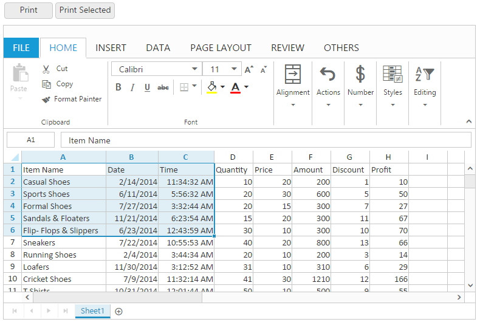
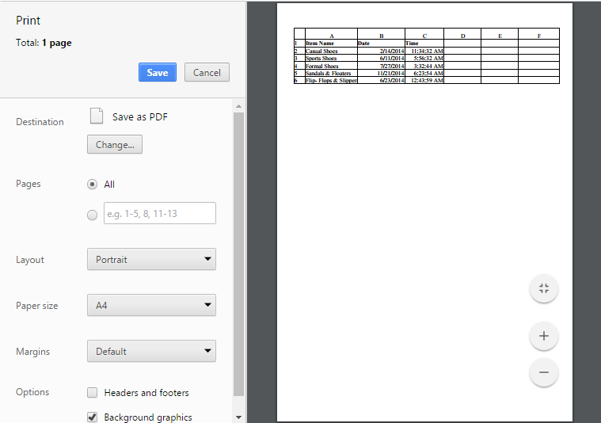

# Print

This feature is used to produce text and graphics from a computer screen or file into a sheet of paper. You can use [`allowPrinting`](https://help.syncfusion.com/api/js/ejspreadsheet#members:printsettings-allowprinting "allowPrinting") property in [`printSettings`](https://help.syncfusion.com/api/js/ejspreadsheet#members:printsettings "printSettings") to enable/disable the print operation.

You have following options in printing.

* Print Sheet / Print Selected Area.
* Print with Gridlines
* Print with Headers

## Print Sheet / Print Selected Area

You can print the sheet or print the selected area by following ways,

* Using the Print button or Print Selected button under Print group of PAGE LAYOUT tab in ribbon.
* Using [`printSheet`](https://help.syncfusion.com/api/js/ejspreadsheet#methods:xlprint-printsheet "printSheet") or [`printSelection`](https://help.syncfusion.com/api/js/ejspreadsheet#methods:xlprint-printselection "printSelection") method to print the spreadsheet.

The following code example describes the above behavior.


<button id="btnPrint">Print</button>
<button id="btnPrintSel">Print Selected</button>




$(function () {
    $("#Spreadsheet").ejSpreadsheet({
        // the datasource "window.defaultData" is referred from 'http://js.syncfusion.com/demos/web/scripts/xljsondata.min.js'
        sheets: [{
            rangeSettings: [{ dataSource: window.defaultData }],                               
        }],
        printSettings: {
            allowPrinting: true
        },
    });
    $("#btnPrint").ejButton({ showRoundedCorner: true, click: "printClick", width: 80});
    $("#btnPrintSel").ejButton({ showRoundedCorner: true, click: "printSelClick"});
});
function printClick(args) {
    var excelObj = $("#Spreadsheet").ejSpreadsheet("instance");
    excelObj.XLPrint.printSheet();
}
function printSelClick(args) {
    var excelObj = $("#Spreadsheet").ejSpreadsheet("instance");
    excelObj.XLPrint.printSelection();
}


The following output is displayed as a result of the above code example.

Print dialog with entire sheet in Chrome browser
{:.caption}

Print dialog with selected area print in chrome browser
{:.caption}

## Print with Gridlines

You have an option to print the spreadsheet with gridlines or without gridlines. You can do this by one of the following ways,

* Check the Gridlines option under Show group of PAGE LAYOUT tab in ribbon to print with Gridlines.
* Using [`showGridlines`](https://help.syncfusion.com/api/js/ejspreadsheet#members:sheets-showgridlines "showGridlines") property to enable / disable the gridlines.

The following code example describes the above behavior.






$(function () {
    $("#Spreadsheet").ejSpreadsheet({
        // the datasource "window.defaultData" is referred from 'http://js.syncfusion.com/demos/web/scripts/xljsondata.min.js'
        sheets: [{
            rangeSettings: [{ dataSource: window.defaultData }], 
            showGridlines: false                             
        }],
    });
});


Print dialog without gridlines in chrome browser
{:.caption}

## Print with Headings

You have an option to print the spreadsheet with headers or without headers. You can do this by one of the following ways,

* Check the Headings option under Show group of PAGE LAYOUT tab in ribbon. 
* Using [`showHeadings`](https://help.syncfusion.com/api/js/ejspreadsheet#members:sheets-showheadings "showHeadings") property to enable / disable headings.

The following code example describes the above behavior.






$(function () {
    $("#Spreadsheet").ejSpreadsheet({
        // the datasource "window.defaultData" is referred from   
        'http://js.syncfusion.com/demos/web/scripts/xljsondata.min.js'
        sheets: [{
            rangeSettings: [{ dataSource: window.defaultData }],
            showHeadings: false                               
        }],
    });
});


Print dialog without headings in chrome browser
{:.caption}
