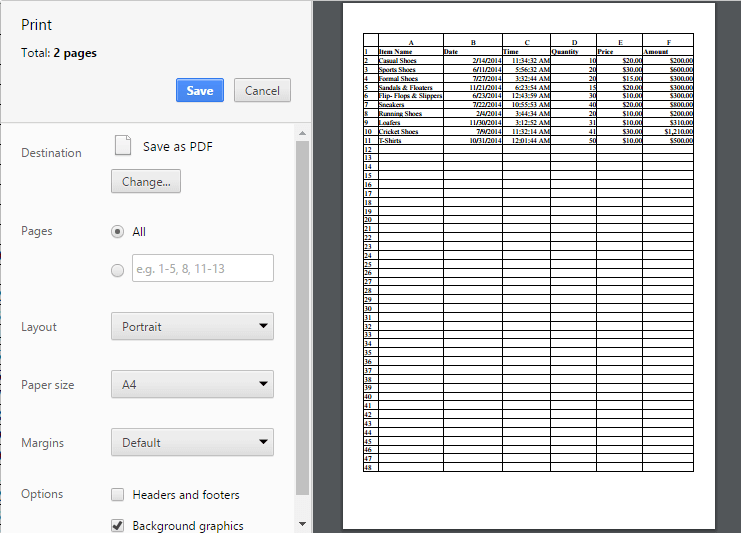

# Print

This feature is used for produce text and graphics from a computer screen or file onto a sheet of paper. You can use [`printSettings.allowPrinting`](https://help.syncfusion.com/js/api/ejspreadsheet#members:printsettings-allowprinting "printSettings.allowPrinting") property to enable/disable the print operation.

You have following options in printing.

* Page Size
* Print Sheet / Print Selected Area.
* Print with Gridlines
* Print with Headers

## Page Size

You have an option to set the page size for printing. You can use [`printSettings.allowPageSize`](https://help.syncfusion.com/js/api/ejspreadsheet#members:printsettings-allowpagesize "printSettings.allowPageSize") property to enable / disable the option to set the page size.

You can set the page size by one of the following ways,

* Using Page Size button to select the page size (A4, A3, letter) of PAGE LAYOUT tab in ribbon.
* Using `pageSize` property to set the page size for printing.

The following code example describes the above behavior.






$(function () {
    $("#Spreadsheet").ejSpreadsheet({
        printSettings: {
            allowPrinting: true,
            allowPageSize: true
        },
        pageSize: ej.Spreadsheet.pageSize.A4
    });
});


## Print Sheet / Print Selected Area

You can print the sheet or print the selected area by following ways,

* Using the Print button or Print Selected button of PAGE LAYOUT tab in ribbon.
* Using [`printSheet`](https://help.syncfusion.com/js/api/ejspreadsheet#methods:xlprint-printsheet "printSheet") or [`printSelection`](https://help.syncfusion.com/js/api/ejspreadsheet#methods:xlprint-printselection "printSelection") method to print the spreadsheet.

The following code example describes the above behavior.



<button id="btnPrint">Print</button>
<button id="btnPrintSel">Print Selected</button>



$(function () {
    $("#Spreadsheet").ejSpreadsheet({
        // the datasource "window.defaultData" is referred from 'http://js.syncfusion.com/demos/web/scripts/xljsondata.min.js'
        sheets: [{
            rangeSettings: [{ dataSource: window.defaultData, startCell: "A1" }],                               
        }],
        printSettings: {
            allowPrinting: true
        },
        pageSize: ej.Spreadsheet.pageSize.A4
    });
    $("#btnPrint").ejButton({ showRoundedCorner: true, click: "printClick", width: 80});
    $("#btnPrintSel").ejButton({ showRoundedCorner: true, click: "printSelClick"});
});
function printClick(args) {
    var xlObj = $("#Spreadsheet").ejSpreadsheet("instance");
    xlObj.XLPrint.printSheet();
}
function printSelClick(args) {
    var xlObj = $("#Spreadsheet").ejSpreadsheet("instance");
    xlObj.XLPrint.printSelection();
}


The following output is displayed as a result of the above code example.

{:caption}

Print dialog with entire sheet in Chrome browser

{:caption}

Print dialog with selected area print in chrome browser

## Print with Gridlines

You have an option to print the spreadsheet with gridlines or without gridlines. You can do this by one of the following ways,

* Check the Gridlines option to print with Gridlines of PAGE LAYOUT tab in ribbon.
* Using [`showGridlines`](https://help.syncfusion.com/js/api/ejspreadsheet#members:sheets-showgridlines "showGridlines") property to enable / disable the gridlines.

The following code example describes the above behavior.






$(function () {
    $("#Spreadsheet").ejSpreadsheet({
        // the datasource "window.defaultData" is referred from 'http://js.syncfusion.com/demos/web/scripts/xljsondata.min.js'
        sheets: [{
            rangeSettings: [{ dataSource: window.defaultData, startCell: "A1"}], 
            showGridlines: false                             
        }],
        printSettings: {
            allowPrinting: true,
        },
    });
});


{:caption}

Print dialog without gridlines in chrome browser

## Print with Headings

You have an option to print the spreadsheet with gridlines or without headers. You can do this by one of the following ways,

* Check the Headings option to print with Headings in PAGE LAYOUT tab of ribbon. 
* Using [`showHeadings`](https://help.syncfusion.com/js/api/ejspreadsheet#members:sheets-showheadings "showHeadings") property to enable / disable gridlines.

The following code example describes the above behavior.






$(function () {
    $("#Spreadsheet").ejSpreadsheet({
        // the datasource "window.defaultData" is referred from   
        'http://js.syncfusion.com/demos/web/scripts/xljsondata.min.js'
        sheets: [{
            rangeSettings: [{ dataSource: window.defaultData, startCell: "A1" }],
            showHeadings: false                               
        }],
        printSettings: {
            allowPrinting: true,
        }
    });
});


{:caption}

Print dialog without headings in chrome browser
