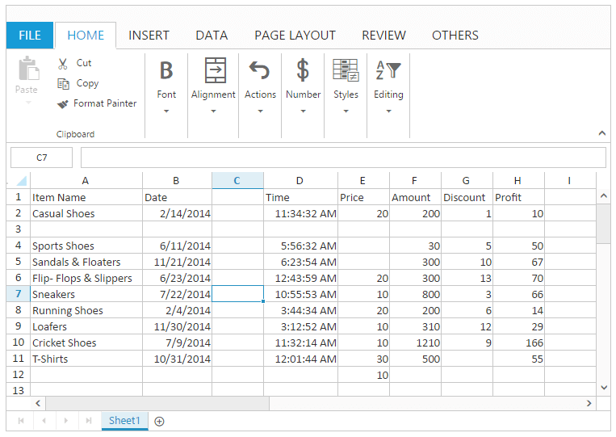

# Rows and columns

Rows and Columns are used to represent the editing area in Spreadsheet. The intersection point of rows and columns are called as Cells. In that you can perform editing. You have rowCount and colCount in sheets property and model for defining the rows and columns count. Based on this grid content will be created.

## Rows 

Rows are a collection of cells that run horizontally. Each row is identified by the row number in the row header.

## Columns

Columns are a collection of cells that run vertically. Each column is identified by column heading in the column header.
The following code example describes the above behavior.






$(function () {
$("#Spreadsheet").ejSpreadsheet({
// the datasource "window.defaultData" is referred from   
'http://js.syncfusion.com/demos/web/scripts/xljsondata.min.js'
sheets: [{
rangeSettings: [{ dataSource: window.defaultData, startCell: "A1", showHeader: true }],                               
}],
rowCount: 50,
colCount: 36,
});
});



## List of operations 

The following list of operations done within the rows and columns are 
* Insert

* Delete

* Show / Hide

* Resizing

### Insert 

You can insert blank cells, rows or columns based on the selection in a worksheet. You have to enable the allowInsert property to perform the insert operation. 
You can access insert operation through,
* OTHERS tab in ribbon.

* Context menu

Note: In the header context menu you can insert only rows or columns.

#### Insert Shift Bottom

You can dynamically insert blank cells to the top of the selected range and shift the selected cells to down by following 
* Click Insert in the context menu and select “Shift Cells Down” option in Insert dialog.

* Click Insert Cells in OTHERS tab in ribbon and select “Shift Cells Down” option in Insert dialog.

You can also perform insert shift bottom using “[insertShiftBottom](http://help.syncfusion.com/js/api/ejspreadsheet#methods:insertshiftbottom "")” method.

#### Insert Shift Right

You can dynamically insert blank cells to the left of the selected range and shift the selected cells to right by following
* Click Insert in the context menu and select “Shift Cells Right” option in Insert dialog.

* Click Insert Cells in OTHERS tab in ribbon and select “Shift Cells Right” option in Insert dialog.

You can also perform insert shift right using “[insertShiftRight](http://help.syncfusion.com/js/api/ejspreadsheet#methods:insertshiftright "")” method.

#### Insert Entire Row

You can dynamically insert the selected number of blank rows to the top of the selected range by following,
* Click Insert in the context menu and select “Entire Row” option in Insert dialog.

* Click Insert Cells in OTHERS tab in ribbon and select “Entire Row” option in Insert dialog.

* Click Insert option in row header context menu. 

You can also perform insert entire row using “[insertEntireRow](http://help.syncfusion.com/js/api/ejspreadsheet#methods:insertentirerow "")” method.

#### Insert Entire Column

You can dynamically insert the selected number of blank columns to the left of the selected range by following
* Click Insert in the context menu and select “Entire Column” option in Insert dialog.

* Click Insert Cells in OTHERS tab in ribbon and select “Entire Column” option in Insert dialog.

* Click Insert option in column header context menu. 

You can also perform insert entire column using “[insertEntireColumn](http://help.syncfusion.com/js/api/ejspreadsheet#methods:insertentirecolumn "")” method.

### Delete 

You can delete a range of cells, rows or columns based on the selection in worksheet. You have to enable the allowDelete property to perform Delete Operation. 
You can access delete operation through,
* OTHERS tab in Ribbon

* Context menu

Note: In header Context menu you can delete only rows or columns.

#### Delete Shift Up

You can dynamically delete the selected range of cells and shift the other cells to top by following
1. Click Delete in the context menu and select “Shift Cells Up” option in Delete dialog.

2. Click Delete Cells in OTHERS tab in ribbon and select “Shift Cells Up” option in Delete dialog.

You can also perform delete shift up using “[deleteShiftUp](http://help.syncfusion.com/js/api/ejspreadsheet#methods:deleteshiftup "")” method.

#### Delete Shift Left

You can dynamically delete the selected range of cells and shift the other cells to left by following,
* Click Delete in the context menu and select “Shift Cells Left” option in Delete dialog.

* Click Delete Cells in OTHERS tab in ribbon and select “Shift Cells Left” option in Delete dialog.

You can also perform delete shift up using “[deleteShiftLeft](http://help.syncfusion.com/js/api/ejspreadsheet#methods:deleteshiftleft "")” method.

#### Delete Entire Row

You can dynamically delete the selected rows and shift the other rows to top by following 
* Click Delete in the context menu and select “Entire Row” option in Delete dialog.

* Click Delete Cells in OTHERS tab in ribbon and select “Entire Row” option in Delete dialog.

* Click Delete option in row header context menu. 

You can also perform delete entire row using “[deleteEntireRow](http://help.syncfusion.com/js/api/ejspreadsheet#methods:deleteentirerow "")” method.

#### Delete Entire Column

You can dynamically delete a selected columns and shift other columns to left by following,
* Click Delete in the context menu and select “Entire Column” option in Delete dialog.

* Click Delete Cells in OTHERS tab in ribbon and select “Entire Column” option in Delete dialog.

* Click Delete option in column header context menu. 

You can also perform delete entire column using “[deleteEntireColumn](http://help.syncfusion.com/js/api/ejspreadsheet#methods:deleteentirecolumn "")” method.
The following code example describes the above behavior.





$(function () {
$("#Spreadsheet").ejSpreadsheet({
// the datasource "window.defaultData" is referred from   
'http://js.syncfusion.com/demos/web/scripts/xljsondata.min.js'
sheets: [{
rangeSettings: [{ dataSource: window.defaultData, startCell: "A1", showHeader: true }],                               
}],
allowInsert: true,
allowDelete: true,
loadComplete: “loadComplete”
});
});
function loadComplete() {
var xlObj = this.XLObj;
xlObj.insertEntireRow(2, 2);
xlObj.insertEntireColumn(2, 2);
xlObj.deleteEntireRow(4, 4);
xlObj.deleteEntireColumn(4, 4);
xlObj.insertShiftBottom({rowIndex: 4, colIndex: 4}, {rowIndex: 4, colIndex: 4});
xlObj.insertShiftRight({rowIndex: 3, colIndex: 4}, {rowIndex: 3, colIndex: 4});
xlObj.deleteShiftUp({rowIndex: 4, colIndex: 6}, {rowIndex: 4, colIndex: 6});
xlObj.deleteShiftLeft({rowIndex: 3, colIndex: 6}, {rowIndex: 3, colIndex: 6});
}



The following output is displayed as a result of the above code example.

### Show and Hide 

You can show or hide the rows and columns in Spreadsheet using methods and context menu. 

#### Hide Row

You can hide the rows dynamically by clicking “Hide” option in row header context menu.
You can also hide rows using “[hideRow](http://help.syncfusion.com/js/api/ejspreadsheet#methods:hiderow "")” method.

#### Hide Column

You can hide columns dynamically by clicking “Hide” option in column header context menu.
You can also hide columns using “[hideColumn](http://help.syncfusion.com/js/api/ejspreadsheet#methods:hidecolumn "")” method.
The following code example describes the above behavior.





$(function () {
$("#Spreadsheet").ejSpreadsheet({
// the datasource "window.defaultData" is referred from   
'http://js.syncfusion.com/demos/web/scripts/xljsondata.min.js'
sheets: [{
rangeSettings: [{ dataSource: window.defaultData, startCell: "A1", showHeader: true }],                               
}],
loadComplete: "loadComplete"
});
});
function loadComplete(args) {
var xlObj = $("#Spreadsheet").data("ejSpreadsheet");
if(!xlObj.isImport){
xlObj.hideRow(2, 2);
xlObj.hideColumn(2, 2);
}
}



The following output is displayed as a result of the above code example.

#### Show Row

You can show the hidden rows dynamically by clicking “Unhide” option in row header context menu.
You can also show rows using “[showRow](http://help.syncfusion.com/js/api/ejspreadsheet#methods:showrow "")” method.

#### Show Column

You can show the hidden columns dynamically by clicking “Unhide” option in column header context menu.
You can also show columns using “[showColumn](http://help.syncfusion.com/js/api/ejspreadsheet#methods:showcolumn "")” method.
The following code example describes the above behavior.





$(function () {
$("#Spreadsheet").ejSpreadsheet({
// the datasource "window.defaultData" is referred from   
'http://js.syncfusion.com/demos/web/scripts/xljsondata.min.js'
sheets: [{
rangeSettings: [{ dataSource: window.defaultData, startCell: "A1", showHeader: true }],                               
}],
loadComplete: "loadComplete"
});
});
function loadComplete(args) {
var xlObj = $("#Spreadsheet").data("ejSpreadsheet");
if(!xlObj.isImport){
xlObj.showRow(2, 2);
xlObj.showColumn(2, 2);
}
}



The following output is displayed as a result of the above code example.

### Resizing

You can change column width or row height with the specified value. You have to enable allowResizing to perform resizing. You can perform resizing through.
* Resize option in column header and row header.

* setColWidth and setRowHeight methods.

* rowHeight and columnWidth property.

The following code example describes the above behavior.





$(function () {
$("#Spreadsheet").ejSpreadsheet({
// the datasource "window.defaultData" is referred from   
'http://js.syncfusion.com/demos/web/scripts/xljsondata.min.js'
sheets: [{
rangeSettings: [{ dataSource: window.defaultData, startCell: "A1", showHeader: true }],
rowHeight: 21,
columnWidth: 64
}],
});
});



#### Set Column Width

You can set the column width to the specified column using “[setColWidth](http://help.syncfusion.com/js/api/ejspreadsheet#methods:xlresize-setcolwidth "")” method.

#### Set Row Height

You can set the row height to the specified row using “[setRowHeight](http://help.syncfusion.com/js/api/ejspreadsheet#methods:xlresize-setrowheight "")” method.
The following code example describes the above behavior.





$(function () {
$("#Spreadsheet").ejSpreadsheet({
// the datasource "window.defaultData" is referred from   
'http://js.syncfusion.com/demos/web/scripts/xljsondata.min.js'
sheets: [{
rangeSettings: [{ dataSource: window.defaultData, startCell: "A1", showHeader: true }],                               
}],
loadComplete: "loadComplete"
});
});
function loadComplete(args) {
var xlObj = $("#Spreadsheet").data("ejSpreadsheet");
if(!xlObj.isImport){
xlObj.XLResize.setColWidth(2, 100);
xlObj.XLResize.setRowHeight(2, 40);
}
}




### 

