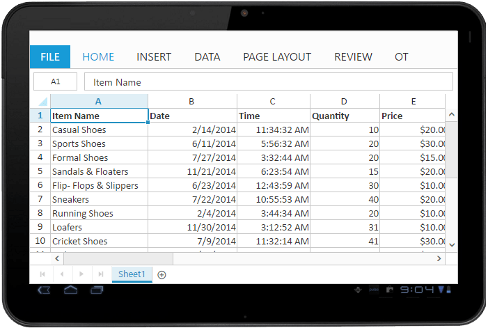

---
layout: post
title: Scrolling with Spreadsheet widget for Syncfusion Essential JS
description: How to enable Scrolling and its functionalities
platform: js
control: Spreadsheet
documentation: ug
--- 

# Scrolling

Scrolling can be enabled by setting [`scrollSettings.allowScrolling`](https://help.syncfusion.com/js/api/ejspreadsheet#members:scrollsettings-allowscrolling "scrollSettings.allowScrolling") as true. The height and width can be set to spreadsheet by setting properties [`scrollSettings.height`](https://help.syncfusion.com/js/api/ejspreadsheet#members:scrollsettings-height "scrollSettings.height") and [`scrollSettings.width`](https://help.syncfusion.com/js/api/ejspreadsheet#members:scrollsettings-width "scrollSettings.width"). 

## Height

You can specify the height of the spreadsheet by following ways,

* Specify the height with pixels.
* Specify the height with percentage.
* Specify the height with string values.
* Specify the height with "auto" - Spreadsheet height is based on the rows which you have bind with the spreadsheet. 

The following code example describes the above behavior.



 



$(function () {
    $("#Spreadsheet").ejSpreadsheet({
        scrollSetting: {
            allowScrolling: true,
            height: "100%",
            //height: "500px",
            //height: 500
        }   
    });
});


## Width

You can specify the width of the spreadsheet by following ways,

* Specify the width with pixels.
* Specify the width with percentage.
* Specify the width with string values.
* Specify the width with "auto" - Spreadsheet width is based on the columns which you have bind with the spreadsheet. 

The following code example describes the above behavior.



 



$(function () {
    $("#Spreadsheet").ejSpreadsheet({
        scrollSetting: {
            allowScrolling: true,
            width: "100%",
            //width: "500px",
            //width: 500
        }   
    });
});


## Responsive

Spreadsheet has support for responsive behavior based on client browser's width and height. To enable responsive, [`scrollSettings.isResponsive`](https://help.syncfusion.com/js/api/ejspreadsheet#members:scrollsettings-isresponsive "scrollSettings.isResponsive") property should be true. There are three modes of responsive layout is available in grid based on client width. They are.

* Mobile(<421px)
* Tablet (421px to 800px)
* Desktop(>800px)

N> Default value of [`scrollSettings.height`](https://help.syncfusion.com/js/api/ejspreadsheet#members:scrollsettings-height "scrollSettings.height") and [`scrollSettings.width`](https://help.syncfusion.com/js/api/ejspreadsheet#members:scrollsettings-width "scrollSettings.width") is "100%"
N> Default value of [`scrollSettings.isResponsive`](https://help.syncfusion.com/js/api/ejspreadsheet#members:scrollsettings-isresponsive "scrollSettings.isResponsive") is true.

### Mobile Mode

If client width is less than 421px, the spreadsheet will render in mobile mode. In which, you can see that grid user interface is customized and redesigned for best view in small screens. The customized feature includes filter dialog, format dialog, chart type dialog and ribbon.

{:caption}
Format cell dialog in mobile layout.

{:caption}
Ribbon in mobile layout

{:caption}
Filter dialog in mobile layout

### Tablet Layout

If the client width is between 421px and 800px, then the spreadsheet will render in tablet mode. Also it has customized the dialogs to match tablet screen size.

## Scroll Mode

Spreadsheet has supports two type of modes in scrolling. You can use [`scrollSettings.scrollMode`](https://help.syncfusion.com/js/api/ejspreadsheet#members:scrollsettings-scrollmode "scrollSettings.scrollMode") property to specify the mode of scrolling.

* Normal - This mode doesn't create new row/column when the scrollbar reaches the end.
* Infinite - This mode creates new row/column when the scrollbar reaches the end.

N> Default value of scrollMode property is infinite mode.

## Virtual Scrolling

Spreadsheet has supports virtual scrolling. This allows you to load data that you require (load data based on viewport size) without buffering the entire huge database. You can set [`scrollSettings.allowVirtualScrolling`](https://help.syncfusion.com/js/api/ejspreadsheet#members:scrollsettings-allowvirtualscrolling "scrollSettings.allowVirtualScrolling") property as true to enable virtual scrolling.

N> Default value of [`scrollSettings.allowVirtualScrolling`](https://help.syncfusion.com/js/api/ejspreadsheet#members:scrollsettings-allowvirtualscrolling "scrollSettings.allowVirtualScrolling") property is true.

The following code example describes the above behavior.



 



$(function () {
    $("#Spreadsheet").ejSpreadsheet({
        scrollSettings: {   
            allowScrolling: true,
            width: "100%",
            isResponsive: true,
            scrollMode: "infinite",
            allowVirtualScrolling: true
        },
        rowCount: 20
    });
});


The following output is displayed as a result of the above code example.

