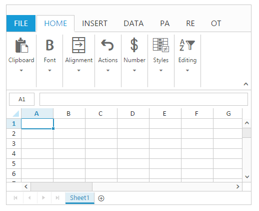
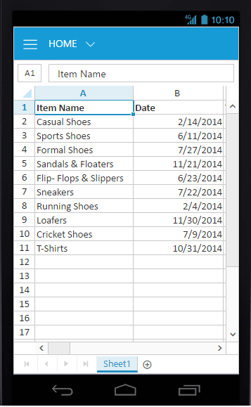
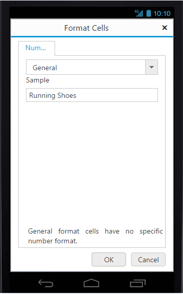

---
layout: post
title: Scrolling with Spreadsheet widget for Syncfusion Essential JS
description: How to enable Scrolling and its functionalities
platform: js
control: Spreadsheet
documentation: ug
api: /api/js/ejspreadsheet
--- 

# Scrolling

Scrolling helps you to move quickly to different areas of worksheet. Scrolling can be enabled by setting [`allowScrolling`](https://help.syncfusion.com/api/js/ejspreadsheet#members:scrollsettings-allowscrolling "allowScrolling") as true in [`scrollSettings`](https://help.syncfusion.com/api/js/ejspreadsheet#members:scrollsettings "scrollSettings"). 

You can scroll through worksheet using one of the following ways,

* Using the arrow keys
* Using the scroll bars
* Using the mouse
* Using[`scrollToCell`](https://help.syncfusion.com/api/js/ejspreadsheet#methods:xlscroll-scrolltocell "scrollToCell") method.

## Set height and width for Scrolling

To set height and width in spreadsheet use [`height`](https://help.syncfusion.com/api/js/ejspreadsheet#members:scrollsettings-height "height") and [`width`](https://help.syncfusion.com/api/js/ejspreadsheet#members:scrollsettings-width "width") property in [`scrollSettings`](https://help.syncfusion.com/api/js/ejspreadsheet#members:scrollsettings "scrollSettings"). The default value for [`height`](https://help.syncfusion.com/api/js/ejspreadsheet#members:scrollsettings-height "height") and [`width`](https://help.syncfusion.com/api/js/ejspreadsheet#members:scrollsettings-width "width") is `100%`. The height and width can be set in percentage and pixel. 

You can also enable or disable sheet on demand by using [`allowSheetOnDemand`](https://help.syncfusion.com/api/js/ejspreadsheet#members:scrollsettings-allowsheetondemand "allowSheetOnDemand") property. It render only the active sheet element while paging remaining sheets are created one by one.

The following code example describes the above behavior.



 



$(function () {
    $("#Spreadsheet").ejSpreadsheet({
        scrollSettings: {
            allowScrolling: true,
            allowSheetOnDemand: true,
            height: 400, // Height in pixel
            width: "50%" // Width in percentage
        }   
    });
});


The following output is displayed as a result of the above code example.

## Responsive

Spreadsheet has support for responsive behavior based on client browser's width and height. To enable responsive, set [`isResponsive`](https://help.syncfusion.com/api/js/ejspreadsheet#members:scrollsettings-isresponsive "isResponsive") property in [`scrollSettings`](https://help.syncfusion.com/api/js/ejspreadsheet#members:scrollsettings "scrollSettings") as true. The three modes of responsive layout available in grid based on client width. They are.

* Mobile(<420px)
* Tablet (420px to 617px)
* Desktop(>617px)

N> Default value of [`isResponsive`](https://help.syncfusion.com/api/js/ejspreadsheet#members:scrollsettings-isresponsive "isResponsive") is true.

I> `ej.responsive.css` should be referred to display spreadsheet in responsive. 

### Mobile Mode

If client width is less than 420px, the spreadsheet will render in mobile mode. In which, you can see that spreadsheet user interface is customized and redesigned for best view in small screens. The customized feature includes filter dialog, format dialog, chart type dialog and ribbon.

Ribbon in mobile layout
{:.caption}

Format cell dialog in mobile layout.
{:.caption}

### Tablet Layout

If the client width is between 420px and 617px, then the spreadsheet will render in tablet mode. Also it has customized the dialogs to match tablet screen size.

Ribbon in tablet layout.
{:.caption}

## Scroll Mode

Spreadsheet supports two type of modes in scrolling. You can use [`scrollMode`](https://help.syncfusion.com/api/js/ejspreadsheet#members:scrollsettings-scrollmode "scrollMode") property in [`scrollSettings`](https://help.syncfusion.com/api/js/ejspreadsheet#members:scrollsettings "scrollSettings") to specify the mode of scrolling.

* Normal - This mode doesn't create new row/column when the scrollbar reaches the end.
* Infinite - This mode creates new row/column when the scrollbar reaches the end.

N> Default value of scrollMode property is infinite mode.

## Virtual Scrolling

Spreadsheet has supports for virtual scrolling. This allows you to load data that you require (load data based on viewport size) without buffering the entire huge database. You can set [`allowVirtualScrolling`](https://help.syncfusion.com/api/js/ejspreadsheet#members:scrollsettings-allowvirtualscrolling "allowVirtualScrolling") property in [`scrollSettings`](https://help.syncfusion.com/api/js/ejspreadsheet#members:scrollsettings "scrollSettings") as true to enable virtual scrolling.

N> Default value of [`allowVirtualScrolling`](https://help.syncfusion.com/api/js/ejspreadsheet#members:scrollsettings-allowvirtualscrolling "allowVirtualScrolling") property is true.

