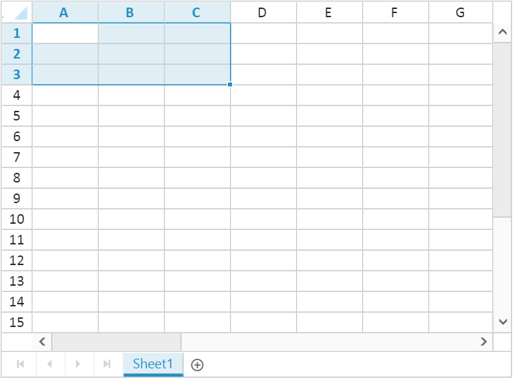
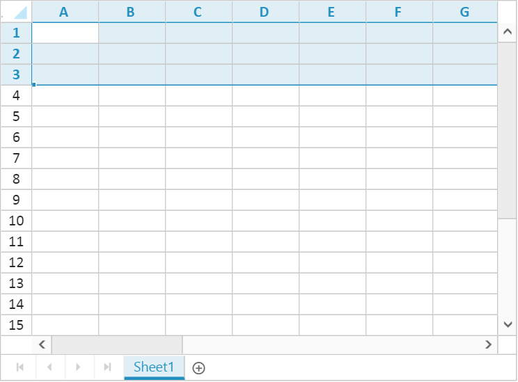
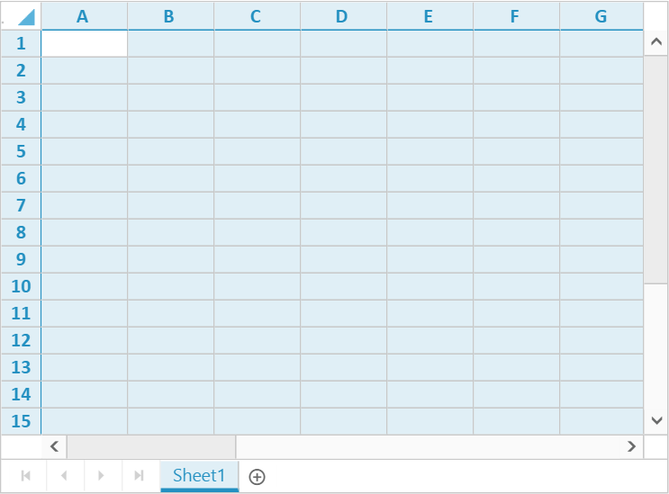

# Selection

Selection functionality enables to select, cell or range of cells to manipulate data on it. Selection can be done through Mouse, Touch or Keyboard interaction. To enable selection, set [`allowSelection`](http://help.syncfusion.com/js/api/ejspreadsheet#members:allowselection "allowSelection") as true.

## Selection modes

Selection can be performed as single or range. The default selection mode can be set using [`selectionUnit`](http://help.syncfusion.com/js/api/ejspreadsheet#members:selectionsettings-selectionunit "selectionUnit") in [`selectionSettings`](http://help.syncfusion.com/js/api/ejspreadsheet#members:selectionsettings "selectionSettings").
The two types of selection mode are as follows

* Single - ej.Spreadsheet.SelectionUnit.Single

* Range - ej.Spreadsheet.SelectionUnit.Range

### Single Selection

Single Selection is used to select a single cell, row or column.
The following code example describes the above behavior.





The following output is displayed as a result of the above code example.

### Range Selection

Range selection is used to select a single or multiple cell, row or column.
The following code example describes the above behavior.





The following output is displayed as a result of the above code example.

## Selection Type

There are four types of selection in Spreadsheet

1. Cell Selection

2. Row Selection

3. Column Selection

4. Sheet Selection

You can set default [`selectionType`](http://help.syncfusion.com/js/api/ejspreadsheet#members:selectionsettings-selectiontype "selectionType") in [`selectionSettings`](http://help.syncfusion.com/js/api/ejspreadsheet#members:selectionsettings "selectionSettings").

### Cell Selection 

Cell selection is used to select a single or multiple cells. It can be performed using [`selectRange`](http://help.syncfusion.com/js/api/ejspreadsheet#methods:xlselection-selectrange "selectRange") method. 
The following code example describes the above behavior.





The following output is displayed as a result of the above code example.

### Row Selection 

Row selection is used to select a single or multiple rows. It can be performed using [`selectRows`](http://help.syncfusion.com/js/api/ejspreadsheet#methods:xlselection-selectrows "selectRows") method.
The following code example describes the above behavior.





The following output is displayed as a result of the above code example.

This type can be set as default by setting [`selectionType`](http://help.syncfusion.com/js/api/ejspreadsheet#members:selectionsettings-selectiontype "selectionType") property in [`selectionSettings`](http://help.syncfusion.com/js/api/ejspreadsheet#members:selectionsettings "selectionSettings") as ej.Spreadsheet.SelectionType.Row.

### Column Selection

Column selection is used to select a single or multiple columns. It can be performed using [`selectColumns`](http://help.syncfusion.com/js/api/ejspreadsheet#methods:xlselection-selectcolumns "selectColumns") method.
The following code example describes the above behavior.





The following output is displayed as a result of the above code example.

This type can be set as default by setting [`selectionType`](http://help.syncfusion.com/js/api/ejspreadsheet#members:selectionsettings-selectiontype "selectionType") property in [`selectionSettings`](http://help.syncfusion.com/js/api/ejspreadsheet#members:selectionsettings "selectionSettings") as ej.Spreadsheet.SelectionType.Column. 

### Sheet Selection

Sheet selection is used to select all cells in a worksheet.  It can be performed using [`selectSheet`](http://help.syncfusion.com/js/api/ejspreadsheet#methods:xlselection-selectsheet "selectSheet") method.
The following code example describes the above behavior.





The following output is displayed as a result of the above code example. 

