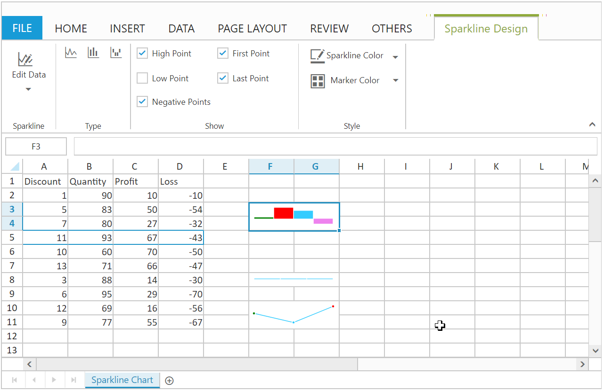

# Sparkline

Sparkline are easy to interpret and it conveys much more information to the user by visualizing the data in a small amount of space. Here sparkline were placed inside the cell. It creates the Sparkline based on the selected cell range’s data. You can use [`allowSparkline`](https://help.syncfusion.com/api/js/ejspreadsheet#members:allowsparkline "allowSparkline") property to enable/disable Sparkline.

## Types of Sparkline 

The Following Types of Sparkline are available in Spreadsheet.

*	Column
*	Line
*	Win/loss 

You can create the Sparkline by one of the following ways,

*	Using the `Sparkline Type` button to select the type of Sparkline under Sparkline groups of INSERT Tab in ribbon.
*	Using `createSparkline` method to create the Sparkline.

## Sparkline Customization

You can perform the following customizations for Sparkline. These options are available in SPARKLINE DESIGN Tab which is enabled, while clicking the Sparkline element.

<table>
    <colgroup><col width="180px" /></colgroup>
    <tr><th>Feature </th><th>API </th><th>Description </th></tr>
    <tr><td>Edit Data & Location Range </td><td>{{'[`createSparkline`](https://help.syncfusion.com/api/js/ejspreadsheet#methods:xlsparkline-createsparkline  "createSparkline")'| markdownify }} </td><td>You can modify the data range, location range of Sparkline  </td></tr>
    <tr><td>Sparkline Type </td><td>{{'[`changeType`](https://help.syncfusion.com/api/js/ejspreadsheet#methods:xlsparkline-changetype  "changeType")'| markdownify }} </td><td>You can change the type of sparkline by using sparkline type button. </td></tr>
    <tr><td>High Point, First Point, Last Point, Low Point, Negative Point, Sparkline Color and Marker Color </td><td>{{'[`changePointColor`](https://help.syncfusion.com/api/js/ejspreadsheet#methods:xlsparkline-changepointcolor  "changePointColor")'| markdownify }} </td><td>You can high light the high point, low point, first point, last point, negative point and Marker Color of sparkline . </td></tr>
</table>

The following code example describes the above behavior,





The following output is displayed as a result of the above code example.

