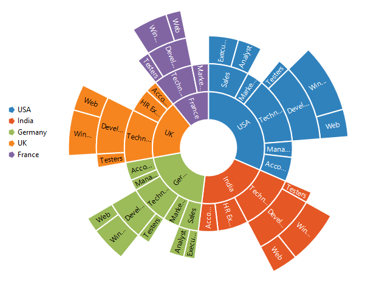
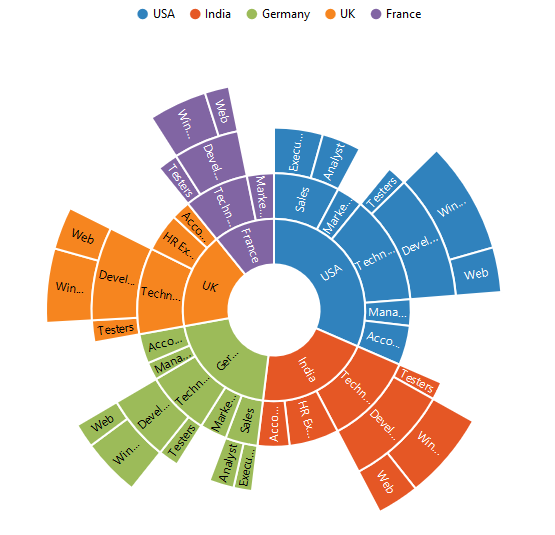
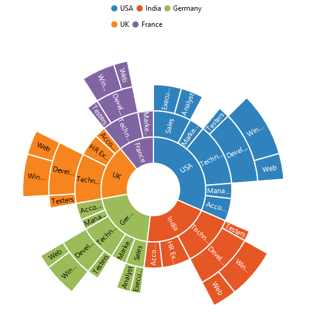

## Legend
The legend is used to represent the first level of items in the Sunburst Chart.The [`legend`](../api/ejsunburstchart#members:legend) can be initialized using the below code snippet,
You can enable or disable it by using the [`visible`](../api/ejsunburstchart#members:legend-visible) option of the legend.



$("#chart"). ejSunburstChart ({

    legend: { visible: true },
   });

 

## Legend Icon 

You can specify different shapes of legend icon by using the [`shape`](../api/ejsunburstchart#members:legend-shape) property of the legend. By default, legend shape is **Circle**. The Sunburst chart has some predefined shapes such as:
* Circle
* Cross
* Diamond
* Pentagon
* Rectangle
* Triangle



$("#chart"). ejSunburstChart ({

    legend: { shape:"pentagon"},
   });



 
## Positioning the Legend

By using the [`position`](../api/ejsunburstchart#members:legend-position) property, you can position the legend at left, right, top or bottom of the chart. 



$("#chart"). ejSunburstChart ({

    legend: {position:"top"},
   });



## Legend title

To add the title to the legend, you have to specify the [`text`](../api/ejsunburstchart#members:legend-title-text) option.You can enable or disable the legend title by using the [`visible`](../api/ejsunburstchart#members:legend-title-visible) option of the legend.

Using [`font`](../api/ejsunburstchart#members:legend-title-font) property, you can customize  [`font family`](../api/ejsunburstchart#members:legend-title-font-fontfamily), [`font style`](../api/ejsunburstchart#members:legend-title-font-fontstyle), [`font weight`](../api/ejsunburstchart#members:legend-title-font-fontweight), [`size`](../api/ejsunburstchart#members:legend-title-font-size) options.



        $("#chart").ejSunburstChart({
            // ...             
              legend: {
                //...
                title: {
                   //Add title to the chart legend
	               text: "Countries",
				
		         }  },

            // ...             
        });


 
### Customization

## Legend Item Size and border
You can change the size of the legend items by using the [`itemStyle.width`](../api/ejsunburstchart#members:legend-itemstyle-width) and [`itemStyle.height`](../api/ejsunburstchart#members:legend-itemstyle-height) properties. To change the legend item border, use [`border`](../api/ejsunburstchart#members:legend-border) option of the legend [`itemStyle`](../api/ejsunburstchart#members:legend-itemstyle).
You can change this default border of the legend by using the [`width`](../api/ejsunburstchart#members:legend-border-width) and `height` options.



$("#chart"). ejSunburstChart ({

    legend: {position:"top",itemStyle:{height:13,width:13},border: { color: "#FF0000", width: 1 }},
   });



## Legend Size

By default, legend takes 20% of the [`height`](../api/ejsunburstchart#members:legend-size-height) horizontally when it was placed on the top or bottom position and 20% of the [`width`](../api/ejsunburstchart#members:legend-size-width) vertically while placing on the left or right position of the chart. You can change this default legend size by using the [`size`](../api/ejsunburstchart#members:legend-size) property of the legend.



$("#chart"). ejSunburstChart ({

    legend: {position:"top",size:{ height:"75",width:"200"}},
   });



## Legend Item Padding

You can control the spacing between the legend items by using the [`itemPadding`](../api/ejsunburstchart#members:legend-itempadding) option of the legend.



$("#chart").ejSunburstChart({
            // ...             
            legend: {
                //...
                //Add space between each legend item
                itemPadding: 15,
            }
            // ...             
        });



## Legend Row and Columns

You can arrange the legend items horizontally and vertically by using the [`rowCount`](../api/ejsunburstchart#members:legend-rowcount) and [`columnCount`](../api/ejsunburstchart#members:legend-columncount) properties of the legend.
•	When only the rowCount is specified, the legend items are arranged according to the rowCount and number of columns may vary based on the number of legend items.
•	When only the columnCount is specified, the legend items are arranged according to the columnCount and number of rows may vary based on the number of legend items.
•	When both the properties are specified, then the one which has higher value is given preference. For example, when the rowCount is 4 and columnCount is 3, legend items are arranged in 4 rows.
•	When both the properties are specified and have the same value, the preference is given to the columnCount when it is positioned at the top/bottom position. The preference is given to the rowCount when it is positioned at the left/right position.
 


$("#chart"). ejSunburstChart ({

    legend: {position:"top",rowCount:"2",columnCount:"3"},
   });



 
## LegendInteractivity

You can select a specific category while clicking on corresponding legend item through [`clickAction'](../api/ejsunburstchart#members:legend-clickaction) property. 

It has three types of action
*	ToggleSegmentSelection
*	ToggleSegmentVisibility
*	None

## Toggle Segment Selection

Used to highlight specific category while clicking on legend item



$("#chart").ejSunburstChart ({

    legend: {clickAction:"toggleSegmentSelection"},
   });
   


 
## Toggle Segment Visibility

Used to disable the specific category while clicking on legend item.



$("#chart").ejSunburstChart ({

    legend: {clickAction:"toggleSegmentVisibility"},
   });



## Customize the legend text

To customize the legend item text and title you can use the [`font`](../api/ejsunburstchart#members:legend-font) and [`title`](../api/ejsunburstchart#members:legend-title) options. You can change the legend title [`alignment`](../api/ejsunburstchart#members:legend-alignment) by using the [`textAlignment`](../api/ejsunburstchart#members:legend-title-textalignment) option of the legend title.

Using [`font`](../api/ejsunburstchart#members:legend-font) property, you can customize  [`font family`](../api/ejsunburstchart#members:legend-font-fontfamily), [`font style`](../api/ejsunburstchart#members:legend-font-fontstyle), [`font weight`](../api/ejsunburstchart#members:legend-font-fontweight), [`size`](../api/ejsunburstchart#members:legend-font-size) options.



        $("#chart").ejSunburstChart({
            // ...             
            legend: {
                //...
                //Customize the legend item text
                font: { fontFamily: 'Segoe UI', fontStyle: 'Normal', fontWeight: 'Bold', size: '15px' },
                title: {
                    //...
		            textAlignment: "center",
                    //Customize the legend title text
	                font: { fontFamily: 'Segoe UI', fontStyle: 'Italic', 
                                        fontWeight: 'Bold', size: '12px' },
	             }            
             },
            // ...             
        });



## Legend Location

The [`location`](../api/ejsunburstchart#members:legend-location) property is used for customizing the position of the sunburst chart legend. 
Legend is placed in provided location only when value of position property is custom. Both the [`x`](../api/ejsunburstchart#members:legend-location-x) and [`y`](../api/ejsunburstchart#members:legend-location-y) locations can be customized in the location property.



$("#chart").ejSunburstChart({
            // ...             
            legend: {
                //...
               
                location :{x :20 ,y:100}  
            }
            // ...             
        });


