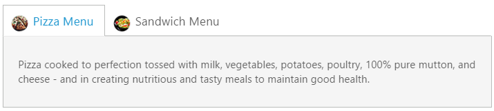
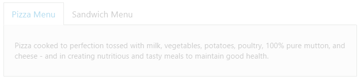
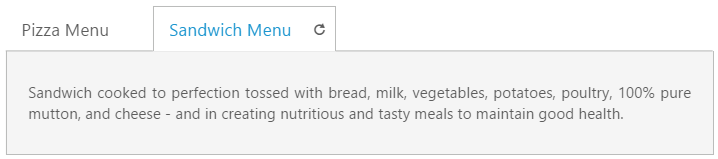
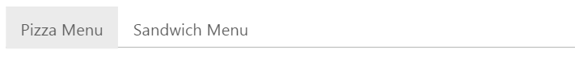
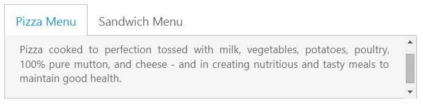
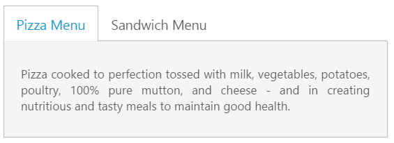
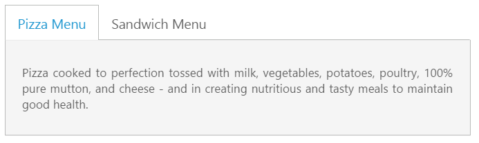

# Appearance and Styling

## Header Image Customization

To set the **Tab** header image for each **Tab** item you can specify image in &lt;span&gt; tag element during the **Tab** header declaration time.

The following code example is used to add the header image for the root **Tab** header element. 

Add the following **HTML** to render **Tab** with header image.



 

    <ul>
        <li><a href="#pizza">Pizza Menu</a></li>
        <li><a href="#sandwich">Sandwich Menu</a></li>
    </ul>
    

        <!--Food item description-->
        
Pizza cooked to perfection tossed with milk, vegetables, potatoes, poultry, 100% pure mutton, and cheese - and in creating nutritious and tasty meals to maintain good health.

    

    

        <!--dish description-->
        
Sandwich cooked to perfection tossed with bread, milk, vegetables, potatoes, poultry, 100% pure mutton, and cheese - and in creating nutritious and tasty meals to maintain good health.

    





   
        // Add the following script for Tab render with customizes header image.
        $(function () {         
             $("#dish").ejTab();    
        });



Add following **CSS** for header image customization.



 



The following screenshot illustrates the **Tab** with the customized header image. 

Header Image Customization
{:.caption}

## Rounded corner

By enabling [showRoundedCorner](https://help.syncfusion.com/api/js/ejtab#members:showroundedcorner) property, you can customize the shape of the **Tab** widget from regular rectangular shape to rounded rectangle shape that is set to ‘**false**’ by default. 

The following code example is used to render the **Tab** widget with **Rounded Corner**.

Add the following **HTML** to render **Tab** with rounder corner.



    <ul>
        <li><a href="#pizza">Pizza Menu</a></li>
        <li><a href="#sandwich">Sandwich Menu</a></li>
    </ul>
    

        <!--Food item description-->
        
Pizza cooked to perfection tossed with milk, vegetables, potatoes, poultry, 100% pure mutton, and cheese - and in creating nutritious and tasty meals to maintain good health.

    

    

        <!--dish description-->
        
Sandwich cooked to perfection tossed with bread, milk, vegetables, potatoes, poultry, 100% pure mutton, and cheese - and in creating nutritious and tasty meals to maintain good health.

    





        // Add the following script to render Tab with rounded corner.
        $(function () {         
             $("#dish").ejTab({ showRoundedCorner: true });
        });



The following screenshot illustrates the **Tab** with Rounded corner.

 

## Enable/Disable

You can enable or disable the **Tab** widget by [enabled](https://help.syncfusion.com/api/js/ejtab#members:enabled) property. By default, the property set to ‘**true**’**.**

The following code example is used to render the **Tab** widget with enable/disable.

Add the following **HTML** to render **Tab** with enable/disable.



    <ul>
        <li><a href="#pizza">Pizza Menu</a></li>
        <li><a href="#sandwich">Sandwich Menu</a></li>
    </ul>
    

        <!--Food item description-->
        
Pizza cooked to perfection tossed with milk, vegetables, potatoes, poultry, 100% pure mutton, and cheese - and in creating nutritious and tasty meals to maintain good health.

    

    

        <!--dish description-->
        
Sandwich cooked to perfection tossed with bread, milk, vegetables, potatoes, poultry, 100% pure mutton, and cheese - and in creating nutritious and tasty meals to maintain good health.

    





  
        // Add the following script to render Tab with disabled format.
        $(function () {
            $("#dish").ejTab({ enabled: false });
        });



The following screenshot illustrates the **Tab** with disabled format.

 

## Enabling Reload Icon
 
Without refresh/reload the whole page, you can reload a particular **Tab** using **Reload** icon. The **Reload** icon is appeared at right corner of the **Tab** by enabling the property [showReloadIcon](https://help.syncfusion.com/api/js/ejtab#members:showreloadicon) to ‘**true**’. When you move cursor over the **Tab** headers, the **Reload** icon is displayed. By default the property value is set to ‘**false**’.   

The following code example is used to render the **Tab** widget with **Reload** icon.

Add the following **HTML** to render **Tab** with **Reload** icon.



        

    <ul>
        <li><a href="#pizza">Pizza Menu</a></li>
        <li><a href="#sandwich">Sandwich Menu</a></li>
    </ul>
    

        <!--Food item description-->
        
Pizza cooked to perfection tossed with milk, vegetables, potatoes, poultry, 100% pure mutton, and cheese - and in creating nutritious and tasty meals to maintain good health.

    

    

        <!--dish description-->
        
Sandwich cooked to perfection tossed with bread, milk, vegetables, potatoes, poultry, 100% pure mutton, and cheese - and in creating nutritious and tasty meals to maintain good health.

    





        // Add the following script to render Tab with Reload icon.
        $(function () {         
             $("#dish").ejTab({ showReloadIcon: true });
        });



The following screenshot illustrates the **Tab** with **Reload** icon.

 

## Collapsible Tabs

You can collapse the **Tab** content by enabling the [collapsible](https://help.syncfusion.com/api/js/ejtab#members:collapsible) property to ‘**true**’. When the property is set to ‘**true**’ then click the active **Tab** header, the **Tab** contents are hidden. By default, the property value is set to ‘**false**’.

The following code example is used to render the **Tab** widget with customized collapsible mode.

Add the following **HTML** to render **Tab** with customized collapsible mode.



    <ul>
        <li><a href="#pizza">Pizza Menu</a></li>
        <li><a href="#sandwich">Sandwich Menu</a></li>
    </ul>
    

        <!--Food item description-->
        
Pizza cooked to perfection tossed with milk, vegetables, potatoes, poultry, 100% pure mutton, and cheese - and in creating nutritious and tasty meals to maintain good health.

    

    

        <!--dish description-->
        
Sandwich cooked to perfection tossed with bread, milk, vegetables, potatoes, poultry, 100% pure mutton, and cheese - and in creating nutritious and tasty meals to maintain good health.

    





        // Add the following script to render Tab with customized collapsible mode.
        $(function () {         
             $("#dish").ejTab({ collapsible: true });
        });



The following screenshot illustrates the **Tab** with customized collapsible mode.

 

## Adjusting Tab Size

### Height Adjust Mode and Height

The height of the **Tab** widget is customized by [height](https://help.syncfusion.com/api/js/ejtab#members:height) property. The **Tab** widget height depends on [heightAdjustMode](https://help.syncfusion.com/api/js/ejtab#members:heightadjustmode) property. Using the **heightAdjustMode** property, you can adjust height by “**content**”, “**auto**”, “**fill**”. By default the **heightAdjustMode** is set as **content**.

The following code example is used to render the **Tab** widget with customized height and height adjust mode.

Add the following **HTML** to render **Tab** with customized height and height adjust mode.



    <ul>
        <li><a href="#pizza">Pizza Menu</a></li>
        <li><a href="#sandwich">Sandwich Menu</a></li>
    </ul>
    

        <!--Food item description-->
        
Pizza cooked to perfection tossed with milk, vegetables, potatoes, poultry, 100% pure mutton, and cheese - and in creating nutritious and tasty meals to maintain good health.

    

    

        <!--dish description-->
        
Sandwich cooked to perfection tossed with bread, milk, vegetables, potatoes, poultry, 100% pure mutton, and cheese - and in creating nutritious and tasty meals to maintain good health.

    





    
           // Add the following script to render Tab with customized height and height adjust mode.
           $(function () {         
               $("#dish").ejTab({ heightAdjustMode:"fill", height:"300px"}); 
           });



The following screenshot illustrates the **Tab** with customized height and height adjust mode.

 

### Width

The **width** of the **Tab** widget is customized by using [width](https://help.syncfusion.com/api/js/ejtab#members:width) property that accepts only the pixel values.

The following code example is used to render the **Tab** widget with customized width.

Add the following **HTML** to render **Tab** with customized width.



    <ul>
        <li><a href="#pizza">Pizza Menu</a></li>
        <li><a href="#sandwich">Sandwich Menu</a></li>
    </ul>
    

        <!--Food item description-->
        
Pizza cooked to perfection tossed with milk, vegetables, potatoes, poultry, 100% pure mutton, and cheese - and in creating nutritious and tasty meals to maintain good health.

    

    

        <!--dish description-->
        
Sandwich cooked to perfection tossed with bread, milk, vegetables, potatoes, poultry, 100% pure mutton, and cheese - and in creating nutritious and tasty meals to maintain good health.

    





        // Add the following script to render Tab with customized width.
        $(function () {         
             $("#dish").ejTab({ width:"450px" });
        });   



The following screenshot illustrates the **Tab** with customized width.

 

## Theme

**Tab** control’s style and appearance are controlled based on **CSS** classes. In order to apply styles to the **Tab** control, you can refer 2 files namely, **ej.widgets.core.min.css** and **ej.theme.min.css**. When the file **ej.widgets.all.min.css** is referred, then it is not necessary to include the files **ej.widgets.core.min.css** and **ej.theme.min.css** in your project**,** as **ej.widgets.all.min.css** is the combination of these two. 

By default, there are 13 themes support available for **Tab** control namely

* default-theme
* bootstrap-theme
* flat-azure-dark
* fat-lime
* flat-lime-dark
* flat-saffron
* flat-saffron-dark
* gradient-azure
* gradient-azure-dark
* gradient-lime
* gradient-lime-dark
* gradient-saffron
* gradient-saffron-dark

## Custom styles

The style of the **Tab** widget is customized by [cssClass](https://help.syncfusion.com/api/js/ejtab#members:cssclass) property. 

The following code example is used to render the **Tab** widget with customized style.

Add the following **HTML** to render **Tab** with customized style.



    <ul>
        <li><a href="#pizza">Pizza Menu</a></li>
        <li><a href="#sandwich">Sandwich Menu</a></li>
    </ul>
    

        <!--Food item description-->
        
Pizza cooked to perfection tossed with milk, vegetables, potatoes, poultry, 100% pure mutton, and cheese - and in creating nutritious and tasty meals to maintain good health.

    

    

        <!--dish description-->
        
Sandwich cooked to perfection tossed with bread, milk, vegetables, potatoes, poultry, 100% pure mutton, and cheese - and in creating nutritious and tasty meals to maintain good health.

    





    
        $(function () {         
             $("#dish").ejTab({ cssClass: "custom" });
        });



Add the following styles



    



The following screenshot illustrates the **Tab** with customized style.

 

