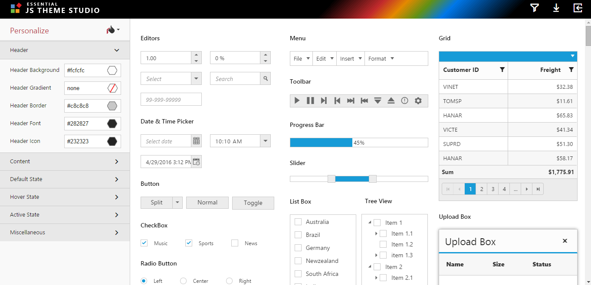
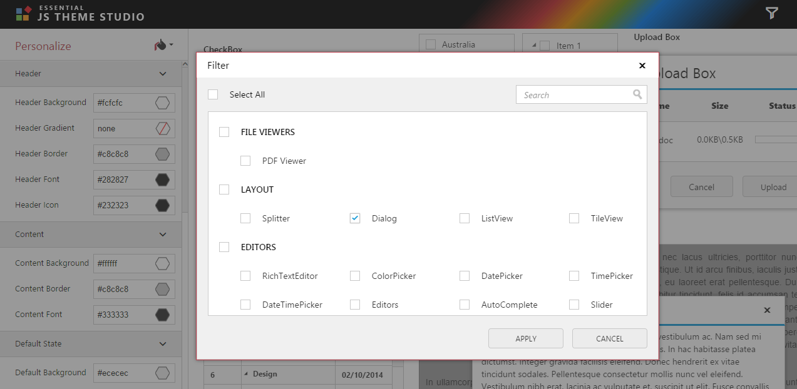
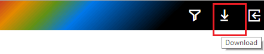
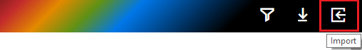
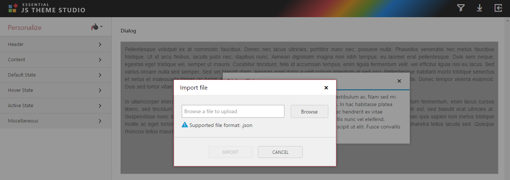
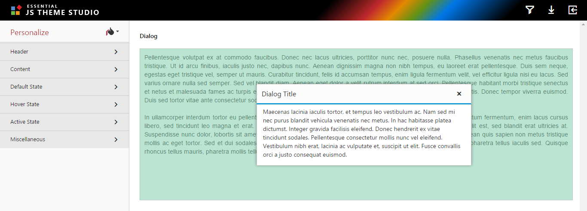
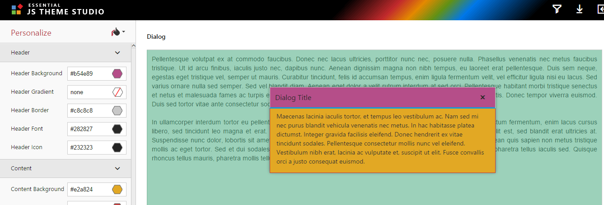
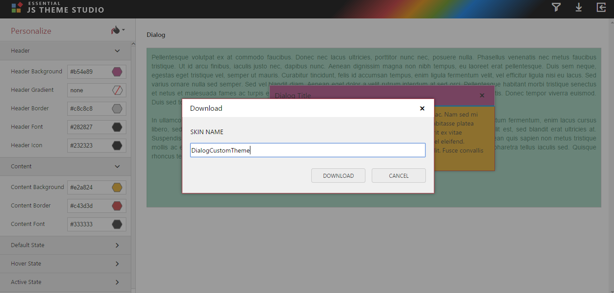
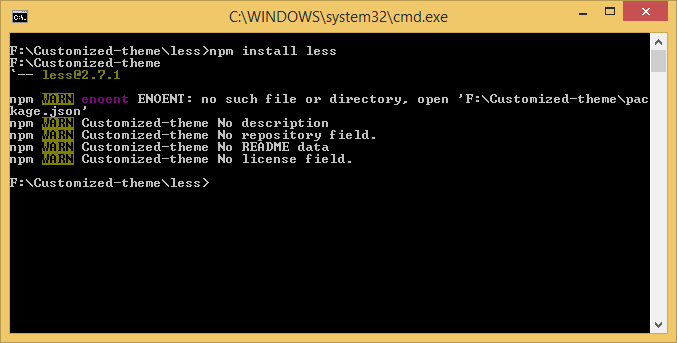

# Overview of Essential Theme Studio

Essential [Theme Studio](http://js.syncfusion.com/themestudio/) for JavaScript allows us to build a new theme based on an existing themes for Syncfusion Essential JavaScript controls except Data visualization controls like Chart, Diagram, Gauge, Range Navigator, Barcode, Maps. Also, you can import your customized theme into the Theme studio and customize the colors and download.

## How to create a new theme based on existing built-in themes?

**Step 1:**

  You can make use of built-in themes in theme studio. In that, you can choose the built-in theme as Flat-Azure theme under the `Personalize` menu and customize theme based on your application.  

You can apply Flat-Azure theme as shown below,

**Step 2:**

The following options of the control can be customized.

* Header

* Content

* Default State

* Hover State

* Active State

* Miscellaneous

**Step 3:**

Essential Theme Studio for JavaScript provides a `Filter` option to customize theme for the specific controls. In this, you can filter the Dialog control and customize theme of it. 

You can find the filter option in theme studio as shown below:

**Step 4:**

Once you customize the theme for the Dialog control, then you can download the customized theme files directly through the `Download` option in theme studio.
 
You can find the Download option in theme studio as shown below:

### 15.4 and below version

In the Download dialog popup provide a name to the file to be generated. Once the Download button is clicked, it will download the customized theme files. The downloaded theme files consist as follows:

<table>
<tr>
<th>Files  </th>
<th>Details  </th>
</tr>
<tr>
<td>
ej.theme.less  </td><td>
You can manually change the color code in this less file and generate the CSS by using less to CSS generator.  </td>
</tr>
<tr>
<td>properties.json  </td>
<td>It contains the configuration of the customized theme. You can reuse the customized theme by importing this file in theme studio and customize the theme further.  </td>
</tr>
<tr>
<td>ej.theme.min.css,ej.widgets.core.min.css  </td>
<td>It’s used for production purpose.  </td>
</tr>
<tr>
<td>ej.theme.css,ej.widgets.core.css  </td>
<td>It’s used for development purpose.  </td>
</tr>
</table>

Downloaded theme file is in the below structure:

You can refer these customized unminified/minified theme files to display the Dialog control in your application.

N> You can filter multiple desired controls and customize their theme as per your needs. Then download the corresponding customized theme files.

## How to import our own customized theme to Theme Studio?

**Step 1:**

Our own customized theme of the Dialog control can be again customized by using this `Import` option in theme studio. 

You can find the import option in theme studio as shown below:

**Step 2:**

Import **properties.json** file which is customized theme of Dialog control earlier as shown below:

**Step 3:**

You can display the Dialog control which is applied the customized theme of Dialog control by importing the properties.json file.

Now, you can customize the Dialog control with your desired theme as shown below:

**Step 4:**

After customizing theme, you can export or download the customized theme files.

## How to use the generated CSS in your web application?

Once download the customized theme from the theme studio, you can find the customized unminified/minified theme files in the downloaded folder as like below structure.

 
Refer these customized unminified/minified theme files into your application. The below section explains what are all the files required to refer and the steps to apply the customized theme in your application.

**Step 1:**

Create the following folders in the same structure under your application folder.

** appfolder\Content\ej\{customized theme name} **

**Step 2:**

Copy the **common-images** folder from the installed location & **ej.widgets.core.min.css** file from the downloaded folder and paste into the **appfolder\Content\ej**.

**Step 3:**

After that copy **ej.theme.min.css** file from the downloaded folder and paste inside the customized theme folder.

**Step 4:**

Now refer the both files (**ej.widgets.core.min.css & ej.theme.min.css**) directly in the place of its reference in your application. 

### From 16.1 version  

<table>
<tr>
<th>Files  </th>
<th>Details  </th>
</tr>
<tr>
<td>
ej.web.all.min.css  </td><td>
It is used for refer both ej.theme.min.css,ej.widgets.core.min.css CSS files in our application.  </td>
</tr>
</table>  

Downloaded theme file is in the below structure:

How to use the generated CSS in your web application?

**Step 1:** 

Create the following folders in the same structure under your application folder.

** appfolder\Content\ej{customized theme name} **

**Step 2:**

Copy the **common-images & ej.widgets.core.min.css** file from the downloaded folder and paste into the appfolder\Content\ej.

**Step 3:**

After that copy ej.theme.min.css &  ej.web.all.min.css file from the downloaded folder and paste inside the customized theme folder.

**Step 4:**

Now refer the file ej.web.all.min.css directly in the place of its reference in your application.

## Compatibility

### From 16.1 version 

The compatibility CSS supports to use both Essential JS 1 and JS 2 components in a same web page. 

Since, we have used same classes in styles for Essential JS 1 and Essential JS 2 components, the both classes were overrides with each other in normal case. In order to resolve this problem, we suggest to use the compatibility CSS in your application.  

### How to use the compatibility CSS files from theme studio?

* After customizing theme, you can download the customized compatibility theme files.

* If the “include compatibility CSS” option is checked, it will generate compatibility files (ej.web.core.compatibility and ej.theme.compatibility) for the selected EJ1 component.

* Using these compatibility theme files, you can render both EJ1 and EJ2 components in a single page

* Downloaded theme with compatibility file is in the below structure

* You can find the customized unminified/minified theme compatibility files in the downloaded folder as like below structure.

For more information, Please refer to the [Compatibility](https://help.syncfusion.com/js/compatibility) Section. 

## How to generate the CSS from the downloaded LESS file?

You can find the customized theme less files in the downloaded folder under below location. 

You can choose any compiler which is available in local/online to generate the CSS from LESS such as dotless compiler, less2css etc. The below section explains how to generate the CSS from LESS using less2css compiler.

**Step 1:**

Install less with global access using npm

   **npm install -g less**

 
**Step 2:**

Go to the less folder present in the custom theme downloaded folder. 

**Step 3:**

Open command prompt and run the below command. 

   ** lessc {source less file name} {output CSS file name} **
    
   ** For example: lessc ej.theme.less output.css **
   
   

**Step 4:**

This will generate the CSS file with the given name “output.css”.

You can manually edit the color code variables in this less (ej.theme.less) file to add more styling and compiled to CSS files.