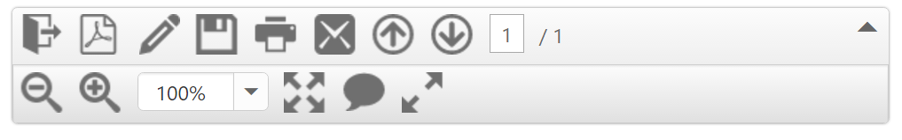

# Responsive Layout

**Responsive Layout** is aimed at crafting sites to provide an optimal viewing experience easy reading and navigation with a minimum of resizing, panning, and scrolling—across a wide range of devices (from mobile phones to desktop computer monitors). You can achieve **Responsive Layout** by using default functionality of **Toolbar** with [isResponsive](https://help.syncfusion.com/api/js/ejtoolbar#members:isresponsive) as **true** and also you need to give **Toolbar** width as in percentage value and add **ej.responsive.css** file in this sample. **CDN** link for the responsive CSS file is as follows.

[http://cdn.syncfusion.com/{{ site.releaseversion }}/js/web/responsive-css/ej.responsive.css](http://cdn.syncfusion.com/{{ site.releaseversion }}/js/web/responsive-css/ej.responsive.css)

Add the above **css** link in the code sample.        

Add the following code example in your **HTML** page.



    

        <!—list of toolbar items-->
        

            <ul>
                <li id="OtherFormat" title="Convert PDF files to Word or Excel Online..">
                    

                </li>
                <li id="PDFOnline" title="Convert files to PDF Online">
                    

                </li>
                <li id="Signature" title="Sign, add text or send a document for signature">
                    

                </li>
                <li id="Save" title="Save file ( Ctrl+S )">
                    

                </li>
                <li id="Print" title="Print file ( Ctrl+P ) ">
                    

                </li>
                <li id="Message" title="Message">
                    

                </li>
            </ul>
            <ul>
                <li id="Previous" title="Show previous page ( Left Arrow )">
                    

                </li>
                <li id="Next" title="Show next page ( Right Arrow )">
                    

                </li>
                <li id="page">
                    

                        <input type="text" value="1" />
                    

                </li>
                <li id="count">
                    / 1
                </li>
            </ul>
            <ul>
                <li id="ZoomOut" title="Zoom Out">
                    

                </li>
                <li id="ZoomIn" title="Zoom In">
                    

                </li>
                <li id="ZoomValue">
                    

                        <input type="text" id="selectPercent" />
                    

                </li>
            </ul>
            <ul>
                <li id="FitFull" title="Fit one full page to window">
                    

                </li>
                <li id="StickyNote" title="Add stick note ( Ctrl+6 ) ">
                    

                </li>
                <li id="ReadMode" title="View File in Read Mode">
                    

                </li>
            </ul>
        

    









    $(function () {
        $("#ToolbarItem").ejToolbar({
            width: "600px", // width of the Toolbar
            height: "33px", // height of the Toolbar
            isResponsive: true // responsive support for toolbar
        });
        var percentList = ["10%", "25%", "50%", "100%", "400%", "800%", "1600%", "3200%", "6400%"];
        $('#selectPercent').ejDropDownList({
            width: "90px",
            height: "27px",
            dataSource: percentList, // Assign List of Dropdown value to data Source
            value: "100%" // Initialize drop down value.
        });
    });



Execute the above code to render the following output.

## responsiveType:Inline

We can set the [responsiveType](https://help.syncfusion.com/api/js/ejtoolbar#members:responsiveType) property to inline to display the overflown toolbar items as inline toolbar.



    $(function () {
        $("#ToolbarItem").ejToolbar({
            width: "600px", // width of the Toolbar
            isResponsive: true // responsive support for toolbar
            responsiveType:"inline"//responsive Type API to display overflow items as inline toolbar.
        });
      
    });



While setting inline responsiveType the following output will be displayed.

## responsiveType:Popup

We can set the [responsiveType](https://help.syncfusion.com/api/js/ejtoolbar#members:responsiveType) property to popup to display the overflown toolbar items as popup.



    $(function () {
        $("#ToolbarItem").ejToolbar({
            width: "600px", // width of the Toolbar
            height: "33px", // height of the Toolbar
            isResponsive: true // responsive support for toolbar
            responsiveType:"popup"//responsive Type API to display overflow items as popup.
        });
      
    });



While setting popup as responsiveType the  following output will be displayed.

