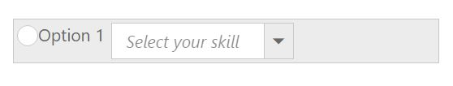

# Template Support

Template allows you to insert custom controls inside the toolbar items. Also you can design simple drop down buttons listing the items and radio button inside the **Toolbar**.

Set the list for **DropDown control** inside a list tag and define this tag as a **Toolbar** item. You can use all simple controls as a **Toolbar** item. To add RadioButton and DropDownList to **Toolbar**, use the following code example.



   <ul>
      <li>
         

            <input type="radio" name="small" id="Radio1" />
         

         Option 1
      </li>
      <li id="Dropdown" title="Dropdown Control">
         <input id="selectcar" type="text" />
        
      </li>
   </ul>





    $(function () {
        // declaration
          var skillset = [
                { skill: "ASP.NET" }, { skill: "ActionScript" }, { skill: "Basic" },
                { skill: "C++" }, { skill: "C#" }, { skill: "dBase" }, { skill: "Delphi" },
                { skill: "ESPOL" }, { skill: "F#" }, { skill: "FoxPro" }, { skill: "Java" },
                { skill: "J#" }, { skill: "Lisp" }, { skill: "Logo" }, { skill: "PHP" }
            ];
        $("#Radio1").ejRadioButton({ size:"medium" });
        $('#selectcar').ejDropDownList({ dataSource: skillset, fields: { text: "skill" },watermarkText: "Select your skill",});
        $("#toolbarcontent").ejToolbar({ width: "250px", height: "28px" });
    });



##Through Items API:



    





    $(function () {
        
          var skillset = [
                { skill: "ASP.NET" }, { skill: "ActionScript" }, { skill: "Basic" },
                { skill: "C++" }, { skill: "C#" }, { skill: "dBase" }, { skill: "Delphi" },
                { skill: "ESPOL" }, { skill: "F#" }, { skill: "FoxPro" }, { skill: "Java" },
                { skill: "J#" }, { skill: "Lisp" }, { skill: "Logo" }, { skill: "PHP" }
            ];
        $("#toolbarcontent").ejToolbar({
        
			 Items:[
                    {id:"item1",group:"group1",template:"<input type='radio' id='Radio1' name='radio'>Option 1</input>"},
					{id: "item2",group:"group2",template:"<input type='text' id='dropdown1' />"}
					],

             
			  });
               $("#Radio1").ejRadioButton({size:"medium"});
                $('#dropdown1').ejDropDownList({
                dataSource: skillset,
                fields: { text: "skill" },
                watermarkText: "Select your skill",
               
            });
    });



##Through template field in dataSource API:



    





    $(function () {
      var skillset = [
                { skill: "ASP.NET" }, { skill: "ActionScript" }, { skill: "Basic" },
                { skill: "C++" }, { skill: "C#" }, { skill: "dBase" }, { skill: "Delphi" },
                { skill: "ESPOL" }, { skill: "F#" }, { skill: "FoxPro" }, { skill: "Java" },
                { skill: "J#" }, { skill: "Lisp" }, { skill: "Logo" }, { skill: "PHP" }
            ];
     toolbaritems = [
		  {
               tid: "1",
               title:"radio",
			   template:"<input type='radio' id='radio1'>Option 1</input>",
			   groups:"group1"

            },
			 {
			         tid:"2",
					 title:"dropdown",
					 template:"<input type='text' id='dropdown2'>
",
					 group:"group2"
			 }],
        
        $("#toolbarcontent").ejToolbar({
			  dataSource: toolbaritems,
              fields: { id: "tid",tooltipText:"title",group:"group",template:"template"},

             
			  });
              $("#radio1").ejRadioButton({size:"medium"});
              $('#dropdown2').ejDropDownList({
                dataSource: skillset,
                fields: { text: "skill" },
                watermarkText: "Select your skill",
              
                
            });
    });



The following screenshot displays a Toolbar with embedded controls.

