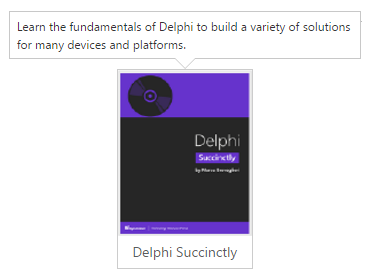
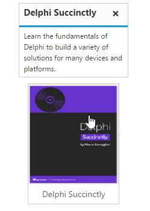

# Getting started

## Preparing HTML document

The Tooltip control has the following list of external JavaScript dependencies. 

* [jQuery](http://jquery.com/) 1.7.1 and later versions

* [jQuery.easing](http://gsgd.co.uk/sandbox/jquery/easing/) - to support animation effects in the components

Refer to the internal dependencies in the following table.

<table>
<tr>
<th>
File                                </th><th>
Description/Usage</th></tr>
<tr>
<td>
ej.core.min.js</td><td>
It is referred always before using all the JS controls.</td></tr>
<tr>
<td>
ej.tooltip.min.js</td><td>
The Tooltip's main file.</td></tr>
</table>

To get started, you can use the `ej.web.all.min.js` file that encapsulates all the `ej` controls and frameworks in one single file. So the complete boilerplate code is



<!DOCTYPE html>
<html>
<head>
    <meta name="viewport" content="width=device-width, initial-scale=1.0">
    <meta name="description" content="Essential Studio for JavaScript">
    <meta name="author" content="Syncfusion">
    <title></title>
    <!-- Essential Studio for JavaScript  theme reference -->
    <link rel="stylesheet" href="http://cdn.syncfusion.com/{{ site.releaseversion }}/js/web/flat-azure/ej.web.all.min.css" />

    <!-- Essential Studio for JavaScript  script references -->
    
    
    

    <!-- Add your custom scripts here -->

</head>
<body>

</body>
</html>



N> In production, we highly recommend you to use our [custom script generator](https://help.syncfusion.com/js/include-only-the-needed-widgets)  to create custom script file with required controls and its dependencies only. Also to reduce the file size further please use [GZip compression](https://developers.google.com/web/fundamentals/performance/optimizing-content-efficiency/optimize-encoding-and-transfer?hl=en) in your server.

For themes, you can use the `ej.web.all.min.css` CDN link from the code example given. To add the themes in your application, please refer to [this link](https://help.syncfusion.com/js/theming-in-essential-javascript-components).

## Create a Tooltip

The Tooltip can be created from any HTML element with the HTML `id` attribute and pre-defined options set to it. To create the Tooltip, you should call the `ejTooltip` jQuery plug-in function with the options as parameter. Refer to the following code example.
[content](https://help.syncfusion.com/api/js/ejtooltip#members:content) option is used for tooltip content.

 

    
    

        
        
Delphi Succinctly

    

// Creates the Tooltip



Apply the following style sheet



    


## Setting Dimensions

Tooltip dimensions can be set using [width](https://help.syncfusion.com/api/js/ejtooltip#members:width) and [height](https://help.syncfusion.com/api/js/ejtooltip#members:height) API.


 

    TypeScript lets you write <a id="test"><u> JavaScript</u> </a>the way you really want to.

// Creates the Tooltip

    


## Tooltip Appearance 

You can configure the appearance of the Tooltip with the title, close button and call out as your application requires. [isBalloon](https://help.syncfusion.com/api/js/ejtooltip#members:isballoon) option is used to enable the arrow in the tooltip.


 

    
    
Delphi Succinctly

// Creates the Tooltip

    


Apply the following styles to show the Tooltip.



    


