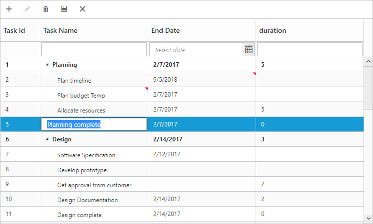
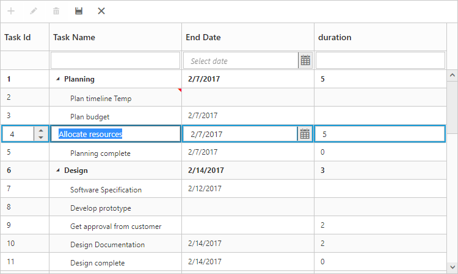

# Editing

## Editing Modes

The TreeGrid provides support to add, edit and delete the records and the following are the types of editing modes available. 

* Cell Editing
* Row Editing
* Dialog Editing
* Batch Editing

You can enable editing in TreeGrid by enabling the property [`allowEditing`](/api/js/ejtreegrid#members:editsettings-allowediting "editSettings.allowEditing").

### Cell Editing

Update the record through editing a cell by setting [`editMode`](/api/js/ejtreegrid#members:editsettings-editmode "editSettings.editMode") as the `cellEditing`.

The following code example shows you how to enable the `cellEditing` in TreeGrid control.



    $("#TreeGridContainer").ejTreeGrid({
        //...
        editSettings: {
            allowEditing: true,
            editMode: "cellEditing"

        },
    });



The output of the TreeGrid with `cellEditing` is as follows.

The edited cell can be saved with custom actions using the [`saveCell`](https://help.syncfusion.com/api/js/ejtreegrid#methods:savecell "saveCell") method.

### Prevent cell editing

In cell edit action [`beginEdit`](https://help.syncfusion.com/api/js/ejtreegrid#events:beginedit) and [`editEdit`](https://help.syncfusion.com/api/js/ejtreegrid#events:endedit) events are triggered before and after the editing action. cell editing for specific cell can prevent by using [`beginEdit`](https://help.syncfusion.com/api/js/ejtreegrid#events:beginedit) event.

The following code example show, how to prevent cell editing in tree grid.



    $("#TreeGridContainer").ejTreeGrid({
        //...
        editSettings: {
            allowEditing: true,
            editMode: "cellEditing"
        },
        beginEdit:function(args)
        {
            if(args.columnIndex == 1)
                args.cancel = true;
        },
        //...
    });



### Row Editing

It is possible to make the entire row to editable state and to update a record by setting [`editMode`](/api/js/ejtreegrid#members:editsettings-editmode "editSettings.editMode") as rowEditing.

The following code example shows you how to enable rowEditing in TreeGrid control.



    $("#TreeGridContainer").ejTreeGrid({
        //...
        editSettings: {
            allowEditing: true,
            editMode: "rowEditing"

        },
    });



The following output is displayed as a result of the above code example.

### Dialog Editing

Set the [`editMode`](/api/js/ejtreegrid#members:editsettings-editmode "editSettings.editMode") as dialogEditing to edit/add a record using dialog.

The following code example shows you how to enable the `dialogEditing` in TreeGrid control.



    $("#TreeGridContainer").ejTreeGrid({
        //...
        editSettings: {
            allowEditing: true,
            editMode: "dialogEditing"

        },
    });



The output of the TreeGrid with `dialogEditing` is as follows.

The add and edit dialogs can be opened on custom actions instead of toolbar icons using the methods [`showAddDialog`](https://help.syncfusion.com/api/js/ejtreegrid#methods:showadddialog "showAddDialog") and [`showEditDialog`](https://help.syncfusion.com/api/js/ejtreegrid#methods:showeditdialog "showEditDialog").

### Prevent dialog editing
In dialog editing action [`actionBegin`](https://help.syncfusion.com/api/js/ejtreegrid#events:actionbegin)  and [`actionComplete`](https://help.syncfusion.com/api/js/ejtreegrid#events:actioncomplete) client side events are triggered before and after the edit action. Dialog editing for specific row can be prevent by using actionBegin event.

The following code example show, how to prevent dialog editing in tree grid.



    $("#TreeGridContainer").ejTreeGrid({
        //...
        editSettings: {
            allowEditing: true,
            editMode: "dialogEditing"

        },
        actionBegin:function(args)
        {
            if(args.requestType == "beforeOpenEditDialog")
            {
                if(args.data.taskID == 4)
                    args.cancel = true;
            }
        },
        //...
    });



N> While saving the edited record [`actionComplete`](https://help.syncfusion.com/api/js/ejtreegrid#events:actioncomplete) event will be triggered with updated record value in `data` argument and `requestType` as `recordUpdate`. Using this event we can update the information in database.

### Batch Editing

The batch editing support in the tree grid is used to save all added, edited, and deleted changes to the database with a single action. This can be enabled by setting the [`editMode`](https://help.syncfusion.com/api/js/ejtreegrid#members:editsettings-editmode) property to `batchEditing`. The following code example shows how to enable the batchEditing in the tree grid control.



    $("#TreeGridContainer").ejTreeGrid({
        //...
        editSettings: {
            allowEditing: true,
            beginEditAction: "click",
            editMode: "batchEditing"
        },
    });



The output of a tree grid with `batchEditing` is as follows.

In batch editing, the edit mode can be changed to **cell** or **row** or **dialog** with the [`batchEditSettings.editMode`](https://help.syncfusion.com/api/js/ejtreegrid#members:editsettings-batcheditsettings-editmode) property. The following code snippet shows how to set the editMode to row in the [`batchEditSettings`](https://help.syncfusion.com/api/js/ejtreegrid#members:editsettings-batcheditsettings) property.



    $("#TreeGridContainer").ejTreeGrid({
        //...
        editSettings: {
            allowEditing: true,
            beginEditAction: "click",
            editMode: "batchEditing",
            batchEditSettings: { editMode: "row" },
        },
    });



The output of a tree grid with `batchEditSettings` and `editMode` set as `row` is as follows.

N> After modifying all changes in the tree grid, click the save button in the toolbar. The [`actionComplete`](https://help.syncfusion.com/api/js/ejtreegrid#events:actioncomplete) event will be triggered with updated records in the `batchChanges` argument with `requestType` argument as `batchSave`. Using this event, you can update all the modified records to the database.

## Cell edit type and its params

The edit type of columns can be customized using [`editType`](/api/js/ejtreegrid#members:columns-edittype "columns.editType") property of [`columns`](/api/js/ejtreegrid#members:columns). The following Essential JavaScript controls are supported built-in by [`editType`](/api/js/ejtreegrid#members:columns-edittype "columns.editType"). You can set the [`editType`](/api/js/ejtreegrid#members:columns-edittype "columns.editType") based on specific data type of the column.

* [`CheckBox`](/api/js/ejcheckbox# "CheckBox") control for boolean data type.
* [`NumericTextBox`](/api/js/ejtextboxes# "NumericTextBox") control for integers, double, and decimal data types.
* `InputTextBox` control for string data type.
* [`DatePicker`](/api/js/ejdatepicker# "DatePicker") control for date data type.
* [`DateTimePicker`](/api/js/ejdatetimepicker# "DateTimePicker") control for date-time data type.
* [`DropDownList`](/api/js/ejdropdownlist# "DropDownList") control for list of data type.

And also you can define the model for all the editTypes controls while editing through [`editParams`](/api/js/ejtreegrid#members:columns-editparams "columns.editParams") property of [`columns`](/api/js/ejtreegrid#members:columns).

The following code example describes the above behavior.



    $("#TreeGridContainer").ejTreeGrid({
        //...
         columns: [
            { field: "taskID", headerText: "Task Id", editType: "numericedit" },
            { field: "taskName", headerText: "Task Name", editType: "stringedit" },
            { field: "startDate", headerText: "Start Date", editType: "datepicker"},
            { field: "endDate", headerText: "End Date", editType: "datepicker"},
            { field: "duration", headerText: "Duration", editType: "numericedit", editParams: {decimalPlaces:2} },
        ],
        //...
    });



The above screenshot shows TreeGrid with different edit type.

### Assign data source for drop down edit type

In TreeGrid, we need to assign the data source for drop down list control to populate the suggestion list while editing the column in tree grid. The [`dropdownData`](/api/js/ejtreegrid#members:columns-dropdowndata "columns.dropdownData") property is used to set the drop down list data source in TreeGrid control.

The following code example shows how to set data source for drop down edit type.


var data = [
            {id:1, text: "Low", value: "Low" },
            {id:2, text: "Normal", value: "Normal" },
            {id:3, text: "High", value: "High" },
            {id:4, text: "Critical", value: "Critical" }
        ];
    $("#TreeGridContainer").ejTreeGrid({
        //...
         columns: [
            //..
            { field: "priority", headerText: "Priority", editType: "dropdownedit", dropdownData: data },
        ],
        //...
    });



The above screenshot shows drop down edit type in tree grid.
{:.caption}

#### Dialog Template

You can edit any of the fields pertaining to a single record of data and apply it to a template so that the same format is applied to all the other records that you may edit later.
Using this template support, you can edit/add the fields that are not bound to TreeGrid columns.
To edit/add the records using dialog template form, set `editMode` as `dialogEditing` and specify the template id to [`dialogEditorTemplateID`](/api/js/ejtreegrid#members:editsettings-dialogeditortemplateid "editSettings.dialogEditorTemplateID") property of `editSettings`.

N> The `value` attribute is used to bind the corresponding field value while editing.
   The `name` attribute is used to get the changed field values while saving the edited record.
   The `id` attribute must to be set in the format of ( treegrid control id + fieldname).

The following code example describes the above behavior.







    $("#TreeGridContainer").ejTreeGrid({
        //...
        editSettings: {
            allowEditing: true,
            editMode: "dialogEditing",
            dialogEditorTemplateID: "#template"

        },
    });



The following output is displayed as a result of the above code example.

#### Using methods to open dialog

It is possible to open the add dialog dynamically with a custom using the method showAddDialog..

Similarly, open the Edit dialog dynamically using the method showEditDialog(index), with the index of the row to be edited as parameter.





### Edit cell/row by single click

The TreeGrid control provide the support for single click edit action for cell and row edit by setting [`beginEditAction`](/api/js/ejtreegrid#members:editsettings-begineditaction "editSettings.beginEditAction") property as `click`, default value this property is `dblClick`.

The following code example shows how to enable single click edit in tree grid.


$("#TreeGrid").ejTreeGrid({
    //...
    editSettings: {
        beginEditAction:ej.TreeGrid.BeginEditAction.Click,
    },
    //...
});



## Cell Edit Template

Edit template is used to create custom editor for editing the column values. It can be created by using the [`editTemplate`](/api/js/ejtreegrid#members:columns-edittemplate "columns.editTemplate") property of `columns`.

The following are the functions available for edit template.

* `create` - It is used to create the control at time of initialize.
* `read` - It is used to read the input value at time of save.
* `write` - It is used to assign the value to control at time of editing.

The following code example describes edit template behavior.





The output of the TreeGrid width editTemplate as follows.

The updated record values are maintained in collection in TreeGrid, and the user can retrieve the updated record collection at any time by using the [`getUpdatedRecords`](https://help.syncfusion.com/api/js/ejtreegrid#methods:getupdatedrecords "getUpdatedRecords") method.

## Add new record

TreeGrid provides support for adding a new record by setting [`allowAdding`](/api/js/ejtreegrid#members:editsettings-allowadding "editSettings.allowAdding") property as `true`. You can add new record by toolbar add item click or context menu.

The below code example shows how to enable add new record option in TreeGrid.


$("#TreeGrid").ejTreeGrid({
    //...
    editSettings: {
        allowAdding: true,
    },
    //...
});



The above screenshot shows before add a new record in tree grid.
{:.caption}

The above screenshot shows after add a new record in tree grid.
{:.caption}

### Add row position

The TreeGrid control provides the support to add the new row in the top, bottom, above selected row, below selected row and child position of tree grid content using [`rowPosition`](/api/js/ejtreegrid#members:editsettings-rowposition "editSettings.rowPosition") property.
 
 The below code example shows how to set row position for new record add in tree grid.


$("#TreeGrid").ejTreeGrid({
    //...
    editSettings: {
        allowAdding: true,
        rowPosition:ej.TreeGrid.RowPosition.Child,
    },
    //...
});



The above screenshot shows new record added in row position of `child`.
{:.caption}

## Adding records using method

Records can be added dynamically to TreeGrid using the method  [`addRow`](/api/js/ejtreegrid#methods:addrow "addRow"). Before calling this method, you should enable the [`allowAdding`](/api/js/ejtreegrid#members:editsettings-allowadding "editSettings.allowAdding") property.

The below code snippet explains dynamically inserting a record in tree grid. The record will be inserted as a child node to the current selected record.



        var treeGridObj = $("#treegrid").data("ejTreeGrid");
        var data = {
            taskId: "40",
            taskName: "New Task 40",
            startDate: "2/20/2014",
            startDate: "2/25/2014"
        };
        treeGridObj.addRow(data, ej.TreeGrid.RowPosition.Child); // To add a task



Using the row position parameter of the method, user can able to insert the record at any desired index at run-time. The user can insert a record dynamically in the following positions

* Top: Top to all the existing records
* Bottom: Bottom to all the existing records
* Above: Above to the selected row
* Below: Below to the selected row
* Child: As a child to the selected row

The row position can be also defined while initializing the TreeGrid. The below code example shows how to set row position for adding new record in TreeGrid.



        $("#TreeGrid").ejTreeGrid({
            //...
            editSettings: {
                allowAdding: true,
                rowPosition: ej.TreeGrid.RowPosition.Child,
            },
            //...
        });



The above screenshot shows new record added in row position of `child`.
{:.caption}

## updating records using method

Records can be updated dynamically to TreeGrid using the method  [`updateRecordByIndex`](/api/js/ejtreegrid#methods:updaterecordbyindex "updateRecordByIndex"). Record index and the data to be updated will be passed to the method argument to update.

The below code snippet explains dynamically updating a record in tree grid. 



        var treeGridObj = $("#treegrid").data("ejTreeGrid");
        var data = {
            taskName: "Updated task",
        };
        treeGridObj.updateRecordByIndex(2,data); // To update a task



## Delete record

TreeGrid provides support to delete a record by enabling [`allowDeleting`](/api/js/ejtreegrid#members:editsettings-allowdeleting "editSettings.allowDeleting") property.

The below code example shows how to enable delete option in TreeGrid.



        $("#TreeGrid").ejTreeGrid({
            //...
            editSettings: {
                allowDeleting: true,
            },
            //...
        });



The above screenshot shows before delete a record in tree grid.
{:.caption}

The above screenshot shows after delete a record in tree grid.
{:.caption}

## Delete confirmation message

Delete confirmation message is used to get the confirmation from the user before delete the record. This confirmation message can be enabled by setting [`showDeleteConfirmDialog`](/api/js/ejtreegrid#members:editsettings-showdeleteconfirmdialog "editSettings.showDeleteConfirmDialog") property as `true`.

The following code snippet explains how to enable delete confirmation message in tree grid.


$("#TreeGrid").ejTreeGrid({
    //...
    editSettings: {
        allowDeleting: true,
	    showDeleteConfirmDialog: true
    },
    //...
});



The above screen shot shows the appearance of delete confirmation message in treegrid.