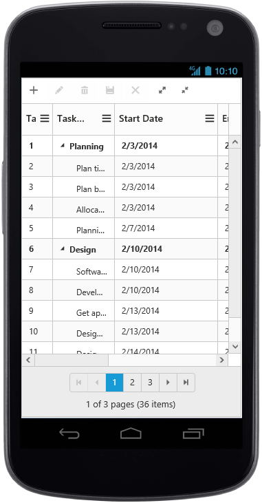
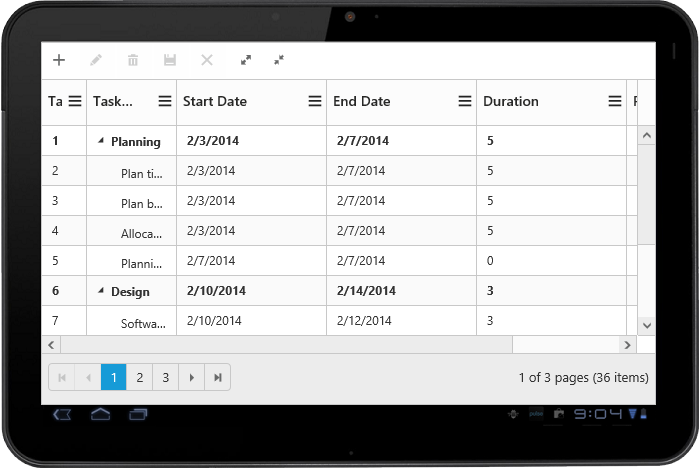
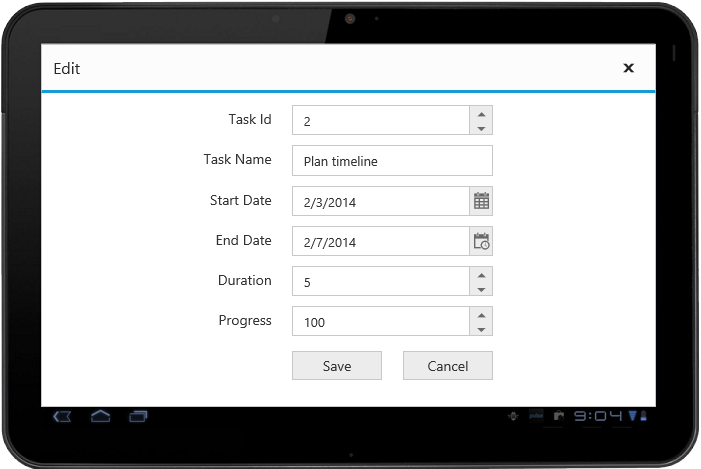
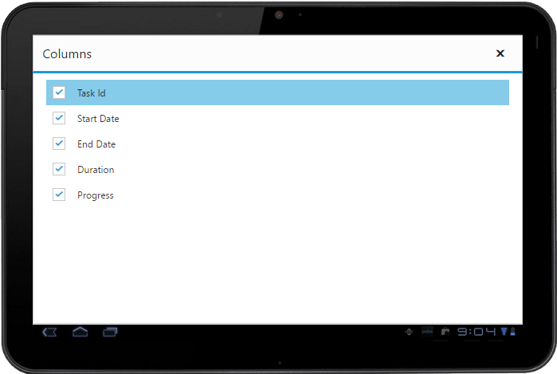

# Responsive

The TreeGrid control has support for responsive behavior based on client browser's width and height. To enable responsive support in TreeGrid, `isResponsive` property should be true.

Please find the example describes the above behavior.






$("#TreeGridContainer").ejTreeGrid({
    //...
    isResponsive: true,
});


The following output is displayed as a result of the above code example

{:caption}
Responsive TreeGrid in Mobile layout.

{:caption}
Responsive TreeGrid in tablet layout.

## Layout

There are three modes of responsive layout is available in TreeGrid based on client width. They are.

* Mobile(<321px)
* Tablet(321px to 768px)
* Desktop(>768px)

## Mobile Layout

The customized layout for filtering, column chooser operations and add/edit operations in mobile device can be seen following screen shots.

{:caption}
filtering in mobile layout.

{:caption}
Add/edit in mobile layout

{:caption}
Column chooser in mobile layout

{:caption}
Insert column options in mobile layout

## Tablet Layout

The customized layout for filtering, column chooser operations and add/edit operations in tablet device can be seen following screen shots.

{:caption}
filtering in tablet layout.

{:caption}
Add/edit in tablet layout

{:caption}
Column chooser in tablet layout

{:caption}
Insert column options in tablet layout

## Public Method

You can change the minimum responsive width dynamically by using public method called `updateResponsiveMinWidth(width)` by passing the width as an argument.
The TreeGrid control get works in responsive mode only when the window width is below the minimum responsive width.

Please find the example describes the above behavior.



<button id="minResponsiveWidth">minResponsiveWidth</button>



$("#TreeGridContainer").ejTreeGrid({
    //...
    isResponsive: true,
});






The following output is displayed as a result of the above code example

