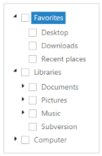

# Accessibility

**TreeView** provides full keyboard support. You can interact with the **TreeView** control by using the keyboard. It is compatible with the standard keyboard navigation and you can focus on **TreeView** with a predefined Alt and Key combination. Also, you can navigate through the nodes, expand or collapse, select, check and uncheck nodes with the provided shortcut keys. You can access the **TreeView** with the shortcut keys by using the **allowKeyboardNavigation** property.

This feature is mainly useful for all the keyboard users to access the **TreeView** with the keyboard shortcut keys.

The following table showcases the various keyboard shortcuts available in the **TreeView** control. 

Keyboard Shortcuts

<table>
<tr>
<td>
<b>Keys </b></td><td>
<b>Functions</b></td></tr>
<tr>
<td>
Alt+j</td><td>
Focus the control.</td></tr>
<tr>
<td>
F2</td><td>
Edit the node.</td></tr>
<tr>
<td>
Ctrl + X</td><td>
Cut the selected node.</td></tr>
<tr>
<td>
Ctrl + V</td><td>
Paste the cut nodes to selected node.</td></tr>
<tr>
<td>
Delete key</td><td>
Delete the node.</td></tr>
<tr>
<td>
Down</td><td>
Traverse next node.</td></tr>
<tr>
<td>
Up</td><td>
Traverse previous node.</td></tr>
<tr>
<td>
Right</td><td>
Expand node/Traverse first child.</td></tr>
<tr>
<td>
Left</td><td>
Collapse node.</td></tr>
<tr>
<td>
Enter</td><td>
Select the node</td></tr>
<tr>
<td>
Space</td><td>
Check/Uncheck node.</td></tr>
<tr>
<td>
Home</td><td>
Traverse first node in Tree.</td></tr>
<tr>
<td>
End</td><td>
Traverse last node in Tree.</td></tr>
</table>

The following steps explain how to enable the **allowKeyboardNavigation** property for **TreeView**.

In the **HTML** page, add &lt;ul&gt; and &lt;li&gt; elements to configure TreeView.



<ul id="treeView">
<li class="expanded">Favorites
        <ul>
            <li>Desktop</li>
            <li>Downloads</li>
            <li>Recent places</li>
        </ul>
</li>
<li class="expanded">Libraries
        <ul>
            <li>Documents
                <ul>
                    <li>My Documents</li>
                    <li>Public Documents</li>
                </ul>
            </li>
            <li>Pictures
                <ul>
                    <li>My Pictures</li>
                    <li>Public Pictures</li>
                </ul>
            </li>
            <li>Music
                <ul>
                    <li>My Music</li>
                    <li>Public Music</li>
                </ul>
            </li>
            <li>Subversion</li>
        </ul>
</li>
<li>Computer
        <ul>
            <li>Folder(C)</li>
            <li>Folder(D)</li>
            <li>Folder(F)</li>
        </ul>
</li>
</ul>





	$(function() {
	    $("#treeView").ejTreeView({
	        showCheckbox: true,
	        allowEditing: true,
	        allowKeyboardNavigation: true
	    });
	    //Control focus key
	    $(document).on("keydown", function(e) {
	        if (e.altKey && e.keyCode === 74) {
	            // j- key code.
	            $("#treeView").focus();
	        }
	    });
	});



The output for **TreeView** when **allowKeyboardNavigation** is set to “**True**” is as follows.

