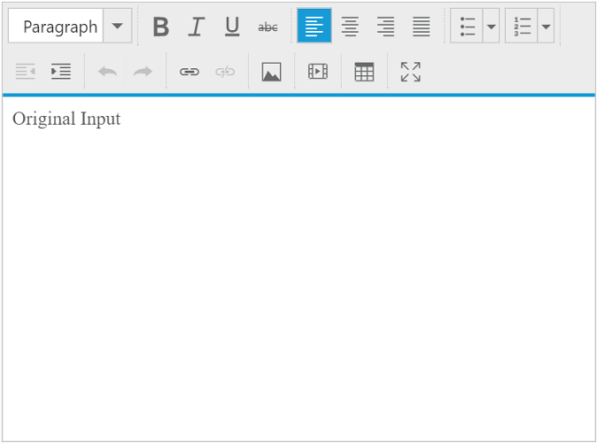

# Preventing Cross-Site Scripting

## XSS Attack

Cross-site scripting (XSS) is an injection attack which is carried out on Web applications which enables an attacker to place client side scripts into web pages. When the user load affected pages the attackers scripts will run, which enables the attacker to steal information and change the contents of the web page through DOM manipulation or redirect the browser to another page.

The following code example from request.html page illustrates this,



<form id="myForm" action="response.html">
        Enter Text : <textarea name="txtValue">Original Input</textarea>
        <input type="button" onclick="myFunction()" value="Submit form"></input>
    </form>

 

The below code snippet injects the malicious script in to the user's browser throw the form submit event and post it to the response.html page.



   function myFunction() {
            document.getElementById("myForm").submit();
        }



## XSS protection

`EJ Controls` does not have built-in support for the XSS protection. So before giving data into `ej controls`,the user can check whether the malicious script is present in the request or not by using [`HTML Sanitizer`](https://www.npmjs.com/package/sanitize-html "HTML Sanitizer").

The following code example from response.html page illustrates this,



<body>
    <textarea id="editor"></textarea>
 </body>

   


 
 $(function () {
            var queryVal = getQueryParams(document.location.search);// here queryVal from the request.html page contains the injected script value.
            var sanitizedStr = sanitizeHtml(queryVal.txtValue); // by passing the txtValue in sanitizeHTML we can get the original input.
            function getQueryParams(queryString) {  //here the query string is from the request.html 
                queryString = queryString.split('+').join(' ');
                var params = {}, tokens, re = /[?&]?([^=]+)=([^&]*)/g;
                while (tokens = re.exec(queryString)) {
                    params[decodeURIComponent(tokens[1])] = decodeURIComponent(tokens[2]);
                }
                return params;
            }
            $("#editor").ejRTE({
                value: sanitizedStr, // here original input of the user is given as the input for ejRTE.
            });
        });
 


The above code example validated the query string values from request.html page by using the html sanitizer. It produce the trusted data which is given as the value for the ejRTE control.

The following output is displayed as a result of the above code example.

## XSS protection for MVC platform

For server side platforms like MVC, the user need to install `AntiXSS` package into the application.In the server side we can get trusted input by using `GetSafeHtmlFragment` method. 

The following code example illustrates this,



        [HttpPost]
        public ActionResult RichTextEditorFeatures(RTEVal model)
        {
            model.val = Sanitizer.GetSafeHtmlFragment(model.val);
            return View(model);
        }

        