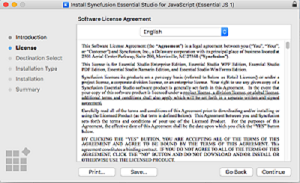

# Installing Syncfusion JavaScript Mac Installer

## Steps to resolve the warning message in Catalina OS or later

   While running Essential Studio JavaScript Mac Installer on Catalina MacOS or later, the below alert will be displayed.

     
     
   If you receive this alert, follow the below steps for the easiest solution.   

   1.	Right-click the downloaded pkg file.
   2.	Select the "Open With" option and choose "Installer (Default)".
   3.	Installer window will be opened.

## Step-by-Step Installation

The steps below show how to install the Essential Studio JavaScript Mac installer.

1. Open Syncfusion Essential Studio JavaScript Mac Installer(.pkg) file. The Installer Wizard opens. Click Continue.

   
   

2. The Software License Agreement wizard will appear. Click the Continue button.

      
   

3. The License Agreement's Confirmation window will appear. If you have read the Software License Agreement, click **Agree**.

   
   
   N> Unlock key is not required for installing the Mac installer. Syncfusion Essential Studio JavaScript Mac installer can be used for developing purposes without registering the Unlock key.

4. The Destination select wizard will appear. You can choose which disc to install the Syncfusion Essential Studio for JavaScript installer on here.

   

5. The Installation Type wizard will appear. Click Install to begin the standard installation of the Syncfusion Essential Studio JavaScript Mac installer.

   

6. The Authentication window will appear. To begin the installation, enter the Mac machine's password and click **Install Software**.

   

7. The installation process will begin on your machine. 
   
   
   
8. Once the installation is complete, the completed screen will be displayed. To exit the installation wizard, click Close. 

   
   
   By default, Mac installer will install the files in following location.

   **Location:** {Documents}\Syncfusion\ {version}\ {platform}
   
   
   
   
