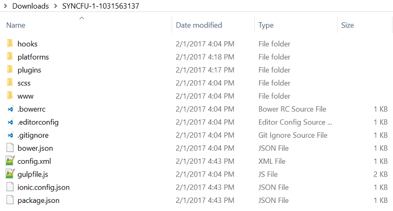
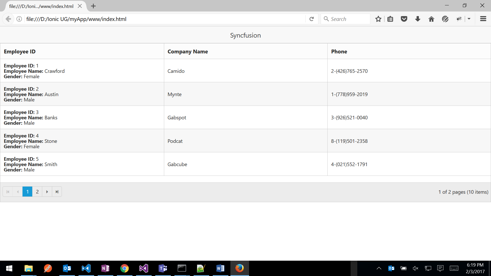
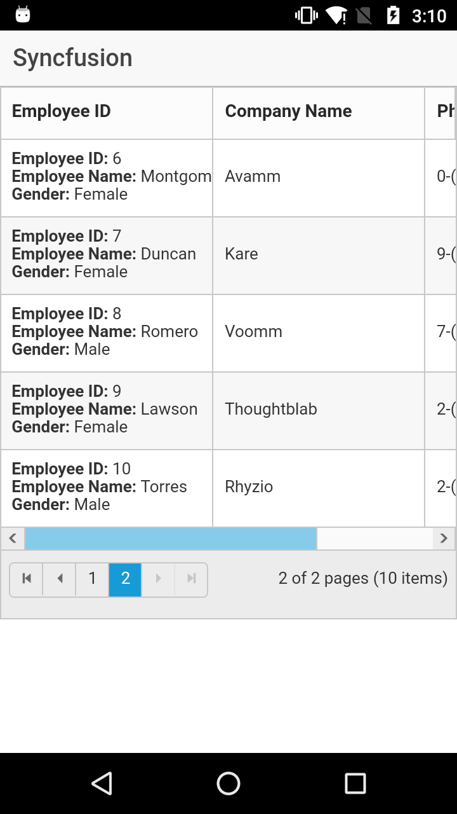

# Ionic

## Introduction

Ionic is an open source Mobile SDK for developing native and progressive web apps. Ionic offers a library of mobile-optimized HTML, CSS and JS components and tools for building highly interactive native and progressive Web apps. Built with Sass, optimized for AngularJS. 
Please go through the [http://ionicframework.com/](http://ionicframework.com/) page.

## Prerequisites and Compatibility

### Prerequisites

While running the ionic it requires [Node.js](https://nodejs.org/en/download/) (which includes [npm](https://npmjs.org/)) on your system.

### Install Ionic

First install the latest Cordova and Ionic command-line tools in your terminal. Follow the Windows and Mac guides to install required tools for development.

#### Windows



npm install -g cordova ionic



#### Mac



$ sudo npm install -g cordova ionic



## Getting started

Steps to add the sample and run the application

#### Get basic application

Get Syncfusion blank ionic project from this [link.](http://www.syncfusion.com/downloads/support/directtrac/general/ze/BlankSyncfusionApplication-982410597.zip) Then extract the project, folder holds following files

Now open command prompt and navigate to this ionic project location, then type npm command for installing node_modules in project



npm install



### Using Syncfusion Essential JS controls with Ionic Framework 

This step by step guide is used to create a combination of Essential JS UI controls with Ionic Framework.

After install npm, add the Syncfusion JS and CSS file reference in index.html file from www folder location

#### Adding the required style sheets into CSS folder

In the below specified location, you can find all the required web related theme folders. Copy the folder **web** in to the www\**ej\themes\** folder of your application.

**(installed location)**/Syncfusion/Essential Studio/{{ site.releaseversion }}/JavaScript/assets/css

Now, Include the specific theme reference to your HTML file by referring the appropriate ej.web.all.min.css file from a particular theme folder (here, we have referred the **default-theme**), within html file, head section



<link href="ej/themes/web/default-theme/ej.web.all.min.css" rel="stylesheet">



#### Adding the required JavaScript files

Essential JS widgets requires the following external dependent scripts,

* jQuery (version supported from 1.7.1)

* jsrender.min.js

In the below specified location, you can find the dependent script files. Copy and paste it into the **www\ej\scripts** folder of your application,

**(installed location)**/Syncfusion/Essential Studio/{{ site.releaseversion }}/JavaScript/assets/external

Apart from the above dependent scripts, you need to refer the **ej.web.all.min.js** file, which contains all the JavaScript components script and globalize library packed together in a minified format.

Copy the **ej.web.all.min.js** file into the www\**ej\scripts** folder.

**(installed location)**/Syncfusion/Essential Studio/{{ site.releaseversion }}/JavaScript/assets/scripts/web

Now, Include the below scripts reference within html file, head section 





#### Supported jQuery Versions

The following link provides jQuery compatibility information of ej controls

[https://help.syncfusion.com/js/control-initialization#supported-jquery-versions](https://help.syncfusion.com/js/control-initialization)

#### Steps to change application name

Application name of ionic project possible to change by following simple steps

Open config.xml file from ionic project location, here &lt;name&gt; tag is responsible for the app name. Put your required name between this tag.



<name> Syncfusion </name>



### Initialize control

Add the Syncfusion grid control sample inside the ion-content in index.html file. All the Syncfusion widget’s control directives are prefixed with ej- to avoid conflict with other library directives and its properties are defined using e- prefix followed by the property name.



  

    

    

    



### Declare angular dependency

Essential JS includes AngularJS directives for all controls in ej.widget.angular.min.js script file. In the below specified location, you can find required script file

Copy the ej.widget.angular.min.js file into the www\**ej\scripts** folder.

**(installed location)**/Syncfusion/Essential Studio/{{ site.releaseversion }}/JavaScript/assets/scripts/common

Then include the below scripts reference within html file, head section





All the Essential JS directives have been encapsulated into a single module called ejAngular, so the first step would be to declare dependency for this module within your ionic application. Now open the app.js in the location (**www/js**) modify codes as below



angular.module('starter', ['ejangular', 'ionic'])



### Initializing controller

In app.js file, you can create separate controller for each control used in that project. Control properties declared inside the corresponding controller



.controller('GridCtrl', function ($scope, $compile, $document) {

    $scope.dateValue = "2/3/2013";

})



Then add ng-controller attribute in sample holding container as mentioned below



  

    

      

        

          

          

          

        

      

    

  



## Steps for run your application

### Run application in browser

Testing your app in the browser it fast, easy and convenient when your app is in development



cd myApp

ionic serve



## Deploy application in device

#### Android

Deploying app into android device, checkout below system requirements

##### Requirements for Android

* [Android Studio](https://developer.android.com/studio/index.html)

* Updated Android SDK tools, platform and component dependencies. Available through Android Studio’s [SDK Manager](https://developer.android.com/studio/intro/update.html)

##### Commands



ionic platform add android

ionic build android

ionic run android



#### IOS

##### Requirements for IOS

Deploying app into ios device, checkout this system requirements

* Xcode 7 or higher

* iOS 9

* A free [Apple ID](https://appleid.apple.com/) or paid Apple Developer account

##### Commands



$ ionic platform add ios

$ ionic build ios

$ ionic emulate ios



