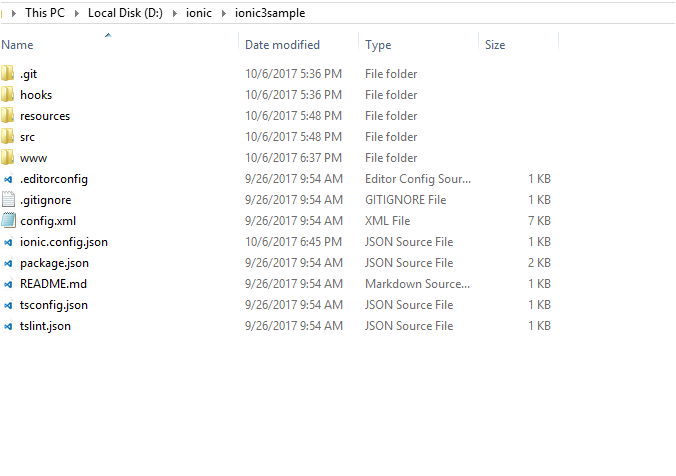

# Ionic3

## Introduction

The [Ionic 3](http://blog.ionic.io/ionic-3-0-has-arrived/) is an open source Mobile SDK for developing native and progressive web apps and that it works with newer version of Angular4 and with a newer version of typescript.

## Prerequisites and Compatibility

### Prerequisites

While running the ionic it requires [Node.js](https://nodejs.org/en/download/) (which includes [npm](https://npmjs.org/)) on your system.

### Install Ionic

First install the latest Cordova and Ionic command-line tools in your terminal. Follow the Windows and Mac guides to install required tools for development.

#### Windows



npm install -g cordova ionic



#### Mac



$ sudo npm install -g cordova ionic



## Getting started

### Creating a basic app with Ionic 3.

To create an Ionic 3 latest project with Syncfusion components, we need to follow the below steps.

**Step 1**:  Update to latest version of the ionic CLI. Run the below commands.

#### Windows



npm uninstall -g ionic





npm install -g ionic@latest



#### Mac



sudo npm install -g ionic@latest



**Step 2**: Need to run the below command to create an ionic 3 default project.



ionic start ionic3-syncfusion tabs


             
**Note**: ionic3-syncfusion is project name and tabs is the project template.

**Step 3**: Install our angular 4 source from npm packages.



 npm install ej-angular2 --save


              
**Step 4**: Include our component common module name(EJAngular2Module) in app.module.ts file in ionic 3 project.



import { NgModule, ErrorHandler } from '@angular/core';
import { BrowserModule } from '@angular/platform-browser';
import { IonicApp, IonicModule, IonicErrorHandler } from 'ionic-angular';
import { MyApp } from './app.component';

import { AboutPage } from '../pages/about/about';
import { ContactPage } from '../pages/contact/contact';
import { HomePage } from '../pages/home/home';
import { TabsPage } from '../pages/tabs/tabs';
import {EJAngular2Module } from 'ej-angular2';

import { StatusBar } from '@ionic-native/status-bar';
import { SplashScreen } from '@ionic-native/splash-screen';

@NgModule({
  declarations: [
    MyApp,
    AboutPage,
    ContactPage,
    HomePage,
    TabsPage
  ],
  imports: [
    BrowserModule,
      IonicModule.forRoot(MyApp), EJAngular2Module.forRoot()
  ],
  bootstrap: [IonicApp],
  entryComponents: [
    MyApp,
    AboutPage,
    ContactPage,
    HomePage,
    TabsPage
  ],
  providers: [
    StatusBar,
    SplashScreen,
    {provide: ErrorHandler, useClass: IonicErrorHandler}
  ]
})
export class AppModule {}



**Step 5**: Enter the below command to load the Syncfusion scripts and CSS through npm node modules.



npm install syncfusion-javascript


             

Then refer our scripts and CSS files in index.html file like below from the installed npm Syncfusion location.



<link href="../node_modules/syncfusion-javascript/Content/ej/web/default-theme/ej.web.all.min.css" rel="stylesheet" />
   
    



**Note**: If you don’t want to install the references from npm, you can simply use the CDN links or local reference to refer Syncfusion references.

**Step 6**:  Now you can initialize our component in the html,ts file.



<ej-grid [allowPaging]="true" [allowSorting]="true" [dataSource]="gridData">
    <e-columns>
        <e-column field="OrderID" headerText="Order ID" width="75" textAlign="right"></e-column>
        <e-column field="CustomerID" headerText="Customer ID" width="80"></e-column>
        <e-column field="EmployeeID" headerText="Employee ID" width="75" textAlign="right"></e-column>
        <e-column field="Freight" width="75" format="{0:C}" textAlign="right"></e-column>
        <e-column field="OrderDate" headerText="Order Date" width="80" format="{0:MM/dd/yyyy}" textAlign="right"></e-column>
        <e-column field="ShipCity" headerText="Ship City" width="110"></e-column>
    </e-columns>
</ej-grid>





import { Component } from '@angular/core';
import { Platform } from 'ionic-angular';
import { StatusBar } from '@ionic-native/status-bar';
import { SplashScreen } from '@ionic-native/splash-screen';
import { NorthwindService } from '../services/northwind.service';

import { TabsPage } from '../pages/tabs/tabs';

@Component({
  templateUrl: 'app.html',
  selector: 'ej-app',
  styles: ['.e-grid{position:inherit !important'],
  providers: [NorthwindService]
})
export class MyApp {
  public gridData: any;
  public dataManager: any;
  public value: any;
  constructor(private service: NorthwindService) {
      this.gridData = service.getOrders();
      this.value = new Date();
  }
}



**Step 7**: Finally run the below command to run the ionic 3 project.



ionic serve



### Quick start application

Get Syncfusion blank ionic3 project from this [link.](http://www.syncfusion.com/downloads/support/directtrac/general/ze/ionic3sample205835827) Then extract the project, folder holds following files

Now open command prompt and navigate to this ionic project location, then type npm command for installing node_modules in project



npm install

